# 全景理解文档（human_read）v18 — 域条件功能秩、on-policy 轨迹与区域输出闭环

更新时间：2026-07-29

本文档是论文的**当前理论与证据总账**，不是按实验到达顺序累积的日志。正文只维护仍成立的理论、
有效证据、必要边界和明确的待确认槽位；完整结果、证明、复现协议和 related work 分别进入对应附录。
已经被双模型或新协议否定的理论不再保留在本文档中，原始研究历史由独立归档承担。

v15 新增的12张解释图均由
[`scripts/plot_human_read_figure_suite.py`](scripts/plot_human_read_figure_suite.py)
从正式 CSV 或附录 B 已冻结的派生统计生成；它们是 human_read 的完整理解层，不代表最终论文必须
逐张保留。

v16 将 reviewer-robustness correction 纳入正式总账：Llama state spectrum、centered covariance、
七模块严格/并列分解、checkpoint-demeaned 与 nested-regularization 增量信息、teacher top-32
retained mass，以及 OPD–frozenSelf0-KD 的 matched behavioral-readout bootstrap。旧 RR2
因错误地测量 displacement spectrum 且错误实现 $\varepsilon$ 而正式作废；RR2D 仅保留为
update-space 辅助结果。

v17 将 non-QK equal-5 与 FAT-R1-v2 区域输出分析升级为正文正式协议。headline 模块集合固定为
v/o/gate/up/down；q/k 只作为异质性敏感性进入附录。MMLU-Pro 的 prompt/format/answer/termination
和 MATH500 的 prompt/CoT/combined-box/termination 现在分别计算 full-vocabulary KL 与 signed/
absolute NLL，并与同域 $c_\varepsilon^{(5)}$、deployed merged-delta $p_k^{(5)}$ 做
leave-one-checkpoint-group-out 公平比较。旧 equal-7、整段 reference-stream output 和 RR5
common-grid 结果仍然有效，但降为敏感性或补充证据，不再承担最新 headline。

v18 补齐 Qwen L18 的四臂 raw-activation exact common grid：OPD/SFT/off-KD/seqKD×
step5/20/40/160×四核心 probes 共64个状态，八个 raw-activation 特征512/512有限；它与既有
Llama equal-5 RR5 形成严格双模型 $A/C_5/P_{k,5}$ checkpoint-held-out 构念比较。修正后的结果
显示，按三个输出目标的 OOF $R^2$ 与 OPD AUC，$C_5$ 在两个模型上对 raw activation $A$ 为
8/8胜，对 $P_{k,5}$ 为7/8胜；唯一例外是 Qwen absolute NLL（.247 对 .261）。同轮还补齐
MATH500 CoT 区域的 exact full-vocabulary $\mathrm{KL}_C$：两模型62个状态、31,000条
sample rows。该 Math-$C$ 结果完整登记在 human_read，但因它是原12-target FAT 分析之后完成的
post-hoc 区域扩展，当前标记为 `PAPER_DEFERRED`，暂不改写论文正文的预注册统计。

全文使用以下状态：

| 状态 | 含义 | 是否可作为论文既定结论 |
|---|---|---|
| `CONFIRMED` | 数学闭环，或冻结协议下有直接配对/跨模型支持 | 可以 |
| `STRONG_DESCRIPTIVE` | 轨迹与配对结果稳定，但独立训练 seed 不足 | 可以，必须限定证据等级 |
| `SUPPORTING` | 有效的次级或局部结果 | 可以，通常不进摘要 |
| `PENDING_CONFIRMATION` | 已有正信号，确认性分析正在执行 | 不可以提前升级 |
| `AUDIT_ONLY` | 数值、协议、coverage 或构念审计 | 不可以 |
| `PAPER_DEFERRED` | 实验与数值有效，但在正文 target family 冻结后到达 | human_read/附录保留，本版论文暂不纳入 |

当前最高层结论是：

> 域条件白化算子 $W_tS_{D,t}$ 将权重映射与模型在输入域上实际访问的激活度量放入同一个局部
> 低秩近似问题。其功能秩 $r_\varepsilon$ 揭示了普通纯权重位置量和 raw activation spectrum
> 并不直接定义的域条件功能轨迹。headline 改为 non-QK equal-5 后，跨 Qwen 与 Llama，OPD 在
> $\varepsilon=.05$ 的严格共同早期四核心网格中达到 24/24 最深；扩展到
> $\varepsilon\in\{.01,.025,.05,.10\}$ 后为 95/96，唯一反例是
> Qwen $E_{\mathrm{ifeval}}@20,\varepsilon=.10$。Llama 上这一排序还经受 stable rank、entropy
> effective rank、centered covariance 和逐模块审计，说明它既不是单阈值现象，也不是 q/k
> 异质性或激活均值方向制造的假象。Llama 的 current-self OPD 相对 frozen-step0-self KD 又在
> 29/30 个后 step5 单元中更深，把主差异收紧到 online support refresh bundle。相对压缩
> $c_\varepsilon^{(5)}$ 在区域 KL 的48条臂内关系中 Spearman 中位数为 .943，41/48 达到
> $|\rho|\ge .8$；严格 matched checkpoint-held-out 比较中，它相对最佳
> $p_k^{(5)}$ 在区域 KL 的 $R^2$/MAE 上均胜出10/12。与此同时，格式—答案 signed contrast
> 与 strict/flexible 行为的对应方向随模型和训练臂改变。进一步在两模型各64个严格共同状态上，
> $c_\varepsilon^{(5)}$ 相对八维 raw-activation suite 在 cumulative KL、absolute/signed NLL
> 的 OOF $R^2$ 和 OPD AUC 上达到8/8胜，说明它不是 raw activation spectrum 的改名；相对
> equal-5 source-principal $p_k$ 为7/8胜，但仍保留 Qwen absolute-NLL 反例与分类校准边界。
> 因此本文的正确定位是一个局部最优、
> 局部完备、能刻画域条件功能压缩与输出分布 departure 的观察空间，而不是单标量端到端解释
> 全部行为，也不是宣称所有权重空间基线均无效。

---

# 一、符号集与研究对象

## 1.1 模型、训练臂与 sequence support

主实验包含 Qwen 学生轨迹与 Llama-3.2-3B 学生轨迹。两者都采用 LoRA 后训练；当前每个模型、每条
训练臂只有一条独立训练轨迹，因此 model×arm×checkpoint×probe 单元不能当作独立训练 seed。

| 训练臂 | 训练时访问的 sequence support | objective / target | 论文角色 |
|---|---|---|---|
| OPD | current student self-rollout | dense teacher forward-KL | on-policy 主臂 |
| frozenSelf0-KD | step0 student rollout 生成一次后永久冻结 | 与 OPD 相同的 dense teacher forward-KL | current refresh 的直接对照 |
| off-KD | 冻结 teacher rollout | dense teacher forward-KL | 与 OPD 同 objective 的 off-policy 对照 |
| seqKD | 与 off-KD 完全相同的冻结 teacher 序列 | hard-label CE | matched-support objective 对照 |
| SFT | 外部 dataset/reference CoT | hard-label CE | 普通离线训练对照 |
| $\alpha=.5$ | current-self 与冻结 external/teacher support 各半 | dense teacher forward-KL | on-policy exposure 干预 |

现有对照分两层：

1. OPD–off-KD 识别 current-student pipeline 相对于 frozen-teacher pipeline 的总效应，同时改变
   生成者、文本风格、长度、重复率、EOS 与 online freshness；
2. OPD–frozenSelf0-KD 保持学生生成者家族、step0 起点、prompt pool、teacher KL、LoRA 和优化协议
   一致，只改变 rollout 是否随当前学生刷新。它因此识别 **current-support refresh bundle 的总效应**。

第二层已经比 OPD–off-KD 更干净地隔离 on-policy，但仍不能把 freshness 与由 refresh 引起的长度、
EOS、重复率和风格变化拆开；这些是潜在中介而非应事前匹配掉的混杂。policy-lag 只属于未来机制增强，
不再是本文证明 current refresh 有效的必要条件。

## 1.2 输入、probe 与行为 Eval 的命名

| 前缀 | 严格含义 |
|---|---|
| $E_D$ | 固定外部 benchmark/dataset 文本，用于采集激活并计算几何；不是行为分数 |
| $D_D$ | 来自训练数据集的固定 reference sequence，可分 train 与同分布 held-out |
| $X_D$ | base/step0 在固定 prompts 上生成一次并冻结的 rollout |
| $X_{D,t}$ | 每个 checkpoint 重新生成的动态 rollout；不进入主线 |
| Eval$_D$ | accuracy、strict/flexible、cap-hit 等真正的行为评测 |

统一数据后缀如下：

| 后缀 | 唯一含义 |
|---|---|
| `_math` | MATH500；$E_{\mathrm{math}}$ 必须使用严格相同的 500 道题面 |
| `_mathHeld` | 排除 MATH500 与训练重叠后冻结的 32 条 Hendrycks MATH 题 |
| `_aime24` / `_aime25` | AIME 2024 / 2025 固定题面 |
| `_mathCoTtrain` | Math-CoT-20k 中实际用于训练的 5,000 条固定样本 |
| `_mathCoThold` | Math-CoT-20k 去重后的同分布未训练样本 |
| `_mmluPro` | MMLU-Pro |
| `_ifeval` | IFEval |
| `_general` | 冻结 general-domain corpus |
| `_numina` | NuminaMath |

仍需保留的历史 artifact 映射只有以下数据接口意义，不构成旧理论：

| artifact 标签 | 论文统一名 |
|---|---|
| Qwen `legacy_S_math` / alpha `S_math` | $D_{\mathrm{mathCoTtrain}}$ |
| M6 `E_mathCoTtrain` / `E_mathCoThold` | $D_{\mathrm{mathCoTtrain}}$ / $D_{\mathrm{mathCoThold}}$；它们是固定 reference corpus，不按 $E$ 解释 |
| 新协议 artifact `E_math` | $E_{\mathrm{mathHeld}}$，不是 MATH500 |
| 旧 `E_math_hard` | $E_{\mathrm{aime24}}$ |
| 新 `E_math_hard_v2` | $E_{\mathrm{aime25}}$ |
| `E_ood` | $E_{\mathrm{mmluPro}}$ |
| `E_if` | $E_{\mathrm{ifeval}}$ |
| Llama artifact `S_math` | $X_{\mathrm{mathHeld}}$ |

## 1.3 功能几何量

对 checkpoint $t$、输入域 $D$ 和某一线性模块，定义

$$
\Sigma_{D,t}=\mathbb E_{x\sim D}[h_t(x)h_t(x)^\top],
\qquad
S_{D,t}S_{D,t}^\top=\Sigma_{D,t},
$$

$$
A_{D,t}=W_tS_{D,t}.
$$

若 $\sigma_1\ge\cdots\ge\sigma_m$ 为 $A_{D,t}$ 的奇异值，则

$$
r_\varepsilon(A_{D,t})
=
\min\left\{r:
\frac{\sum_{i>r}\sigma_i^2}{\sum_i\sigma_i^2}\le\varepsilon
\right\}.
$$

为检验结论是否只由某个离散阈值产生，令

$$
p_i=\frac{\sigma_i^2}{\sum_s\sigma_s^2},\qquad
r_{\mathrm{stable}}(A)=\frac{\|A\|_F^2}{\sigma_1^2},\qquad
r_{\mathrm{ent}}(A)=\exp\!\left(-\sum_i p_i\log p_i\right).
$$

$r_{\mathrm{stable}}$ 衡量总能量相对于第一奇异方向的铺开程度；
$r_{\mathrm{ent}}$ 是完整奇异能量分布的 entropy effective rank。二者都是连续谱统计，不使用
$\varepsilon$ 截断。它们的压缩量统一写成
$r_{\bullet}(A_{D,0})-r_{\bullet}(A_{D,t})$，正值表示谱更集中。

主指标的 uncentered second moment 包含激活均值方向。构念消融另定义

$$
\mu_{D,t}=\mathbb E[h_t],\qquad
\Sigma^{\mathrm c}_{D,t}
=\mathbb E[(h_t-\mu_{D,t})(h_t-\mu_{D,t})^\top]
=\Sigma_{D,t}-\mu_{D,t}\mu_{D,t}^\top,
$$

并以其平方根 $S^{\mathrm c}_{D,t}$ 构造 $W_tS^{\mathrm c}_{D,t}$。centered 与 uncentered
对应两个不同 estimand；前者用于判断主排序是否仅由均值方向造成，不事后替换主定义。

正文 headline 使用 $\varepsilon=.05$。基本变化量为

$$
\Delta r_{\varepsilon,D,a,t}
=r_{\varepsilon,D,a,t}-r_{\varepsilon,D,a,0}.
$$

原始 profile 包含七个线性模块
`q_proj/k_proj/v_proj/o_proj/gate_proj/up_proj/down_proj`。最新 headline 模块集合固定为

$$
\mathcal M_5=
\{\mathrm{v\_proj},\mathrm{o\_proj},
\mathrm{gate\_proj},\mathrm{up\_proj},\mathrm{down\_proj}\}.
$$

每个模块先分别计算 rank 和相对变化，再对 $\mathcal M_5$ 等权聚合。q/k 不被删除出原始数据，
而是因双模型逐模块审计显示其排序高度异质，降为 equal-7 sensitivity。为了跨模型、层和域比较，
当前核心相对量为

$$
c_{\varepsilon,D,a,t,j}
=
\frac{r_{\varepsilon,D,a,0,j}-r_{\varepsilon,D,a,t,j}}
{r_{\varepsilon,D,a,0,j}},
\qquad
c^{(5)}_{\varepsilon,D,a,t}
=\frac15\sum_{j\in\mathcal M_5}c_{\varepsilon,D,a,t,j}.
$$

$c_\varepsilon>0$ 表示相对自身基线发生功能压缩；$c_\varepsilon<0$ 表示相对膨胀。正文不加
上标时，$c_\varepsilon$ 均指上述 module-first equal-5 聚合，而不是“五模块平均 rank 的比值”。
旧 equal-7 只作为 paired sensitivity。它与
$\Delta r_\varepsilon$ 包含相同的 rank 变化信息，但将绝对 directions 转换为基线功能维数的比例。

辅助相对量为

$$
G_{D,a,t}
=
\Delta r_{\varepsilon,D,a,t}
-\Delta r_{\varepsilon,\mathrm{general},a,t},
$$

用于判断领域相对于 general 的重分配；以及

$$
C^{\mathrm{on}}_{D,t}
=
\Delta r_{\varepsilon,D,\mathrm{OPD},t}
-\Delta r_{\varepsilon,D,\mathrm{offKD},t},
$$

用于同 KL 下的广义 on/off-policy 配对。两者都必须逐 checkpoint 报告，不能只看终点。

共同 horizon 内的负压缩暴露 NCD 是在 $\tau=\log(1+t)$ 上对
$[-\Delta r_{\varepsilon,D,a,t}]_+$ 做分段线性积分，再对 probes 等权平均；单位仍是 directions。它是
轨迹面积摘要，不是新的 rank 定义，也不等于行为损伤面积。

模块级排序明确区分三种情况：`OPD strict deepest` 表示 OPD 是唯一最深臂；`OPD tied deepest`
表示至少一条离线臂与 OPD 并列；`offline strictly deeper` 表示至少一条离线臂严格超过 OPD。
后文不再用“OPD deepest”混合前两类。

<a id="14-输出与行为量"></a>

## 1.4 输出与行为量

对 frozen probe 中样本 $x$ 的固定 reference-token 位置 $\ell$，令 $p_{0,\ell}$ 与
$p_{t,\ell}$ 分别为 base/checkpoint 的完整词表分布，$y_\ell$ 为 reference token，
$w_\ell$ 为该样本内归一化 token 权重。先逐样本计算

$$
K_x=\sum_\ell w_\ell\operatorname{KL}(p_{0,\ell}\Vert p_{t,\ell}),
\qquad
d_{x,\ell}=-\log p_{t,\ell}(y_\ell)+\log p_{0,\ell}(y_\ell),
$$

$$
N_x^\pm=\sum_\ell w_\ell d_{x,\ell},
\qquad
N_x^{\mathrm{abs}}=\sum_\ell w_\ell|d_{x,\ell}|,
$$

再对样本等权平均。特别注意，absolute NLL 是**先对每个 token 的 NLL 变化取绝对值，再聚合**，
不是 $|\operatorname{mean}_xN_x^\pm|$。

| 量 | 定义与解释 |
|---|---|
| cumulative KL | $\operatorname{mean}_xK_x$；base 到 checkpoint 的 fixed-token full-vocabulary 无符号 departure |
| signed NLL | $\operatorname{mean}_xN_x^\pm$；正值表示固定 reference token likelihood 净恶化 |
| absolute NLL | $\operatorname{mean}_xN_x^{\mathrm{abs}}$；忽略改善/恶化方向，只测 token-level 变化强度 |
| stepwise KL/NLL | 相邻 checkpoint 的输出变化 |
| Eval$_{\mathrm{math}}$ | MATH500 accuracy、cap-hit、长度等 |
| Eval$_{\mathrm{mmluPro}}$ | strict、flexible、extract failure |
| Eval$_{\mathrm{ifeval}}$ | prompt-strict、instruction-strict 与类别通过率 |

FAT-R1-v2 进一步把“整段固定 reference stream”拆成可解释的 token-clean 区域。为避免与旧文档
中的 prompt 标签重名，统一记号为：

| 记号 | MMLU-Pro | MATH500 | 是否计算 KL |
|---|---|---|---|
| $P$ | true prompt tokens | true problem prompt tokens | NLL；不作为主 KL 区域 |
| $F$ | 输出答案前的固定格式 tokens | 不适用 | full-vocabulary KL 与 NLL |
| $A$ | gold option letter | 不适用 | full-vocabulary KL 与 NLL |
| $C$ | 不适用 | gold solution 中 final boxed span 之前的 CoT | NLL；后补 exact full-vocabulary KL 作为 `PAPER_DEFERRED` 审计 |
| $B$ | 不适用 | token-clean 的完整 final boxed-answer span | full-vocabulary KL 与 NLL |
| $T$ | EOS/EOT termination token | EOS/EOT termination token | full-vocabulary KL 与 NLL |
| $R$ | 旧 D10.5 的整段 fixed reference-token stream | 同左 | 旧 cumulative KL/NLL sensitivity |

MMLU 因而有
$\mathrm{KL}_{F/A/T}$、$\Delta\mathrm{NLL}_{P/F/A/T}$ 和
$\Delta\mathrm{NLL}_{F-A}=\Delta\mathrm{NLL}_F-\Delta\mathrm{NLL}_A$；
原冻结 FAT 主分析中，MATH 有
$\mathrm{KL}_{B/T}$、$\Delta\mathrm{NLL}_{P/C/B/T}$ 和
$\Delta\mathrm{NLL}_{B-C}=\Delta\mathrm{NLL}_B-\Delta\mathrm{NLL}_C$。2026-07-29 的独立
completion 又在完全相同的 token-clean $C$ span 上补齐
$\mathrm{KL}_C=D_{\mathrm{KL}}(p_0\Vert p_t)$，因此现在可以审计
$\mathrm{KL}_{B-C}:=\mathrm{KL}_B-\mathrm{KL}_C$。后者只是两个非负 KL 标量的区域差，
本身不是一个 KL divergence。为保持原12-target FAT 比较的冻结性，$\mathrm{KL}_C$ 与
$\mathrm{KL}_{B-C}$ 当前只进入 human_read/附录，不加入论文正文 headline、10/12胜负统计或
原 grouped model。

FAT 采用 teacher forcing，而不是自由 rollout：Qwen/Llama 均在同一原始 gold completion 上做
BF16 forward，FP32 `log_softmax`/NLL/KL，KL 方向固定为
$D_{\mathrm{KL}}(p_0\Vert p_t)$。MMLU-Pro 使用1400题，MATH500使用500题；先逐样本 macro 聚合，
再形成 model×arm×checkpoint cells。MATH v1 试图按字符强拆 `\boxed{`、答案和 `}`，因 tokenizer
跨边界合并而被 S0 正确阻断；v2 将完整 boxed final answer 定义为 token-clean 的联合区域 $B$，
没有过滤样本或改写原 solution。后补 $\mathrm{KL}_C$ 复用相同500题、相同 $C$ mask 和
sample-macro 聚合，未重写旧 FAT 文件。

固定外部 probe、fixed-token KL/NLL 和自由生成行为 Eval 是三个不同层次，后文不混用。

配对轨迹的

$$
\operatorname{MAE}(a,b)=\frac1N\sum_{j=1}^N|a_j-b_j|
$$

保留原指标单位；Pearson 描述线性同动，Spearman/Kendall 描述排序。高相关不等于数值接近，因此
轨迹比较必须同时报告相关和 MAE。

---

# 二、理论：当前主要发现、边界与次级结果

## 2.1 方法理论：局部最优、局部完备的域条件功能空间【CONFIRMED】

**本节符号与下标**

| 符号 | 含义 |
|---|---|
| $t$ | 训练 checkpoint；$t=0$ 表示共同 base |
| $D$ | 输入域或冻结 probe 所定义的输入分布 |
| $h\sim D$ | 固定某一层、某一线性模块时，从域 $D$ 得到的模块输入激活 |
| $W_t$ | 该线性模块在 checkpoint $t$ 的完整 deployed 权重；本节暂时省略模型、训练臂、层和模块下标 |
| $\widetilde W$ | 用来近似 $W_t$ 的候选低秩矩阵 |
| $S_{D,t}$ | $\mathbb E_{h\sim D}[hh^\top]$ 的对称半正定平方根 |
| $\|\cdot\|_F$ | Frobenius 范数；矩阵全部元素平方和再开根号 |
| $k$ | 候选近似允许保留的矩阵 rank，不是训练 step |

这里的 $W_tS_{D,t}$ 不是在权重之外拼接一个激活特征。令
$z=S_{D,t}^{\dagger}h$；在激活二阶矩的支撑空间内，
$h=S_{D,t}z$ 且 $\mathbb E[zz^\top]=I$，所以

$$
W_th=(W_tS_{D,t})z.
$$

因此 $W_tS_{D,t}$ 是同一个权重映射在域条件白化输入坐标中的表示。进一步地，

$$
(W_tS_{D,t})(W_tS_{D,t})^\top
=W_t\mathbb E[hh^\top]W_t^\top
=\mathbb E[(W_th)(W_th)^\top].
$$

所以 $\sigma_i^2(W_tS_{D,t})$ 直接等于模块输出二阶矩的第 $i$ 个特征值。裸权重奇异值会随
隐藏坐标缩放而改变，大权重方向也不一定被域输入频繁访问；功能谱则把这些尺度和相关性吸收到
输入度量，使奇异值按实际模块输出能量排序。

对任意候选近似 $\widetilde W$，还有

$$
\mathbb E_{h\sim D}\|W_th-\widetilde W h\|_2^2
=
\|(W_t-\widetilde W)S_{D,t}\|_F^2.
$$

因此对 $W_tS_{D,t}$ 做截断 SVD，等价于在域 $D$ 当前输入二阶矩下寻找最小期望本层输出误差的
rank-$k$ 近似。这里的“局部最优、局部完备”严格限定为：

- **局部最优：**在固定 checkpoint、模块和输入二阶矩下，SVD 给出最优 rank-$k$ 本层输出近似；
- **局部完备：**在该二阶、线性、本层误差模型中，完整奇异谱决定所有 rank-$k$ 最优误差；
- **不是全局完备：**它不包含后续非线性、残差路径、最终 token readout 或任务语义。

这说明本文不是偶然发现一个经验相关指标，而是先把裸权重映射转写到与域条件模块输出严格对应的
输入度量中，再研究不同后训练方式如何在其中演化。正文保留白化坐标、输出二阶矩和误差恒等式
三个关键步骤，完整证明和扰动稳定性放在论文独立补充材料 Appendix B；human_read 的完整推导
仍登记在附录 A。

结果直达：[§6.1 构念与公平对照](#61-对应-21功能状态是否增加了纯权重和纯激活之外的信息) · [附录 A 完整证明](#附录-a域条件功能秩的数学性质与证明)

## 2.2 主要发现一：on-policy exposure 组织可分辨的功能轨迹【STRONG_DESCRIPTIVE】

**本节符号与下标**

正文中完整的一个测量单元可写成
`model $m$ × arm $a$ × checkpoint $t$ × domain $D$ × layer $\ell$ × module $j$`。
因此功能秩最完整的写法是
$r_{\varepsilon,m,a,D,t,\ell,j}$。为避免公式过长，headline 公式将固定的模型和层省略为
$r_{\varepsilon,D,a,t,j}$；激活和矩阵公式还会省略已经固定的训练臂。

| 符号/下标 | 含义 |
|---|---|
| $m$ | 模型家族；本文为 Qwen 或 Llama |
| $a$ | 训练臂；OPD、SFT、off-KD、seqKD，或辅助干预臂 |
| $t$ | checkpoint；$t=0$ 是该训练臂共享的 base |
| $D$ | probe/domain，如 $E_{\mathrm{general}}$、$E_{\mathrm{mathHeld}}$ |
| $\ell$ | 被测 transformer 层；headline 为 Qwen L18、Llama L14 |
| $j$ | 层内线性模块；原始 profile 有 q/k/v/o/gate/up/down，headline 集合 $\mathcal M_5$ 为 v/o/gate/up/down |
| $x$、$N_D$ | probe 中的一条样本，以及该 probe 的样本数 |
| $h_{D,t,j}(x)$ | 样本 $x$ 在 checkpoint $t$ 进入模块 $j$ 前的输入激活 |
| $\Sigma_{D,t,j}$、$S_{D,t,j}$ | 激活 uncentered second moment 及其矩阵平方根 |
| $A_{D,t,j}=W_{t,j}S_{D,t,j}$ | 域条件功能矩阵 |
| $\sigma_s$、$q$ | $A$ 的第 $s$ 个奇异值，以及奇异值总数；$s=1,\ldots,q$ |
| $\varepsilon$ | 允许丢弃的尾部能量比例；headline 为 $.05$ |
| $r_{\varepsilon,D,a,t,j}$ | 保留至少 $1-\varepsilon$ 功能能量所需的最小方向数 |
| 上标 $(5)$ | 先在 $\mathcal M_5$ 的五模块分别计算，再对五个模块等权平均 |
| 上标 $(7)$ | 包含 q/k 的旧七模块等权 sensitivity，不再是 headline |
| $\mathcal T_m$ | 模型 $m$ 实际纳入分析的有序 checkpoint 集合 |
| $\mathbf R_{m,a,D}$ | 固定模型、训练臂和域后，按 checkpoint 排列的完整功能秩轨迹 |

### 2.2.1 $r_\varepsilon$ 在实验中究竟怎样计算

对每个 `model×arm×checkpoint×probe×layer×module` 单元，执行以下固定流程：

1. 在冻结 probe 文本上前向，收集该线性模块在有效 window/token 位置的输入激活
   $h_{D,t,j}(x,\ell)$；
2. 对每个样本先在其有效 token/window 内按 $w_{x,\ell}$ 归一化，再对样本等权：

   $$
   \Sigma_{D,t,j}
   =\frac1{N_D}\sum_{x=1}^{N_D}\sum_{\ell\in\mathcal M_x}
   w_{x,\ell}h_{D,t,j}(x,\ell)h_{D,t,j}(x,\ell)^\top,
   \qquad \sum_{\ell\in\mathcal M_x}w_{x,\ell}=1,
   $$

   并取
   $S_{D,t,j}S_{D,t,j}^\top=\Sigma_{D,t,j}$；
3. 构造域条件功能矩阵 $A_{D,t,j}=W_{t,j}S_{D,t,j}$，将其 $q$ 个奇异值按降序记为
   $\sigma_1\ge\cdots\ge\sigma_q$；
4. 从头部累积能量，取使尾部能量比例第一次不超过 $\varepsilon$ 的最小 rank：

   $$
   r_{\varepsilon,D,a,t,j}
   =\min\left\{r:
   \frac{\sum_{s>r}\sigma_s^2}{\sum_{s=1}^{q}\sigma_s^2}\le\varepsilon\right\};
   $$

   这里集合中的 $r$ 是依次尝试的候选整数；最终得到的
   $r_{\varepsilon,D,a,t,j}$ 才是该 cell 的功能秩。它回答“至少需要多少个最强奇异方向，才能保留
   $1-\varepsilon$ 的 $WS$ 功能能量”；

5. 先在每个模块内与该 arm 的 step0 比较，
   $\Delta r_{\varepsilon,D,a,t,j}=r_{\varepsilon,D,a,t,j}-r_{\varepsilon,D,a,0,j}$，
   再对 v/o/gate/up/down 五模块等权平均：

   $$
   \Delta r^{(5)}_{\varepsilon,D,a,t}
   =\frac15\sum_{j\in\mathcal M_5}\Delta r_{\varepsilon,D,a,t,j}.
   $$

headline 使用 Qwen L18、Llama L14 和 $\varepsilon=.05$；`.01/.025/.10` 以及其他层、模块与
equal-7 聚合方式用于稳健性分析。正式 matched-state 数值协议是：serialized BF16 deployed merged
checkpoint、BF16 forward、FP64 Gram/eigh、FP32 构造 $WS$、FP64 SVD/rank accumulation。

一条轨迹不是一次终点测量，而是固定 $(m,a,D)$ 后的有序向量

$$
\mathbf R_{m,a,D}
=\left(\Delta r^{(5)}_{\varepsilon,m,a,D,t}:t\in\mathcal T_m\right).
$$

#### 从冻结 probe 到轨迹量的完整图示

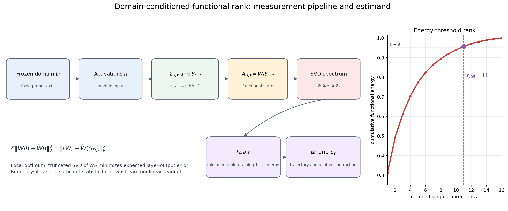

图右侧的累积能量曲线只用于解释阈值 rank 的定义，不是某个真实 checkpoint 的谱。左侧等式给出
$WS$ 的第一性含义：在固定域、checkpoint 和模块的线性二阶模型中，截断 $WS$ 等价于最小化期望
本层输出误差；底部边界同时强调，它并不因此成为最终行为的充分统计量。

### 2.2.2 理论判断如何由对照产生

当前最严格的证据链是：

1. OPD、SFT、off-KD、seqKD 的 $\mathbf R$ 可分辨；
2. OPD 与 off-KD 使用相同 forward-KL，因而二者差异定位到 current-self
   sequence-support bundle，而不是 KL/CE 标签差异；
3. Llama OPD–frozenSelf0-KD 进一步只把 current rollout refresh 换成永久冻结的 step0
   student rollout；其余 prompt pool、teacher KL、LoRA 与优化器保持一致；
4. Qwen $\alpha=.5$ 改变 current-self exposure 后，轨迹多数坐标沿 off-KD→OPD 方向有序移动，
   但不构成精确一维插值；
5. off-KD/seqKD 用于检查“相同 support、不同 target”以及界定单一 rank 轨迹的解释边界。

因此论文讨论的是 **on-policy exposure 如何组织功能轨迹**，不是把 soft/hard label 当作主问题。
frozenSelf0-KD 识别的是 current-refresh bundle 的总效应；长度、EOS、重复和风格可以是其作用通路，
不能据此宣称已经单独识别抽象 freshness。

结果直达：[§6.2 派生结果](#62-对应-22on-policy-exposure-与四臂功能轨迹) ·
[双模型 matched 轨迹图](#双模型-matched-四核心域轨迹图) ·
[Qwen matched 四核心原始表](#b1k-d10d105d11数值对齐output-link-与权重基线) ·
[Llama 四臂原始表](#b1h-llama-32-3b-四臂至-step320-的完整交接表) ·
[$\alpha=.5$ 原始表](#b1g-qwen-alpha-05-的完整-epsilon-敏感性) ·
[frozenSelf0-KD 原始表](#b1i-llama-frozenself0-kdcurrent-refresh-的完整直接对照)

## 2.3 主要发现二：OPD 的跨模型早期压缩支配【STRONG_DESCRIPTIVE】

**本节符号与下标**

| 符号/下标 | 含义 |
|---|---|
| $m$ | 模型家族；本文为 Qwen 或 Llama |
| $D$ | 一个冻结 probe/domain |
| $t$ | checkpoint；本节正式共同窗口为 20、40、80 |
| $\varepsilon$ | 功能秩允许丢弃的尾部能量比例；headline 为 $.05$ |
| $a$、$b$ | 任意训练臂；$b$ 在 dominance 公式中专指一条离线比较臂 |
| $\mathcal O$ | 离线臂集合 $\{\mathrm{SFT},\mathrm{offKD},\mathrm{seqKD}\}$ |
| $\Delta r^{(5)}_{\varepsilon,m,a,D,t}$ | 训练臂 $a$ 在该 cell 相对 step0 的 non-QK 五模块平均功能秩变化；越负表示压缩越深 |
| $M_{m,D,t}$ | OPD 相对“最接近它的离线臂”的压缩边际 |
| $\mathcal D$、$|\mathcal D|$ | 纳入 NCD 的 probe 集合及其个数；headline 为四核心域 |
| $T$ | NCD 的共同终止 horizon；本文固定为 320 |
| $\tau=\log(1+t)$ | 用于积分的对数训练时间 |
| $[z]_+=\max(z,0)$ | 只保留正部分；NCD 中因此只累计基线以下的压缩 |
| $\operatorname{NCD}_{m,a}(T)$ | 训练臂 $a$ 在 $0$ 到 $T$ 间的平均负压缩面积 |

这一理论不要求两模型共享“正峰—负过冲—回弹”形状，而比较每个 cell 中 OPD 相对所有离线臂的
**排序边际**。令离线集合
$\mathcal O=\{\mathrm{SFT},\mathrm{offKD},\mathrm{seqKD}\}$，定义

$$
M_{m,D,t}
=\min_{b\in\mathcal O}\Delta r^{(5)}_{\varepsilon,m,b,D,t}
-\Delta r^{(5)}_{\varepsilon,m,\mathrm{OPD},D,t}.
$$

$M_{m,D,t}>0$ 表示 OPD 比该 cell 中每一条离线臂都更压缩；$M=0$ 是并列；$M<0$ 表示至少一条
离线臂更深。冻结的共同检验窗口是 $t\in\{20,40,80\}$，核心域为
$E_{\mathrm{general}}/E_{\mathrm{mathHeld}}/E_{\mathrm{mmluPro}}/E_{\mathrm{ifeval}}$。
在 headline $\varepsilon=.05$ 下报告24/24；将四个 $\varepsilon$ 合并时报告95/96。每个
model×domain×checkpoint×$\varepsilon$ cell 只记一次排序，不是独立训练重复。

为避免只靠三个 checkpoint 的符号，另定义共同 horizon $T=320$ 的负压缩剂量：

$$
\operatorname{NCD}_{m,a}(T)
=\frac1{|\mathcal D|}\sum_{D\in\mathcal D}
\int_{0}^{\log(1+T)}
\left[-\Delta r^{(5)}_{\varepsilon,m,a,D}(\tau)\right]_+\,d\tau .
$$

其中 $\tau=\log(1+t)$，离散 checkpoint 间采用分段线性插值。NCD 是“压缩深度×持续时间”的轨迹
面积，单位为 direction×log-step；它不是新 rank，也不是行为损伤面积。

该排序还必须经受三类构念稳健性：

1. **阈值稳健性：**在
   $\varepsilon\in\{.01,.025,.05,.10\}$ 上重复 $r_\varepsilon$；
2. **连续谱稳健性：**用 $r_{\mathrm{stable}}$ 与 $r_{\mathrm{ent}}$ 的 base-relative
   contraction 替代离散 threshold rank；
3. **均值与模块稳健性：**改用 centered covariance，并分别统计七个 projection 模块中的严格胜出、
   并列和离线胜出。

双模型 equal-5 正式共同网格为 2 models×3 checkpoints（20/40/80）×4 probes×4
$\varepsilon$，共96格：Llama 48/48、Qwen 47/48，合并95/96；在 $\varepsilon=.05$ 时两模型
均为12/12，合并24/24。唯一反例是
Qwen $E_{\mathrm{ifeval}}@20,\varepsilon=.10$，连续 margin 为−.8 direction。Llama 的完整谱和
centered 审计继续提供构念稳健性：不依赖 $\varepsilon$ 的 stable rank 与 entropy rank 在12个
唯一 checkpoint×probe cells 上均为12/12；centered 与 uncentered 的 deepest-arm 身份在48个
checkpoint×probe×$\varepsilon$ 单元中一致；centered 非 q/k 五模块为严格238/240、并列2/240，
而 centered q/k 明显异质。因而当前理论是“OPD 相对离线臂的压缩支配排序在 non-QK equal-5、
阈值和 Llama 连续谱/centered 审计上稳健”，不是“每一个 attention projection 都遵循同一定律”，
更不表示 value/output/MLP 承担了绝大多数压缩量。

结果直达：[§6.3 dominance margin 与 NCD](#63-对应-23跨模型-opd-早期压缩支配) ·
[双模型 matched 轨迹图](#双模型-matched-四核心域轨迹图) ·
[附录 B.10 equal-5 完整 cell 审计](#b10-fat-r1-v2-与-equal-5-区域输出闭环) ·
[附录 B.8 equal-7 敏感性](#b8-opd-早期跨域压缩支配与-ncd-的完整审计) ·
[附录 B.9 reviewer-robustness 完整结果](#b9-reviewer-robustness-formal) ·
[Qwen 四核心逐 checkpoint 表](#b1k-d10d105d11数值对齐output-link-与权重基线)

## 2.4 主要发现三：相对压缩追踪输出分布 departure【STRONG_DESCRIPTIVE】

**本节符号与下标**

| 符号/下标 | 含义 |
|---|---|
| $\varepsilon,D,a,t,j$ | 尾部能量阈值、probe domain、训练臂、checkpoint、线性模块 |
| 省略的 $m,\ell$ | 本节在每个模型的 headline 层分别计算，故公式中不重复写模型和层下标 |
| $r_{\varepsilon,D,a,t,j}$ | 当前 cell 的功能秩；它是 $WS$ 需要保留的方向数 |
| $c_{\varepsilon,D,a,t,j}$ | 模块 $j$ 相对自身 step0 的功能压缩比例 |
| $c^{(5)}_{\varepsilon,D,a,t}$ | v/o/gate/up/down 分别归一化后再等权平均；后文简写为 $c$ |
| $Z$ | FAT token 区域；MMLU 为 $P/F/A/T$，MATH 为 $P/C/B/T$ |
| $Y_{D,a,t,Z}$ | 同一 state 和区域的一种输出量：KL、signed NLL、absolute NLL 或区域 contrast |
| $n$ | 相关分析中的一行，即一个具体的 domain×checkpoint cell |
| $\operatorname{Rnk}_{\mathrm{avg}}(z_n)$ | 将数值 $z_n$ 替换为其从小到大的次序；并列值使用平均次序 |
| $\rho_s(c,Y)$ | $c$ 与 $Y$ 的 Spearman 秩相关 |
| $\overline c_{m,D,t},\overline Y_{m,D,t}$ | 固定 model×domain×checkpoint 时，对四条训练臂取均值 |
| $\widetilde c,\widetilde Y$ | 减去上述同期均值后的量 |
| $C$、$C_{\mathrm{matched}}$ | 使用完整 checkpoint 的 $c^{(5)}$ 单特征模型，以及与 $p_k$ 严格同状态的版本 |
| $P_k$ | 同一五模块、同 deployed merged-delta 上的 $p_4/p_8/p_{16}/p_{32}$ |

先在每个模块内计算相对自身基线的压缩比例，再 equal-5：

$$
c_{\varepsilon,D,a,t,j}
=\frac{r_{\varepsilon,D,a,0,j}-r_{\varepsilon,D,a,t,j}}
{r_{\varepsilon,D,a,0,j}},
\qquad
c^{(5)}_{\varepsilon,D,a,t}
=\frac15\sum_{j\in\mathcal M_5}c_{\varepsilon,D,a,t,j}.
$$

FAT 主分析把 $E_{\mathrm{mmluPro}}$ 对齐 MMLU-Pro 区域输出，把
$E_{\mathrm{mathHeld}}$ 对齐 MATH500 区域输出。它们是 **domain-matched，不是 item-matched**：
几何 probe 与输出 benchmark 共享任务域，但不要求逐题相同。step0 因 $c$ 与所有 departure 均为
结构性零而排除。状态覆盖为：

| 模型×域 | 非零 checkpoint | 四臂状态数 |
|---|---:|---:|
| Llama×MMLU | 6 | 24 |
| Llama×MATH | 6 | 24 |
| Qwen×MMLU | 9 | 36 |
| Qwen×MATH | 9 | 36 |
| 合并 coverage | — | **120/120** |

第一层统计是每个 model×domain×arm 内的逐 checkpoint Spearman：

$$
\rho_s(c,Y_Z)
=\operatorname{Corr}\!\left(
\operatorname{Rnk}_{\mathrm{avg}}(c_{\varepsilon,D,a,t}),
\operatorname{Rnk}_{\mathrm{avg}}(Y_{D,a,t,Z})
\right),
$$

其中 MMLU 的主要无符号 $Y_Z$ 为
$\mathrm{KL}_{F/A/T}$ 与 $\mathrm{KL}_{F}-\mathrm{KL}_{A}$，MATH 为
$\mathrm{KL}_{B/T}$；signed/absolute NLL 和 §1.4 的全部区域 contrast 同时完整保存。它回答
“同一条训练轨迹上，压缩比例越大的 checkpoint，区域输出 departure 是否也倾向越大”，不假设
线性斜率或相同物理单位。

后补 Math-$C$ 审计把 MATH 的 $Y_Z$ 扩展到 $\mathrm{KL}_C$ 与
$\mathrm{KL}_{B-C}=\mathrm{KL}_B-\mathrm{KL}_C$，沿用同一 Spearman 与 checkpoint-demeaning
公式；但它不改变本节冻结的正文 target family、48条主序列和12个区域-KL grouped targets。

这里“取 rank”只是**将观测值转换为排序位置**。例如三个 cell 的
$c=[.02,.08,.05]$ 会转换成次序 $[1,3,2]$；如果对应 KL 的次序也是 $[1,3,2]$，Spearman
就是 1，即使两者数值尺度完全不同。这样做有四个目的：

1. 检验我们真正主张的**单调关系**：压缩更多的 cell 是否通常也有更大的输出 departure；
2. 避免把 $c_\varepsilon$ 的无量纲比例与 KL/NLL 的数值单位强行拟合成线性比例；
3. 对非线性但单调的关系，以及少数极端幅值，比 Pearson 更稳健；
4. 允许不同 domain 的量级不同，只比较它们在同一冻结分析网格中的相对顺序。

代价是 Spearman 会丢掉幅值间距：`.02→.05` 与 `.05→.50` 在没有 ties 时都只贡献一个次序变化。
因此本文同时报告 held-out $R^2$/MAE、checkpoint-demeaned 相关和原始散点，而不把高 Spearman
解释成固定比例定律。

> **不要混淆两个 rank。** $r_\varepsilon$ 中的 rank 是功能矩阵保留的奇异方向数，是本文的
> 几何状态量；$\operatorname{Rnk}_{\mathrm{avg}}$ 是 Spearman 计算中的样本排序编号，只是统计
> 变换，不代表模型又被截断或重新计算了一次功能秩。

为区分训练时钟与同一时刻的横向信息，第二层做四臂 checkpoint-demeaning。对每个
model×domain×checkpoint，在四条臂内分别从 $c$ 和 $Y_Z$ 中减去同期均值，再 pooled 计算
Spearman：

$$
\widetilde c_{m,a,D,t}=c_{m,a,D,t}-\overline c_{m,D,t},\qquad
\widetilde Y_{m,a,D,t,Z}=Y_{m,a,D,t,Z}-\overline Y_{m,D,t,Z}.
$$

这里删除的是“在同一模型、同一域、同一 checkpoint 四臂共有的水平”，直接问同训练进度下
臂间压缩差是否对应区域输出差。它是辅助 difference-in-differences 风格诊断，不替代完整逐轨迹
关系，也不等同于在每条轨迹内 residualize `log1p(step)`。

第三层使用 leave-one-checkpoint-group-out 的严格样本外模型。所有同 checkpoint 四臂必须在同一
外层 fold；标准化只拟合训练 fold，ridge $\alpha$ 只在训练 checkpoints 内层选择。特征块为：

- `C-only`：完整 checkpoint 上的 $c_\varepsilon^{(5)}$，负责回答本指标自身能做什么；
- `C-only-matched`：只保留 $p_k^{(5)}$ 也存在的 checkpoint，负责公平横向比较；
- `Pk(k)-only`：每个固定 $k\in\{4,8,16,32\}$；
- `PkAll-only`：联合四个 $p_k^{(5)}$；
- `M0`：arm one-hot+$\log(1+t)$；再分别加入 $C$、$P_k$ 或二者。

Qwen 的 $p_k$ 原始表缺 step10，因此完整 `C-only` 每域使用36状态，而公平
`C-only-matched` 与所有 $p_k$ 每域使用32状态；Llama 两者均为24状态。没有插值、倒填或
adapter-$BA$ 替代。整个比较覆盖48个 model×domain×target 单元：MMLU 每模型13个 targets，
MATH 每模型11个 targets。证据顺序固定为 `C-only` 自身、matched $C$–$p_k$、最后才是
`beyond-p_k`，不把“帮助别人的指标”写成本文卖点。

旧 D10.5 整段 $R$-stream cumulative KL/NLL 仍然有效；RR5/QRAW 现已形成双模型各64-cell
raw-activation common grid，用于说明 equal-5 不是 FAT 特定构造以及 $WS$ 不是 raw activation spectrum 的改名；
但区域 FAT 是当前更接近“格式—答案—终止”问题的主输出闭环。

结果直达：[§6.4 完整相关矩阵](#64-对应-24相对压缩与无符号-output-departure) ·
[§6.1 严格 matched 公平比较](#61-对应-21功能状态是否增加了纯权重和纯激活之外的信息) ·
[附录 B.10 FAT/equal-5 完整登记](#b10-fat-r1-v2-与-equal-5-区域输出闭环) ·
[FAT/equal-5 正式 handoff](../local_experiment_results/cycle_09_aaai_competitiveness_completion/run_01/mini/fat_outlink_round1_v2_link_equal5/fat_r1_v2_equal5_handoff.md)

## 2.5 signed readout alignment 是模型依赖分支，而非跨模型定律【CONFIRMED BOUNDARY】

**本节符号与下标**

| 符号/下标 | 含义 |
|---|---|
| $m,a,D,Z$ | 模型、训练臂、probe domain 与 FAT token 区域；统计在每个模型内完成 |
| $n$ | 固定 model×domain×arm 后的一行 checkpoint 观测 |
| $t_n$ | 第 $n$ 行对应的 checkpoint |
| $c_n$ | 第 $n$ 行的 non-QK 相对压缩 $c_\varepsilon^{(5)}$ |
| $N_{n,Z}^\pm$ | 第 $n$ 行区域 $Z$ 的 signed NLL；正值表示该 gold-token 区域 likelihood 净恶化 |
| $N_{F-A}^\pm$ | MMLU 的 $\Delta\mathrm{NLL}_F-\Delta\mathrm{NLL}_A$；正值表示格式区域相对答案区域恶化更多 |
| $N_{B-C}^\pm$ | MATH 的 $\Delta\mathrm{NLL}_B-\Delta\mathrm{NLL}_C$；正值表示 boxed final answer 相对 CoT 恶化更多 |
| $G_{\mathrm{fmt}}$ | MMLU flexible accuracy−strict accuracy；序列级格式实现缺口 |
| $E_{\mathrm{fail}}$ | strict extractor failure rate |
| $\alpha_c,\alpha_N$ | 分别拟合 $c$ 和 signed NLL 的截距 |
| $\beta_c,\beta_N$ | 二者随 $\log(1+t)$ 变化的训练进度斜率 |
| $e_n^c,e_n^N$ | 去除各自训练进度拟合后的残差 |
| $I_{\mathrm{OPD}}$ | OPD 指示变量；OPD cell 为 1，其他训练臂为 0 |
| $\gamma_D$ | domain 固定效应；吸收不同 probe 的平均水平差异 |
| $\eta$ | 交互回归未解释的剩余项 |
| $\beta_3$ | OPD 的 $c$–signed-NLL 斜率相对离线臂多出的部分 |

FAT 使 signed readout 从一个整段平均值分解成格式、答案/boxed span、CoT 与 termination。主统计
仍然是原始逐 checkpoint 关系以及同 checkpoint 四臂去均值关系；它们分别回答“压缩和读出是否
共同演化”与“训练进度相同时臂间差是否对齐”。另外保留旧 D10.5 的 progress-residual：

$$
c_n=\alpha_c+\beta_c\log(1+t_n)+e^c_n,\qquad
N_{n,Z}^\pm=\alpha_N+\beta_N\log(1+t_n)+e^N_n,
$$

并报告 $\rho_s(e^c,e^N)$。但该量现在明确标记为 `diagnostic_only`：如果真实路径包含
$t\rightarrow c_\varepsilon\rightarrow N_Z$，先回归掉 step 会一并删除部分目标信号。因此它只问
“超出线性训练时钟后是否仍有额外共变”，不能反过来否定 raw compression–readout 关系。

旧整段 $R$-stream 还在每个模型的全部四臂四域 cell 上拟合直接交互：

$$
N^\pm
=\beta_0+\beta_1c+\beta_2I_{\mathrm{OPD}}
+\beta_3(c\times I_{\mathrm{OPD}})
+\beta_4\log(1+t)+\gamma_D+\eta.
$$

$\gamma_D$ 是域固定效应；$\beta_3$ 比较 OPD 与离线臂的压缩—signed-readout 斜率差。置信区间按
checkpoint 分组 bootstrap（256 draws），而不是把每个 probe cell 当独立重复。正的
$\beta_3$ 只表示 OPD 斜率相对更正，不等于“只有 OPD 的臂内相关为正”。

预注册分叉仍是：

- **A：跨模型 OPD-specific。** 两模型 OPD 的 raw、progress-residual 与交互均稳定，而离线臂弱；
- **B：跨模型共有。** OPD 与离线臂均有相近 signed alignment；
- **C：模型依赖边界。** 两模型的臂内结构不一致，不能维护统一 OPD-only 定律。

现有结果选择 C，而且 FAT 给出更具体的原因。MMLU 的
$\rho_s(N_{F-A}^\pm,G_{\mathrm{fmt}})$ 在 Qwen off-KD/seqKD/SFT 为
.717/.717/.667，却在 Qwen OPD 为−.217；Llama seqKD 为.829，OPD 为−.543，off-KD/SFT 近零。
$c_\varepsilon^{(5)}$ 与 format gap 在 Qwen off-KD/seqKD/SFT 为.867/.867/.883，但 Qwen OPD
仅.450、Llama OPD 为−.771。也就是说，区域压缩/输出移动与序列级格式失败之间不存在跨模型、
跨 objective 的固定符号映射。

KL/absolute NLL 是无符号 departure；signed NLL 和 $F-A/B-C$ 还取决于变化落在格式、答案、
termination 的哪个方向；strict/flexible 又需要完整自由生成序列实现这些局部倾向。因此
“功能压缩幅度”“局部读出效价”和“序列级行为实现”是三层互补对象，不能写成压缩必然导致能力
下降，也不能把 Qwen 的 flexible−strict gap 直接归因于单一 $F-A$ 指标。

结果直达：[§6.5 分支判定表](#65-对应-25signed-readout-的预注册分支) ·
[附录 B.10 FAT 区域与行为连接表](#b10-fat-r1-v2-与-equal-5-区域输出闭环) ·
[D10.5 grouped/residual 原始入口](#b1k-d10d105d11数值对齐output-link-与权重基线)

## 2.6 必要边界：support–readout separation【CONFIRMED AS A BOUNDARY】

**本节符号与下标**

| 符号/下标 | 含义 |
|---|---|
| $k_{\mathrm{teacher}}$ | off-KD 保留的 teacher 分布 top-$k$；当前实现为 32，与 rank-$k$ 近似中的 $k$ 无关 |
| $\mathbf z_{\mathrm{off}}$ | 将 off-KD 的匹配 probe×checkpoint $\Delta r_\varepsilon^{(5)}$ 按固定顺序串接后的向量 |
| $\mathbf z_{\mathrm{seq}}$ | seqKD 以完全相同 cell 顺序构造的向量 |
| $n$、$N$ | 串接向量中的一个匹配 cell，以及匹配 cell 总数 |
| $z_{\mathrm{off},n},z_{\mathrm{seq},n}$ | 第 $n$ 个匹配 cell 的 off-KD/seqKD 功能秩变化 |
| Pearson | 两条向量的线性同动程度；对整体平移和正比例缩放不敏感 |
| MAE | 两条向量逐 cell 的平均绝对差，保留 direction 单位 |

这一边界由 matched-teacher 配对产生。off-KD 与 seqKD 使用相同 teacher-generated sequence
support、样本顺序、训练步数和 LoRA 配置；off-KD 使用 teacher
top-$k_{\mathrm{teacher}}$ dense distribution 的 KL，
seqKD 使用同一文本的 hard next-token CE。先把每个 arm 的所有匹配
`probe×nonzero-checkpoint` $\Delta r_\varepsilon^{(5)}$ 按同一顺序串成向量
$\mathbf z_{\mathrm{off}}$、$\mathbf z_{\mathrm{seq}}$，计算

$$
\operatorname{Pearson}(\mathbf z_{\mathrm{off}},\mathbf z_{\mathrm{seq}}),
\qquad
\operatorname{MAE}
=\frac1N\sum_{n=1}^N|z_{\mathrm{off},n}-z_{\mathrm{seq},n}|.
$$

Pearson 回答两条轨迹是否同动；MAE 回答它们在 direction 单位上是否数值接近。高相关本身不能
替代低 MAE。随后在同一 checkpoint 比较 MATH accuracy/cap-hit/长度、MMLU-Pro
strict/flexible/extract-failure 与 IFEval strict readout，由此形成两种可能分叉：

- **几何相近、行为也相近：**rank path 在该模型/任务上足以概括较多共同变化；
- **几何相近、行为分叉：**相同 support 可组织近似 rank path，但 target distribution 仍改变
  EOS、格式或任务读出；rank 标量不是行为的充分统计量。

正式四核心 equal-5 轨迹中，Qwen off-KD/seqKD 的 Pearson=.995、MAE=2.067 directions；
Llama 为 Pearson=.944、MAE=2.225 directions。Qwen 明确出现第二种分叉；Llama 复现几何接近，
但没有复现同等幅度的终止分叉。因此本文只维护
“存在性边界”，不把 objective 的行为效应外推为跨模型固定大小。该边界不否定
$r_\varepsilon/c_\varepsilon$ 对训练范式、功能压缩和 output departure 的解释价值，只否定
“单一 rank 指标端到端解释所有行为”。

结果直达：[§6.6 几何—行为分叉表](#66-对应-26supportreadout-的具体分叉) ·
[Qwen 完整行为原始表](#b1c-qwen-四臂完整行为轨迹) ·
[Llama 完整轨迹与行为](#b1h-llama-32-3b-四臂至-step320-的完整交接表)

## 2.7 仍有效的次级结果【SUPPORTING】

**本节符号与下标**

| 符号/下标 | 含义 |
|---|---|
| $V^{(3)}$ | 最近三个 landmark 区间内 $\Delta r_\varepsilon$ 双向变化绝对值之和；上标 3 是窗口数 |
| $D_{\mathrm{mathCoTtrain}}$ | 实际用于训练的固定 Math-CoT reference 样本 |
| $D_{\mathrm{mathCoThold}}$ | 与训练集同分布、但未进入训练的固定 Math-CoT 样本 |
| $E_{\mathrm{numina}}$ | Numina 固定外部 probe；这里是几何输入域，不是 accuracy |
| `@624`、L12–17 | 指定 checkpoint 624，以及被干预的层号 12 到 17 |

1. 最近三个 landmark 区间的功能总变差 $V^{(3)}$ 与部分严格 IFEval/MMLU 行为 drawdown 跨模型同向，
   但 Math、逐臂 DiD 和不同模型斜率不统一；它是弱风险指标，不是主理论。
2. Qwen off-KD@624 的 L12–17 adapter zeroing 明显改善 strict format failure，而 flexible 与数学
   accuracy 近似不变；这是模型特定的局部干预证据，不证明存在统一格式模块。
3. Qwen OPD 的 MMLU 答案位异常主要表现为概率质量逸出合法选项 token，而不是只在合法选项间增加
   犹豫；它支持读出通道分析，不测量知识量。
4. Qwen 与 Llama 可以通过不同时间形态实现同一 OPD 压缩支配。具体正峰、局部恢复或持续压缩只
   属于模型特定轨迹描述，不列为理论条目。
5. Qwen 的 $D_{\mathrm{mathCoTtrain}}$ 与同分布未训练
   $D_{\mathrm{mathCoThold}}$ 在 4 臂×4 checkpoint 上高度锁定
   （Pearson=.994、Spearman=.977、MAE=.813 directions），说明主要几何信号是分布级而非逐样本记忆。
6. $E_{\mathrm{numina}}$ 给出重要 horizon 边界：OPD 在 step40 最深，但 step160/624 被 off-KD 或
   seqKD 超过。因此本文主张 early/common-window on-policy regime，不主张 OPD 终态在所有数学域最深。
7. teacher top-32 retained-mass 审计表明平均截断误差很小：Qwen off-KD、Llama off-KD 与
   Llama frozenSelf0-KD 的 token-weighted retained mass 分别为 .999987、.999212、.998134。
   这支持 top-32 在平均意义上高保真，但 frozenSelf 的稀有低质量尾部仍存在，不能把 top-32
   当作精确 full-vocabulary KL。
8. Llama OPD–frozenSelf0-KD 的 500 道 MATH500 配对 readout bootstrap 显示长度、EOS、截断、
   重复率和 boxed 方向会随 checkpoint 翻转；不存在一个跨 checkpoint 稳定的单一行为中介。
   这些是训练完成后的自由生成 readout，不是训练 rollout mediation。

结果直达：[§6.7 次级派生结果与底层路由](#67-对应-27有效但不升级为主理论的结果)

---

# 三、相关工作与本文理论的关系

## 3.1 理论来源链

本文的思想链不是“已有指标拼盘”，而是逐步收紧观察对象：

$$
\text{参数更新在哪里/多集中}
\rightarrow
\text{哪些输入方向被实际访问}
\rightarrow
\text{这些方向经权重后产生多少本层输出能量}
\rightarrow
\text{域条件低秩功能状态如何随后训练演化}.
$$

SVD-LLM 提供关键方法血缘：激活二阶矩定义的白化空间使局部权重截断对应域条件输出误差。本文不再
执行静态模型压缩，而是将同一空间用于 checkpoint-wise 状态测量，定义
$r_\varepsilon(W_tS_{D,t})$ 与 $c_\varepsilon$。

## 3.2 相关工作构念地图

| 文献/构念 | 原生问题 | 与本文的关系 |
|---|---|---|
| SVD-LLM / activation-aware SVD | 如何最小化静态层输出重建误差 | 提供 $WS_D$ 的方法血缘；本文扩展到动态后训练状态 |
| Dense Supervision, Sparse Updates | OPD 更新尺度、稀疏性、谱集中和 source-principal 位置 | 纯权重更新对照；不能看到域条件激活后的功能状态 |
| The Path Not Taken | principal-coordinate mask、主角度与权重谱漂移 | off-principal/坐标位置对照；D11 已补低秩与 spectrum-matched null |
| PABS/NSS、singular-vector OOD 工作 | 权重奇异子空间旋转与奇异值谱漂移 | 方向性一级对照；D11 在相同 checkpoint/cell 上实现 matched 版本 |
| OPD weight geometry | on-policy distillation 的参数几何 | 最直接的 OPD 近邻；本文增加 activation-conditioned functional geometry |
| raw ER、PR、CKA、anisotropy | hidden-state 表征是否塌缩或重组 | 纯激活对照；不知道权重如何使用这些方向 |
| OPD/GKD 与 on-policy forgetting | current policy support 为何影响训练与遗忘 | 提供机制背景，不替代本文的几何测量 |
| reasoning-SFT 与遗忘 | 知识、格式、终止和访问如何分离 | 支撑行为边界，不等同于功能秩理论 |

<a id="33-一级相关工作指标怎样计算"></a>

## 3.3 一级相关工作指标怎样计算

比较的第一步不是把不同曲线缩放到相同纵轴，而是明确每个指标的**观察对象**。下列权重指标统一
使用 deployed update

$$
\Delta W_{t,j}
=\operatorname{FP32}(W^{\mathrm{BF16}}_{t,j})
-\operatorname{FP32}(W^{\mathrm{BF16}}_{0,j}),
$$

即 serialized BF16 deployed merged checkpoint 减 serialized BF16 base；source SVD、投影和范数
至少以 FP32 计算。D11 广覆盖审计先逐模块计算再 equal-7；FAT 正式横向对照使用同一
v/o/gate/up/down non-QK equal-5，与当前 $c_\varepsilon^{(5)}$ 严格对齐。它们与使用当前
$W_tS_{D,t}$ 的 state-rank 不共享 estimand。

### 3.3.1 更新尺度与 activation-weighted update

纯权重更新能量为

$$
E_W(a,t)=\frac17\sum_j
\|\Delta W_{a,t,j}\|_F^2.
$$

它回答“部署后权重移动了多少”，不随 probe domain 改变。activation-weighted update 则为

$$
E_{WS}^{\mathrm{current}}(D,a,t)
=\frac17\sum_j
\|\Delta W_{a,t,j}S_{D,a,t,j}\|_F^2,
$$

并以 $S_{D,0,j}$ 替换 $S_{D,a,t,j}$ 得到 fixed-whitening 版本。它测量 update 在该域输入度量上的
局部输出移动能量；它仍不是 $r_\varepsilon(W_tS_{D,t})$，因为前者研究“更新多大”，后者研究
“当前功能状态需要多少方向”。

### 3.3.2 source-principal 联合投影 $p_k$

令 source 权重 $W_{0,j}=U_j\Sigma_jV_j^\top$，则严格联合投影为

$$
p_{k,j}
=\frac{\|U_{j,k}^\top\Delta W_{t,j}V_{j,k}\|_F^2}
{\|\Delta W_{t,j}\|_F^2},
\qquad k\in\{4,8,16,32\}.
$$

它测量更新能量有多少**同时**落入 source 的 top-$k$ 左、右奇异子空间。它是 arm×checkpoint
级纯权重量，在四个 domain 行中重复；不能把这种重复当作四个独立权重观测。left-only
$\|U_k^\top\Delta W\|_F^2/\|\Delta W\|_F^2$ 与 joint $p_k$ 不是同一指标。

### 3.3.3 TPNT principal-coordinate mask

TPNT-style coordinate 指标先做 source rank-$k$ 重建，再选其绝对值最大的 $\alpha$ 比例坐标：

$$
W_0^{(k)}=U_k\Sigma_kV_k^\top,\qquad
M_{\mathrm{princ}}=\operatorname{Top}_{\alpha}(|W_0^{(k)}|),
\qquad
M_\Delta=\mathbf1[\Delta W\ne0].
$$

$$
\operatorname{Coverage}_{k,\alpha}
=\frac{|M_{\mathrm{princ}}\cap M_\Delta|}{|M_\Delta|},
\qquad
\operatorname{OverlapLift}_{k,\alpha}
=\frac{\operatorname{Coverage}_{k,\alpha}}{\alpha}.
$$

`lift=1` 表示相对同密度随机坐标没有富集。正式 suite 还报告真实 lift 减低秩随机更新 null，以及
保留真实正奇异值、随机化子空间的 spectrum-matched null $z_{\mathrm{TPNT}}$。该量研究坐标 mask
重合，不等于 $p_k$ 的子空间能量。

### 3.3.4 PABS 与 NSS

对 source/checkpoint 的 top-$k$ 左、右奇异子空间，principal-angle cosine 为

$$
q_i^U=\sigma_i(U_{0,k}^\top U_{t,k}),\qquad
q_i^V=\sigma_i(V_{0,k}^\top V_{t,k}).
$$

本文冻结的 PABS scalar 是

$$
\operatorname{PABS}_k
=\frac12\left(\frac1k\sum_iq_i^U+\frac1k\sum_iq_i^V\right).
$$

越接近 1 表示 top-$k$ source/checkpoint 子空间越少旋转。与之配套的 NSS 使用两端 top-32
奇异值各自 sum-normalize 后的谱 $\widehat{\boldsymbol\sigma}_{0,32}$、
$\widehat{\boldsymbol\sigma}_{t,32}$：

$$
\operatorname{NSS}_{1,32}
=\|\widehat{\boldsymbol\sigma}_{t,32}
-\widehat{\boldsymbol\sigma}_{0,32}\|_1,
$$

并同时保存 L2 版本。这里报告的是本项目的冻结 matched implementation；附录 F 另说明相关论文的
原生定义与使用场景。

### 3.3.5 raw activation suite

对固定 probe 的 centered hidden-state covariance 特征值 $\lambda_i$，令
$q_i=\lambda_i/\sum_j\lambda_j$。纯激活铺开度包括

$$
\operatorname{ER}_{\mathrm{ent}}
=\exp\!\left(-\sum_iq_i\log q_i\right),\qquad
\operatorname{PR}
=\frac{(\sum_i\lambda_i)^2}{\sum_i\lambda_i^2},
$$

理论上若要消除 hidden width，可再除以特征维数 $d$；当前 RR5/QRAW 在每个模型内分别拟合，
hidden width 在该模型的 arm/checkpoint 间固定，不直接比较两模型 ER 的绝对幅值，因此使用上式
**未除以 $d$** 的原始 ER/PR。artifact 历史列名
`normalized_entropy_effective_rank` 中的 `normalized` 指特征值先归一化为 $q_i$，不表示最终
ER 再除以 hidden width；论文不得误写成 $r_{\rm ent}/d$。其余量为 top-1/8/32 variance share、
sample-mean pairwise cosine 的 raw/centered anisotropy，以及相对同 probe step0 的 linear CKA。
两组在样本维度中心化的 representation $X,Y$ 的线性 CKA 为

$$
\operatorname{CKA}(X,Y)
=\frac{\|X^\top Y\|_F^2}
{\|X^\top X\|_F\|Y^\top Y\|_F}.
$$

这些量只看激活谱或表示相似性；它们不知道当前权重怎样放大、压低或旋转这些输入方向。本文的
$r_\varepsilon(W_tS_{D,t})$ 正位于纯权重与纯激活之间：它以域激活定义输入度量，再测当前权重在
该度量下的功能能量谱。最新 exact-grid 对比中，$A$ 固定为上述八维 raw suite：
ER、PR、top-1/8/32 share、raw/centered anisotropy 与 step0 CKA；Qwen/Llama 都使用32个固定
probe samples、同一四臂×四 checkpoint×四 probe 网格。

结果直达：[§3.4 公平比较摘要](#34-已完成的公平比较与正确结论) ·
[§6.1 理论负责结果](#61-对应-21功能状态是否增加了纯权重和纯激活之外的信息) ·
[附录 B.11 双模型 raw-activation exact grid](#b11-qraw双模型-equal-5-raw-activation-严格共同网格) ·
[附录 B.1E 原始 native-space 表](#b1e-相关工作与-native-space-仪器完整表) ·
[附录 B.1K D11 完整表](#b1k-d10d105d11数值对齐output-link-与权重基线)

<a id="34-已完成的公平比较与正确结论"></a>

## 3.4 已完成的公平比较与正确结论

“本文比权重空间多表达什么”不能用不同量纲的曲线幅度回答。公平比较必须区分：

1. **Model-W：**raw update energy、source-principal $p_k$、PABS/NSS 等纯权重量；
2. **Model-C：**$c_\varepsilon$；
3. **Model-WS：**activation-weighted update energy；
4. **Model-WC/WSC：**检验 $c_\varepsilon$ 在已有特征之外的增量信息；
5. **raw activation suite：**ER、PR、top-share、anisotropy、CKA。

当前结果分成三个证据等级，不能再混成一张“最终优越性”表。

**第一层：FAT/equal-5 双模型严格 matched 输出比较。**它在 MMLU-Pro 与 MATH 两个域形成120个
功能—区域输出状态。`C-only` 使用全部状态；横向 $C$–$p_k$ 比较只使用112个双方同时存在的状态，
即 Qwen 排除缺失 $p_k$ 的四臂 step10，Llama 保留全部。两者均使用 v/o/gate/up/down、
module-first equal mean；$p_k$ 的更新构造统一为 deployed BF16 merged-minus-base。外层按
checkpoint group 留一，四臂同折，标准化和 ridge 选择均只看训练 checkpoints。

在48个 model×domain×target 单元中，严格 matched $C$ 相对每个 target 上最好的 scalar/block
$p_k$：

| 判断 | 全部48 targets | 区域 KL 12 targets |
|---|---:|---:|
| OOF $R^2$ 更好 | 29/48 | **10/12** |
| OOF MAE 更低 | 30/48 | **10/12** |
| prediction Spearman 更高 | 20/48 | **8/12** |

全部 target 的平均 OOF $R^2$ 为 $C=.435$、best-$p_k=.421$；中位数为 .470/.459。它不支持
“$C$ 全面击败 $p_k$”，但在最接近本文理论的区域 full-vocabulary KL 上给出稳定优势。
加入 $C$ 后，`M0+PkAll5` 的 OOF $R^2$ 在34/48 targets 提升；区域 KL 为10/12，平均增量
+.094。这只作为 non-redundancy 次级证据，不能覆盖 $C$ standalone。

**第二层：RR5/QRAW 双模型 exact-common-grid 的整段 $R$-stream/raw-activation 构念检验。**
每个模型都使用严格精确合并的64行：4 arms×4 checkpoints（5/20/40/160）×4 probes。八维
$A$、equal-5 $C_5$、equal-5 $P_{k,5}$ 与三个输出 target 在64/64状态上完整；外层按 checkpoint
留一，标准化和正则选择只看 outer-train checkpoints。Qwen 新 forward 得到64行 raw suite，
512/512特征有限，没有插值、nearest matching 或 probe substitution。equal-7 只作历史 paired
sensitivity，不再进入跨模型正式表。

**第三层：D11 双模型广覆盖构念审计。**它使用相同的 192 个
model×arm×checkpoint×probe cells，并将两模型 strict $p_k$ 统一为 serialized BF16 deployed
merged checkpoint 减 base。旧模型使用固定的极弱正则，因此只保留为广覆盖 parity/descriptive
track。它显示 strict $p_k$ 是强基线，$C$ 对 raw update/TPNT 有明显补充，而
$p_k+C$ 的 pooled 改善较小且由 Llama 驱动。这里的 $W$、$p_k$、TPNT 是 arm×checkpoint 级特征，
在四个 domain 行上重复；192行是同 cell 网格，不是192次独立训练。

Llama RR5 equal-5 的样本外结果为：

| target | raw activation $A$ | $C_5=c_\varepsilon^{(5)}$ | $P_{k,5}$ | $A+C_5$ | $P_{k,5}+C_5$ | $P_{k,5}+A+C_5$ |
|---|---:|---:|---:|---:|---:|---:|
| cumulative KL $R^2$ | .104 | **.720** | −.349 | **.722** | .433 | .343 |
| absolute NLL $R^2$ | .181 | **.738** | .436 | .651 | .728 | .706 |
| signed NLL $R^2$ | .022 | **.541** | −.364 | .373 | −.008 | .154 |
| OPD AUC | .556 | .743 | .688 | **.751** | .724 | .714 |

因此最准确的功能分工是：

1. 两模型三个输出 target 的 OOF $R^2$ 与 OPD AUC 共8个比较中，$C_5$ 对 raw activation $A$
   为8/8胜；相对 $P_{k,5}$ 为7/8胜，唯一反例是 Qwen absolute NLL（.247 对 .261）；
2. raw activation suite 单独通常很弱；把 $A$ 加到 $C_5$ 后，Llama/Qwen cumulative-KL
   $R^2$ 分别变化+.003/−.269，absolute NLL 为−.087/−.214，只有 Qwen signed NLL 有+.050，
   因而 $WS$ 组合不是 raw activation spectrum 的改名，也不是“更多特征自然获胜”；
3. equal-5 的 OPD AUC 在 Llama/Qwen 分别为 .743/.708，均高于 $A$ 的 .556/.595 和
   $P_{k,5}$ 的 .688/.521；但 Qwen $C_5$ log-loss=1.305、balanced accuracy=.521，说明排序
   判别力不等于概率校准或固定阈值分类全面更好；
4. Llama equal-7 的旧 .725/.846/.350 与 OPD AUC=.672 只作 paired aggregation sensitivity，
   不得重新标成 equal-5；QRAW 修正后的跨模型表直接读取 `EQUAL5_nested_metrics.csv`；
5. FAT 的区域 signed 结果仍然模型/训练臂依赖，不能用 RR5 的单一整段 signed $R^2$ 推导统一
   读出规律；
6. 每模型只有4个 checkpoint groups，step5 的目标方差极小，逐 fold $R^2$ 会出现极端负值；正式解释
   同时看 pooled OOF $R^2$、MAE、Spearman 与逐 fold 表，不把它写成普适预测定律。

TPNT principal-mask overlap 的均值与随机低秩 null 近乎相同。更严格的 E7 spectrum-matched
random-subspace null（每格10 seeds）给出 real/null mean=.749852/.747134，平均
$z_{\mathrm{TPNT}}=.712$，但 cell mean 范围为 −2.228 到 3.002；这表示存在局部高于 null 的单元，
却没有跨模型、训练臂和 checkpoint 稳定的 OPD 特异结构。E5/E6 又显示 overlap 的绝对值随层、
source rank 和 mask density 明显变化，而 PABS joint cosine 仍约 .9996、NSS 极小。这是当前
LoRA/deployed-BF16 设置中的边界，不能外推为对 TPNT 全参 RLVR 结论的否定。完整文献、公式和
原生指标见附录 F。

结果直达：[§6.1 构念与公平增量表](#61-对应-21功能状态是否增加了纯权重和纯激活之外的信息) ·
[附录 B.10 equal-5/FAT strict matched](#b10-fat-r1-v2-与-equal-5-区域输出闭环) ·
[附录 B.11 QRAW 双模型 raw-activation exact grid](#b11-qraw双模型-equal-5-raw-activation-严格共同网格) ·
[附录 B.9 旧 RR5/equal-7 敏感性](#b9-reviewer-robustness-formal) ·
[附录 B.1E raw representation/native-space 原始表](#b1e-相关工作与-native-space-仪器完整表) ·
[附录 B.1K D11 同 cell 完整表](#b1k-d10d105d11数值对齐output-link-与权重基线) ·
[附录 F 完整文献与原生指标](#附录-f完整-related-work原生指标与本文对照地图)

---

# 四、理论所需的实验与当前状态

## 4.1 claim–experiment matrix

| 理论主张 | 必需实验/检验 | 当前状态 | 结果槽位 |
|---|---|---|---|
| $WS_D$ 具有最优局部输出近似意义 | 能量恒等式、Eckart–Young–Mirsky、尺度/坐标性质 | `CONFIRMED` | [§6.1](#61-对应-21功能状态是否增加了纯权重和纯激活之外的信息) / 附录 A |
| on-policy exposure 改变轨迹 | 四臂、OPD–offKD、$\alpha=.5$、OPD–frozenSelf0-KD | `STRONG_DESCRIPTIVE`；全部单轨迹 | [§6.2](#62-对应-22on-policy-exposure-与四臂功能轨迹) |
| OPD 跨模型早期压缩支配 | Qwen/Llama non-QK equal-5 共同窗口、固定 NCD、Llama 连续谱/centered/module audit | $\varepsilon=.05$ 为24/24；四阈值95/96；`STRONG_DESCRIPTIVE` | [§6.3](#63-对应-23跨模型-opd-早期压缩支配) |
| current refresh bundle 的作用 | Llama OPD–frozenSelf0-KD 同 KL/同学生生成者 | 29/30，外部 probes 25/25 | [§6.2](#62-对应-22on-policy-exposure-与四臂功能轨迹) |
| $c_\varepsilon$ 追踪 output departure | 双模型四臂 equal-5 与 FAT 区域 KL/NLL | 120/120 states；区域 KL 臂内48关系中位 $\rho=.943$ | [§6.4](#64-对应-24相对压缩与无符号-output-departure) |
| OPD 特异 signed-readout 对齐 | FAT $F/A/T$、$C/B/T$、同-step四臂、旧 progress residual/交互 | 跨模型命题被否定；区域/模型依赖边界成立 | [§6.5](#65-对应-25signed-readout-的预注册分支) |
| 相较权重/激活空间有增量信息 | 双模型 equal-5 $A/C_5/P_{k,5}$ exact grid、FAT strict $p_k$、TPNT/PABS/NSS | 双模型 $C_5>A$ 为8/8、$C_5>P_{k,5}$ 为7/8；FAT 区域 KL $R^2$/MAE 10/12胜 | [§6.1](#61-对应-21功能状态是否增加了纯权重和纯激活之外的信息) |
| support–readout separation | off-KD/seqKD matched-support 几何与行为 | `CONFIRMED AS BOUNDARY` | [§6.6](#66-对应-26supportreadout-的具体分叉) |
| 分布级而非训练样本泄漏 | Math-CoT train/hold probe 与 held-out behavior | M6 完成 | [§6.7](#67-对应-27有效但不升级为主理论的结果) / 附录 B |
| 数学域 late-horizon 边界 | Numina probe/behavior | geometry 四臂完成；behavior 四臂来自分批 campaign | [§6.7](#67-对应-27有效但不升级为主理论的结果) / 附录 B |

## 4.2 已完成的原占位

以下任务在 v12 中还是占位，现在已由正式产物替换：

| 原槽位 | 正式完成状态 |
|---|---|
| Qwen merged full-state | D4：四臂×9 checkpoint×四核心 probes，144/144 cells |
| Llama matched numeric | D10：100/100 state-output cells；旧/新 $\varepsilon=.05$ Spearman=.9966、MAE=.0005 |
| Model-C full held-out | D10.5：Llama 96 + Qwen 144 cells |
| output correlation/signed branch | D10.5：四 epsilon、逐臂、demeaned、detrended、interaction |
| strict $p_k$/TPNT/PABS/NSS | D11 E0–E7 全部完成：两模型 deployed BF16 merged-delta 统一 |
| frozenSelf0-KD | Llama 0–320 geometry、raw representation、MATH/MMLU/IFEval behavior 完整 |
| Math-CoT train/hold 与 Numina | M6 geometry/behavior 正式交付 |
| state-spectrum/centered/module 稳健性 | RR2S/RR3：Llama 四臂×20/40/80×四 probe×七模块×四阈值；1456 module rows/track |
| nested 增量信息 | RR5/QRAW：两模型各 exact 64-cell grid；各112 outer-fold rows、28 grouped metrics；跨模型表56行 |
| top-32 fidelity | RR4：Qwen/Llama off-KD 与 Llama frozenSelf0-KD retained-mass 分位数完成 |
| matched behavioral readout | RR6：MATH500 500题×4 checkpoints×7指标，2000次 paired bootstrap |
| non-QK equal-5 | 双模型四臂、四核心、四阈值；headline 24/24，完整95/96；equal-7 paired sensitivity 1306 rows |
| FAT-R1-v2 区域 output | 62 model-state forwards；MMLU 1400题、MATH500 500题；full-vocabulary KL 与区域 NLL |
| equal-5/FAT output link | 120/120 C5 states、112/120 matched $p_k$ states、528 grouped metrics、60行 canonical behavior join |
| Qwen raw-activation exact grid | QRAW：L18四臂×step5/20/40/160×四 probes=64 states；八特征512/512有限；无插值/替换 |
| MATH $\mathrm{KL}_C$ completion | 双模型62 states、31,000 sample rows；exact full-vocabulary $D_{\mathrm{KL}}(p_0\Vert p_t)$；`PAPER_DEFERRED` |

## 4.3 尚未闭环但不应冒充“未做主实验”的项目

| 项目 | 当前真实状态 | 论文处理 |
|---|---|---|
| 独立训练 seed | A10 未启动；当前机器 2×32G，不满足冻结的 2×96G 协议 | 所有 cellwise 规律明确称单轨迹 descriptive |
| centered covariance 跨模型扩展 | Llama 正式四臂早期网格已完成；Qwen 同网格缺正式 profiles | centered 稳健性只写 Llama，不外推双模型 |
| sample-count | RR1A/RR1B 仍缺 per-sample second-moment contribution，需要新 forward | 不把 aggregate Gram 或 sample mean 当成 exact bootstrap |
| top-32 的未覆盖臂 | Qwen $\alpha=.5$ raw full-vocabulary provenance 不足 | 已完成三条 pipeline 的 retained mass；未覆盖臂保持 blocked |
| 行为 bootstrap 的范围 | RR6 只覆盖 Llama OPD–frozenSelf0-KD 的 matched MATH500 readout | 不冒充全部 Eval 或训练中介检验 |
| `T_SUB` displacement subspace | 只覆盖两模型 OPD/off-KD、$E_{\mathrm{mmluPro}}$、headline layer、6 checkpoints | audit-only；协议/截断不够统一 |
| policy lag / $\alpha=.25,.75$ | 未训练 | future mechanism，不影响 frozen-self 总效应 |
| A11 seed 到320 | 已设计，依赖 A10 且需显式 GO | 不进入当前证据 |
| Qwen $p_k@10$ | deployed merged-delta 原始表缺四臂 step10 | `C-only` 保留完整36状态；严格 $C$–$p_k$ 比较排除该点，不插值 |

---

# 五、实验设置

## 5.1 checkpoint 与主比较范围

| 模型/训练臂 | 正式 checkpoint |
|---|---|
| Qwen 四臂 | $\{0,5,10,20,40,80,160,320,480,624\}$ 中各协议实际可用点；跨臂使用严格交集 |
| Qwen $\alpha=.5$ | $\{0,5,20,40,80,160,320\}$；训练、行为与六 probe 几何已经交付 |
| Llama 四臂 | $\{0,5,20,40,80,160,320\}$；论文接受范围停止在 320 |
| Llama frozenSelf0-KD | $\{0,5,20,40,80,160,320\}$；与 Llama OPD 严格配对 |

step0 是共同基线。对于 $c_\varepsilon$ 和 cumulative output，step0 分别为 0；它作为定义锚点，不进入
主要 held-out 误差。

## 5.2 几何估计协议

- Qwen headline 层为 L18，敏感性层为 L9/L27；Llama headline 层为 L14，敏感性层为 L7/L21；
- 每层保留 q/k/v/o_proj 与 gate/up/down_proj 七个原始模块；headline 只对
  v/o/gate/up/down 做模块级基线归一化和 equal-5，equal-7 为 paired sensitivity；
- headline $\varepsilon=.05$，稳健性为 $.01/.025/.05/.10$；
- 主轨使用 current/per-checkpoint $S_{D,t}$；fixed $S_{D,0}$ 与 centered covariance 是构念消融；
- Llama reviewer-robustness 正式网格固定为四臂×step20/40/80×四核心 probes×L14×七模块，
  同时输出 threshold rank、stable rank、entropy effective rank 与 centered rank；
- 该 Llama 网格的 sample-equal probe 数为
  $E_{\mathrm{general}}=128$、$E_{\mathrm{mathHeld}}=32$、
  $E_{\mathrm{mmluPro}}=128$、$E_{\mathrm{ifeval}}=541$；
- 双模型 raw-activation RR5/QRAW 网格另固定每 probe 前32个正式样本，保持 sample IDs、文本与
  顺序；Qwen L18 与 Llama L14 均输出 ER、PR、top-1/8/32、raw/centered anisotropy 和 step0 CKA；
- $|\Delta r_\varepsilon|\le1$ direction 仅作为数值 near-baseline 容忍区，不用于定义跨模型峰形理论；
- probe 样本、token mask 和聚合顺序必须由 manifest 冻结。

## 5.3 merged-state 与 update-space 的数值轨道

$r_\varepsilon$ 与 $c_\varepsilon$ 是完整模型状态量，主轨必须计算 $W_tS_{D,t}$。Adapter
$sBA$ FP32 只用于独立的 update/displacement 审计，不能代替完整 $W_t$。

state-space 正式协议现已由 D10 对齐：两模型都使用 serialized BF16 deployed merged checkpoint，
BF16 forward，激活以 FP32 累积 Gram，再用 FP64 对称 eig/SVD，最后计算 $W_tS_{D,t}$ 的完整奇异谱。
Llama 共完成 100/100 matched state-output cells。旧 Llama 与 matched 协议在 384 个共同非 base cells
上 Pearson=.9987、Spearman=.9957、MAE=.00046；$\varepsilon=.05$ 的 Spearman=.9966、
MAE=.00050，说明主结果不由旧 FP16/Cholesky 链造成。

严格权重基线也由 D11 对齐：Qwen 与 Llama 的正式 $p_k$/TPNT 都使用
`BF16 merged checkpoint − BF16 base` 后转 FP32 计算。Adapter $sBA$ FP32 只保留为 LoRA
训练动作与数值差异审计，不进入正式 deployed-weight 跨模型表。

这里必须区分两个问题：完整状态 $W_tS_{D,t}$ 不做两个大权重的微小相减，因此 merge 舍入不是其
主要风险；纯更新谱/$p_k$ 必须明确选择 deployed effective delta 或 adapter action。本文正式相关工作
对照选择前者，LoRA 代数审计选择后者，两者不混表。

## 5.4 output 与行为协议

- 旧 $R$-stream cumulative KL、signed/absolute NLL 使用冻结 prompts、整段 reference tokens、
  同一 token mask 和完整词表；
- FAT-R1-v2 使用 plain-completion teacher forcing，不套 chat template；MMLU-Pro 为1400题，
  MATH500为500题，逐样本 macro 聚合；
- FAT full-vocabulary KL 固定为 $D_{\mathrm{KL}}(p_0\Vert p_t)$；BF16 forward 后在 FP32
  `log_softmax` 上计算 KL/NLL；
- MMLU 区域为 $P/F/A/T$；MATH 区域为 $P/C/B/T$。MATH 的 $B$ 是 token-clean 完整 boxed-answer
  span；原正文目标族只含 $\mathrm{KL}_{B/T}$。后补 $\mathrm{KL}_C$ 与区域差
  $\mathrm{KL}_{B-C}$ 只作 `PAPER_DEFERRED` 审计，不回写原12-target grouped 统计；
- 行为 Eval 包括 MATH500、MMLU-Pro、IFEval 与 Eval$_{\mathrm{mathCoThold}}$；
  GPQA/TruthfulQA/AIME/Numina 为补充；
- MATH 行为需同时报告 accuracy、cap-hit 和生成长度；
- MMLU-Pro 同时报 strict、flexible 与 extract failure；
- IFEval 同时报 prompt-strict、instruction-strict，类别分解进入附录；
- 几何 probe 的 $E$ 前缀不代表行为 Eval。

Qwen 行为轨迹存在 early 4096/late 16384 cap 协议；已有统一 campaign 与配对审计支持其不构成几何
结论威胁。跨 cap 的长度/终止跳变仍需明确标注，不能解释成纯训练效应。Llama early 4096/16384
逐题配对结果见附录 E。

## 5.5 统计单位与模型

- probe、module、domain 和 checkpoint 是同一训练轨迹上的相关测量，不是独立 seed；
- raw pooled correlation、去 checkpoint 趋势、fixed checkpoint 跨 arm/domain、逐 domain 时间轨迹必须分开；
- FAT/equal-5 held-out 模型使用 leave-one-checkpoint-group-out，同 checkpoint 四臂同折；
  标准化和 ridge 选择只在训练 checkpoints 内完成；
- 完整 `C-only` 与严格 `C-only-matched` 必须分开：前者保留 Qwen step10，后者为了与 $p_k$
  公平比较排除该点；
- RR5/QRAW 双模型正式增量模型均使用 outer leave-one-checkpoint-group-out；正则强度在 outer-train checkpoints
  内再做 grouped inner selection，旧固定 $10^{-6}/10^{-4}$ 轨只作 parity；
- 置信区间按 checkpoint/domain/trajectory 合理分组，不对 cell 做伪独立 bootstrap；
- 比较“OPD 显著而其他臂不显著”不能替代直接的 OPD×metric 交互检验；
- 24/24、95/96、29/30 等计数表示冻结网格上的 cellwise 一致排序，不是独立训练复现。

完整训练超参数、prompt IDs、dtype、cap、producer 和路径由附录 D/E 与 manifest 维护；正文实验设置只
保留解释结果所需的信息。

---

# 六、实验结果对应理论判断：派生统计层

本节与第二节严格一一对应。第二节定义理论问题和计算；本节只展示由底层
`module×probe×checkpoint` 原值经过冻结聚合、配对或统计模型后得到的**理论负责结果**；附录 B
保存所有逐点原值。因而阅读路径固定为：

$$
\text{§2 理论与 estimand}
\longrightarrow
\text{§6 派生统计}
\longrightarrow
\text{附录 B 原始逐点表}.
$$

<a id="61-对应-21功能状态是否增加了纯权重和纯激活之外的信息"></a>

## 6.1 对应 2.1：功能状态是否增加了纯权重和纯激活之外的信息

### 6.1.1 计算与公平比较口径

本文的状态量是 $r_\varepsilon(W_tS_{D,t})$；对照分别是 §3.3 的 raw activation block $A$、
source-principal block $P_k$、TPNT/PABS/NSS 与其他纯权重量。为防止“不同样本、不同 checkpoint
或不同模块集合”制造虚假优势，当前证据分为三层：

1. **FAT-R1-v2/equal-5 严格 matched 主比较**：在同一模型、域、checkpoint、区域 target 和
   non-QK 五模块集合上比较 $C=c_\varepsilon^{(5)}$ 与最佳单个/组合 $p_k$；
2. **RR5/QRAW 双模型 exact-common-grid**：每模型在64个完全匹配 cells 上，用 nested、
   train-fold-only regularization 比较 $A/C_5/P_{k,5}$，作为较宽 target 的样本外构念检验；
3. **D11 双模型广覆盖审计**：旧 fixed-regularization parity 只用于检查构念，不再承担正式优劣结论。

FAT 中 MMLU-Pro 使用 $P/F/A/T$，MATH500 使用 $P/C/B/T$；只比较实际存在、且双方 checkpoint
完全匹配的 target。RR5/QRAW 中 $A$ 包含 entropy ER、PR、top1/8/32 share、
raw/centered anisotropy 与 step0 CKA；$C$ 是 $c_\varepsilon^{(5)}$；$P_k$ 是
$p_4/p_8/p_{16}/p_{32}$。所有 held-out 数字都来自外层 checkpoint-grouped OOF predictions，
不是把同一条轨迹上的 cells 当作独立训练重复。

### 6.1.2 FAT/equal-5 双模型严格 matched 正式结果

先对每个 `model×domain×target` 单独做 held-out 比较，再汇总胜负；不把一个模型或一个输出区域
的优势平均成“普遍胜出”。$C$ 对最佳 $p_k$ block 的结果为：

| 模型/域 | targets | $R^2$ 胜数 | MAE 胜数 | prediction-$\rho_s$ 胜数 | mean $R^2(C)$ | mean $R^2(\mathrm{best}\ P_k)$ |
|---|---:|---:|---:|---:|---:|---:|
| Llama / MMLU-Pro | 13 | 11 | 13 | 5 | .641 | .556 |
| Llama / MATH500 | 11 | 6 | 6 | 3 | .514 | .471 |
| Qwen / MMLU-Pro | 13 | 7 | 6 | 7 | .374 | .357 |
| Qwen / MATH500 | 11 | 5 | 5 | 5 | .185 | .288 |
| **合并** | **48** | **29** | **30** | **20** | **.435** | **.421** |

这不是“$C$ 对所有 target 都显著优于 $p_k$”：Qwen/MATH 是明确反例，prediction rank-correlation
也只有20/48胜。更窄、且最贴近 output-distribution departure 的12个区域 KL targets 上，
$C$ 的结果更集中：$R^2$ 10/12胜、MAE 10/12胜、prediction-$\rho_s$ 8/12胜。两个主要例外是
Llama/MATH 的 $\mathrm{KL}_B$ 与 Qwen/MATH 的 $\mathrm{KL}_T$。

把所有 $p_k$ 作为基线 $M_0+P_{k,\mathrm{all}}$，再加入 $C$ 时，48个 targets 中34个提高
OOF $R^2$；12个 KL targets 中10个提高，平均 $\Delta R^2=+.094$，且9/12改善 MAE。这个
“增量信息”只证明两者并非同一坐标；本文的首要结论仍是 $C$ 单独在 KL 上已有较稳定的解释力，
不是“我们的指标只有搭配别人的指标才有用”。


### 6.1.3 RR5 Llama equal-5 exact-common-grid

| target | block | OOF $R^2$ | OOF MAE | OOF Spearman |
|---|---|---:|---:|---:|
| cumulative KL | $A$ | .104 | .0418 | .527 |
|  | $C$ | **.720** | **.0235** | .771 |
|  | $P_k$ | −.349 | .0510 | .803 |
|  | $A+C$ | **.722** | **.0235** | .824 |
|  | $P_k+C$ | .433 | .0375 | **.871** |
| absolute NLL | $A$ | .181 | .0787 | .417 |
|  | $C$ | **.738** | .0523 | .666 |
|  | $P_k$ | .436 | .0679 | .820 |
|  | $A+C$ | .651 | .0583 | .706 |
|  | $P_k+C$ | .728 | **.0476** | **.892** |
| signed NLL | $A$ | .022 | .0401 | .366 |
|  | $C$ | **.541** | **.0309** | .455 |
|  | $P_k$ | −.364 | .0484 | .446 |
|  | $A+C$ | .373 | .0340 | **.522** |
|  | $P_k+C$ | −.008 | .0436 | .451 |
|  | $P_k+A+C$ | .154 | .0418 | .478 |

无符号 departure 上，$C$ 单独已经是最强简约 block；加入八维 raw activation suite 只使 KL
$R^2$ 增加 .003，并使 absolute NLL 下降 .087。加入 $P_k$ 也不超过 $C$ 单独。这说明
$c_\varepsilon$ 提供的不是“更多特征总会更好”的维数优势，而是与累计 output-drift 幅度直接相关的
低维功能坐标。signed NLL 的关系较弱且不如区域 KL 稳定，进一步支持方向/读出边界。

OPD 分类的结果为：

| block | AUC | log-loss | balanced accuracy |
|---|---:|---:|---:|
| $A$ | .556 | .570 | .510 |
| $C$ | .743 | **.464** | .688 |
| $P_k$ | .688 | .683 | .500 |
| $A+C$ | **.751** | .572 | **.719** |
| $P_k+C$ | .724 | .606 | .500 |
| $P_k+A+C$ | .714 | .640 | .563 |

$C$ 单独在该 exact grid 上比 $P_k$ 更能识别 OPD；$A+C$ 的 AUC和 balanced accuracy最高，
但 log-loss 比 $C$ 单独更差。因此不能把任一组合写成“稳定全面胜出”，也不能再概括为
“$p_k$ 更擅长识别 OPD”。

### 6.1.4 QRAW Qwen equal-5 exact-common-grid

QRAW 使用 Qwen L18、四臂、step5/20/40/160 与四个核心 probes，形成64/64严格状态。每个
probe 固定前32个正式样本；八个 raw features 共512/512有限。$A/C_5/P_{k,5}$ 与整段
$R$-stream 输出使用同一 exact key，没有插值、nearest matching 或 probe substitution。

| target | block | OOF $R^2$ | OOF MAE | OOF Spearman |
|---|---|---:|---:|---:|
| cumulative KL | $A$ | −.575 | .0375 | −.020 |
|  | $C_5$ | **.344** | **.0240** | .471 |
|  | $P_{k,5}$ | .052 | .0294 | .488 |
|  | $A+C_5$ | .075 | .0269 | **.558** |
|  | $P_{k,5}+A$ | −.018 | .0321 | .472 |
|  | $P_{k,5}+C_5$ | −.003 | .0292 | .469 |
|  | $P_{k,5}+A+C_5$ | −.173 | .0337 | .452 |
| absolute NLL | $A$ | .112 | .0633 | .440 |
|  | $C_5$ | .247 | .0645 | .428 |
|  | $P_{k,5}$ | .261 | .0634 | .734 |
|  | $A+C_5$ | .033 | .0685 | .554 |
|  | $P_{k,5}+A$ | .200 | .0654 | .717 |
|  | $P_{k,5}+C_5$ | **.299** | **.0604** | **.791** |
|  | $P_{k,5}+A+C_5$ | −.011 | .0673 | .603 |
| signed NLL | $A$ | −.284 | .0188 | .003 |
|  | $C_5$ | .278 | .0120 | .572 |
|  | $P_{k,5}$ | −.264 | .0185 | −.053 |
|  | $A+C_5$ | **.328** | **.0118** | **.685** |
|  | $P_{k,5}+A$ | −.299 | .0191 | −.002 |
|  | $P_{k,5}+C_5$ | .183 | .0143 | .549 |
|  | $P_{k,5}+A+C_5$ | .150 | .0156 | .635 |

OPD 分类为：

| block | AUC | log-loss | balanced accuracy |
|---|---:|---:|---:|
| $A$ | .595 | **.533** | **.542** |
| $C_5$ | .708 | 1.305 | .521 |
| $P_{k,5}$ | .521 | 1.037 | .500 |
| $A+C_5$ | **.712** | 1.414 | .521 |
| $P_{k,5}+A$ | .552 | .945 | .510 |
| $P_{k,5}+C_5$ | .667 | 1.346 | .531 |
| $P_{k,5}+A+C_5$ | .681 | 1.395 | .531 |

因此 Qwen 复现了最关键的构念差异：$C_5$ 对 cumulative KL、signed NLL 和 OPD AUC 明显超过
raw $A$ 与 $P_{k,5}$；absolute NLL 则由 $P_{k,5}+C_5$ 最强，$P_{k,5}$ 单独的 $R^2$ 也略高于
$C_5$（.261 对 .247），必须保留为反例。分类中 $C_5$ 的 AUC 较高但 log-loss 和 balanced
accuracy 不占优，说明它提供的是排序判别而非良好校准的 OPD 概率。

跨两模型按三个回归目标的 OOF $R^2$ 与 OPD AUC 计，$C_5>A$ 为8/8，$C_5>P_{k,5}$ 为7/8。
但 $A+C_5$ 对 $C_5$ 只有 Qwen signed NLL 有明显改善；其余输出持平或下降，OPD AUC 仅增加
.004–.008。这是“白化组合产生新功能坐标”的直接证据，不是“多塞八个激活特征就会更好”。

### 6.1.5 checkpoint 控制、双模型 parity 与构念审计图

以下 first-pass checkpoint control 来自旧 equal-7 RR5 sensitivity。在每个 Llama checkpoint
内减去16个 arm×domain cell 的同期均值后，$C$ 与 cumulative KL、
absolute NLL、signed NLL 的 Spearman 分别为 .797、.833、.598；这证明无符号关系不是只由
训练时钟产生。相应的 $p_{32}$ 为 .715、.693、.768：$C$ 更贴近无符号幅度，$p_k$ 更贴近
signed/arm identity。

逐外层 fold 必须同时保留。step5 的目标标准差只有 .00108，故即便 MAE 很小，fold $R^2$ 仍可达到
极端负值；这不是数据损坏，而是近零方差下 $R^2$ 不稳定。论文应把 pooled OOF 与逐 fold
MAE/Spearman 并列，且把 RR5/QRAW 称为每模型只有四个 checkpoint groups 的强探索性样本外证据。

D11 双模型 fixed-regularization parity 表仍有解释价值：它显示 pooled $p_k+C$ 相对 $p_k$ 的
KL/absolute-NLL $R^2$ 仅增加 .020/.009，模型分开后改善来自 Llama 而不在 Qwen 稳定。它不再覆盖
上述 QRAW/RR5 nested 结果，也不能被引用为“最终比较”。

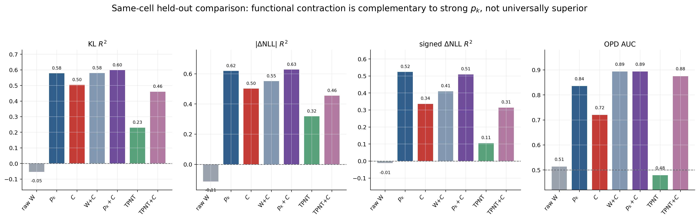

该图仍绘制 D11 广覆盖 parity，需要在最终论文作图时替换为 RR5 nested panel。它当前只用于展示
构念关系：$C$ 明显优于 raw update energy，但不能由旧图宣称全面优于 strict $p_k$。

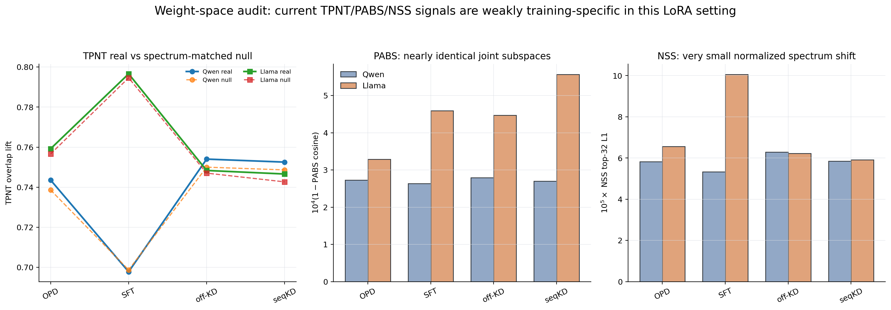

第二张图只针对本文当前 LoRA/deployed-BF16 设置。TPNT 面板比较真实 principal-coordinate
overlap 与保留奇异谱的 spectrum-matched random null；PABS 画的是
$10^4(1-\mathrm{cosine})$，NSS 画的是 $10^5$ 倍 top-32 L1 差异，均为了让接近零的小量可见。
它支持“当前实现下训练特异性有限”，不支持否定全参量 TPNT/PABS/NSS 构念。

raw activation 也不是替代解释：例如 Llama 的
$E_{\mathrm{mathHeld}}/E_{\mathrm{mmluPro}}/E_{\mathrm{ifeval}}$ 上 CKA、ER、PR 近乎不变时，
OPD 的 $r_\varepsilon$ 已产生明显下降；而训练输入轴 $X_{\mathrm{mathHeld}}$ 上 raw activation
确实强烈塌缩。这说明激活是否重组具有域差异，$WS$ 测的是激活相对于当前权重的功能谱。

底层结果：[附录 B.10 equal-5/FAT 严格 matched 全表](#b10-fat-r1-v2-与-equal-5-区域输出闭环) ·
[附录 B.11 QRAW 双模型 exact grid](#b11-qraw双模型-equal-5-raw-activation-严格共同网格) ·
[附录 B.9 旧 RR5/equal-7 敏感性](#b9-reviewer-robustness-formal) ·
[附录 B.1E raw activation/native 指标](#b1e-相关工作与-native-space-仪器完整表) ·
[附录 B.1K D11 全表](#b1k-d10d105d11数值对齐output-link-与权重基线) ·
[§3.3 指标公式](#33-一级相关工作指标怎样计算)

<a id="62-对应-22on-policy-exposure-与四臂功能轨迹"></a>

## 6.2 对应 2.2：on-policy exposure 与四臂功能轨迹

### 6.2.1 四核心域的派生均值轨迹

下表先按 §2.2 对 non-QK 五模块 equal-5，再对四个核心 probes
$E_{\mathrm{general}}/E_{\mathrm{mathHeld}}/E_{\mathrm{mmluPro}}/E_{\mathrm{ifeval}}$
等权平均；单位为相对 step0 的 directions。它是方便比较训练臂的派生摘要，不替代逐域原值。

**Llama L14，$\varepsilon=.05$**

| arm | 5 | 20 | 40 | 80 | 160 | 320 |
|---|---:|---:|---:|---:|---:|---:|
| OPD | −.400 | −17.250 | −22.000 | −24.900 | −26.400 | −31.050 |
| SFT | −1.900 | −6.800 | −7.600 | −11.950 | −17.150 | −19.850 |
| off-KD | −.900 | −3.300 | −4.400 | −6.450 | −5.600 | −7.200 |
| seqKD | −.700 | −2.250 | −2.400 | −2.850 | −3.300 | −3.500 |

**Qwen L18，$\varepsilon=.05$**

| arm | 5 | 10 | 20 | 40 | 80 | 160 | 320 | 480 | 624 |
|---|---:|---:|---:|---:|---:|---:|---:|---:|---:|
| OPD | −1.950 | −3.150 | −5.000 | −10.300 | −8.950 | −13.600 | −19.850 | −23.100 | −27.300 |
| SFT | .000 | +.050 | +.250 | +2.000 | −.550 | −2.700 | −6.300 | −7.450 | −7.150 |
| off-KD | +.600 | +1.600 | +2.300 | +.700 | −3.800 | −12.000 | −17.150 | −21.050 | −20.050 |
| seqKD | +.450 | +1.000 | +1.500 | .000 | −5.000 | −13.950 | −21.650 | −24.750 | −25.050 |

两模型都分离 OPD 与普通离线轨迹，但时间形状不同：Llama 从 step20 后持续加深；Qwen 含局部恢复
与离线臂后期追赶。因此旧“统一正峰—负过冲—回弹”不成立。

<a id="双模型-matched-四核心域轨迹图"></a>

### 旧 equal-7 matched 四核心域图（聚合敏感性）

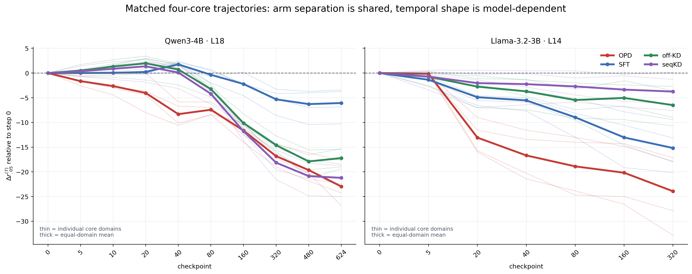

这两张 v15 图使用旧 equal-7 聚合；当前 equal-5 绝对值应以上方两张正式新图和表为准。同色细线
是四个核心域，粗线是四域等权均值。它们作为 paired aggregation sensitivity 仍显示：两模型共享
OPD 与普通离线轨迹的分离，却不共享同一个正峰—负过冲—回弹形状。


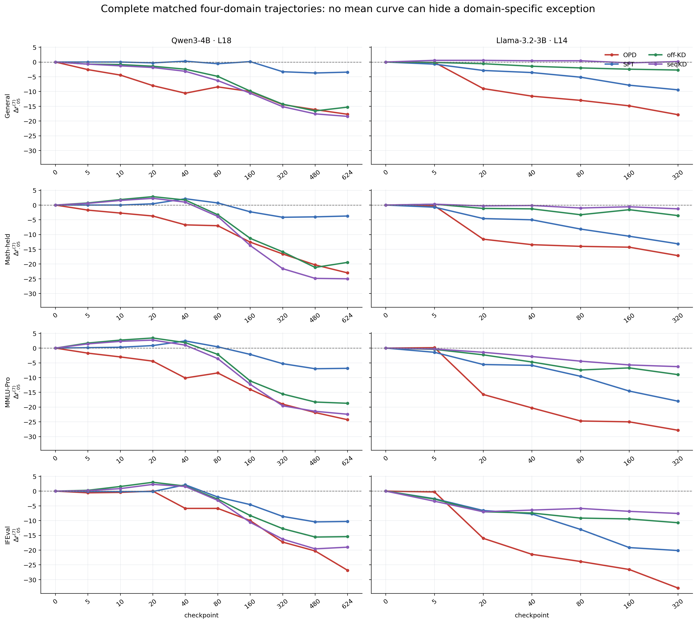

上图进一步取消四域平均：每行严格对应一个外部域，每列对应一个模型。它用于检查旧 equal-7 的
$E_{\mathrm{ifeval}}@20$ 局部例外如何产生；当前 equal-5 下该 cell 在
$\varepsilon=.05$ 已不再是反例。

### 6.2.2 exposure 对照的派生判定

| 对照 | 保持不变 | 改变量 | 派生结果 | 能支持什么 |
|---|---|---|---|---|
| OPD vs off-KD | forward-KL、teacher supervision、LoRA/optimizer | current-self vs frozen teacher sequence support | OPD 在早期核心网格更深 | 差异位于 support bundle 侧，不是 KL/CE |
| Qwen $\alpha=.5$ | 模型/teacher/训练框架 | current-self exposure 比例 | 可比 10 格中 8 格位于 off-KD→OPD 端点间；$\hat\lambda=.376$；正交残差=.497 | exposure 有序移动轨迹，但不是精确一维剂量律 |
| Llama frozenSelf0-KD | step0 student generator、prompt pool、teacher top-32 KL、LoRA/optimizer | rollout 是否随 current policy 刷新 | 六 probe×五步 29/30；固定外部 probe 25/25；step160 margin 4.857–13.429 | current-refresh bundle 是强组织因素 |
| off-KD vs seqKD | teacher sequence support、顺序、步数 | dense KL vs hard CE | rank path 接近而部分行为分叉 | target/readout 是指标边界，不推翻 support 主线 |

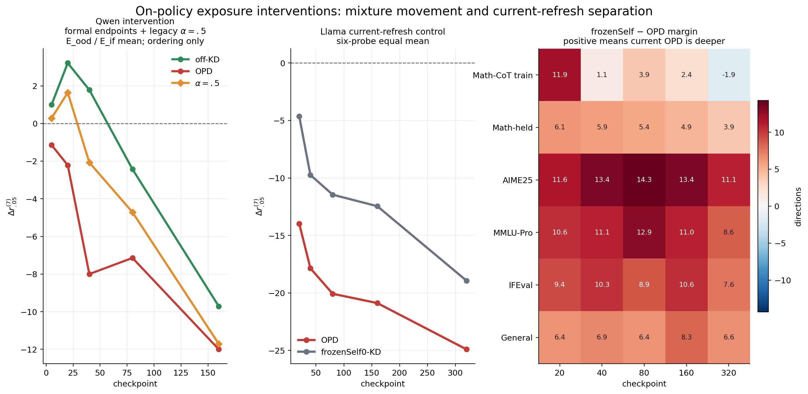

左图将 Qwen 正式 matched OPD/off-KD 端点与 legacy $\alpha=.5$ 干预轨叠在一起，只用于判断
off-KD→OPD 的有序位置，不能把纵轴细小差异解释成严格同协议数值效应；这也是图题中明确写
`ordering only` 的原因。中图和右图则来自同一 Llama per-checkpoint 轨道：右图的
`frozenSelf−OPD` margin 为正表示 current-self OPD 更深，唯一负格即
$D_{\mathrm{mathCoTtrain}}@320$，因此完整保留 29/30 而不是只画成功 cells。

底层结果：[equal-5 双模型完整轨迹](#b10-fat-r1-v2-与-equal-5-区域输出闭环) ·
[Qwen equal-7 matched 原值](#b1k-d10d105d11数值对齐output-link-与权重基线) ·
[Llama 四臂原值](#b1h-llama-32-3b-四臂至-step320-的完整交接表) ·
[$\alpha=.5$ 全阈值](#b1g-qwen-alpha-05-的完整-epsilon-敏感性) ·
[frozenSelf0-KD 全表](#b1i-llama-frozenself0-kdcurrent-refresh-的完整直接对照)

<a id="63-对应-23跨模型-opd-早期压缩支配"></a>

## 6.3 对应 2.3：跨模型 OPD 早期压缩支配

按 §2.3 的 non-QK equal-5
$M_{m,D,t}=\min_{b\in\mathcal O}\Delta r_b-\Delta r_{\mathrm{OPD}}$，
冻结窗口 $t=\{20,40,80\}$ 的 cellwise 判定为：

| 网格 | Qwen | Llama | 合并 |
|---|---:|---:|---:|
| $\varepsilon=.05$：四核心 probes×三 checkpoint，$M>0$ | **12/12** | **12/12** | **24/24** |
| 四阈值合并，$M>0$ | **47/48** | **48/48** | **95/96** |
| 唯一例外 | $E_{\mathrm{ifeval}}@20,\varepsilon=.10$，margin $=-.8$ | 无 | 单一高阈值 cell |

因此原 equal-7 在 $\varepsilon=.05$ 下的 23/24 例外在排除异质 q/k 后消失；但全阈值仍完整登记
一个 Qwen 高阈值反例。作为全轨迹补充，按 $\tau=\log(1+t)$ 对基线以下的相对压缩量积分至共同
$T=320$，equal-5 raw NCD 为：

| 模型 | OPD | SFT | off-KD | seqKD |
|---|---:|---:|---:|---:|
| Qwen | **50.423** | 9.554 | 31.017 | 37.793 |
| Llama | **77.594** | 39.683 | 17.518 | 11.093 |

### 6.3.1 Llama 完整 state spectrum：不是单一 $\varepsilon$ 的阈值效应

RR2S 使用正式 D10 state spectrum，1456/1456 module-epsilon rows 与 D10
$r_\varepsilon$ 完全一致，最大 rank difference 为0，全部 tail-consistency 检查通过。在每个
$\varepsilon$ 上共有12个 checkpoint×probe cells：

| metric | 阈值/唯一网格 | OPD strict deepest |
|---|---|---:|
| absolute $r_\varepsilon$ contraction | $\varepsilon=.01$ | 12/12 |
|  | $\varepsilon=.025$ | 12/12 |
|  | $\varepsilon=.05$ | 12/12 |
|  | $\varepsilon=.10$ | 12/12 |
| stable-rank contraction | 不依赖 $\varepsilon$，12个唯一谱 cell | 12/12 |
| entropy-rank contraction | 不依赖 $\varepsilon$，12个唯一谱 cell | 12/12 |

在 headline $\varepsilon=.05$ 下，四臂对四 probe×三 checkpoint 的平均 contraction 为：

| arm | absolute rank | stable rank | entropy effective rank |
|---|---:|---:|---:|
| OPD | **16.214** | **.376** | **11.991** |
| SFT | 6.464 | .165 | 5.145 |
| off-KD | 3.976 | .061 | 2.097 |
| seqKD | 2.333 | .029 | 1.160 |

OPD 相对最近离线臂的平均 margin 分别为 9.714 directions、.211 stable-rank units 与
6.846 entropy-rank units。连续谱统计与 threshold rank 给出相同排序，因此“OPD 早期更集中”
不是 $\varepsilon=.05$ 刚好跨过几个奇异值制造的离散现象。

### 6.3.2 centered covariance：均值方向不是主排序的唯一来源

RR3 使用同一正式 Gram、sample-equal mean weighting 和 deployed BF16 weights 构造
$W_tS^{\mathrm c}_{D,t}$。centered 与 uncentered 的 absolute-contraction deepest-arm identity
在48个 checkpoint×probe×$\varepsilon$ cells 中完全一致。$\varepsilon=.05$ 的均值为：

| arm | centered absolute contraction | uncentered absolute contraction |
|---|---:|---:|
| OPD | **14.833** | **16.214** |
| SFT | 7.024 | 6.464 |
| off-KD | 4.071 | 3.976 |
| seqKD | 2.381 | 2.333 |

四个 $\varepsilon$ 上，centered/uncentered contraction 的 Pearson 为 .944–.976。centered 会显著
提高绝对 state rank，说明均值方向确实影响 estimand；但它没有改变该 equal-7 敏感性轨的臂排序，所以
uncentered OPD dominance 不能归因于均值方向 alone。

### 6.3.3 non-QK 五模块 headline 与七模块分解敏感性

下表不再把并列记为“严格最深”：

| analysis | OPD 严格最深 | OPD 并列最深 | 离线臂严格更深 | 总格数 |
|---|---:|---:|---:|---:|
| uncentered $r_\varepsilon$ | 311 | 19 | 6 | 336 |
| uncentered stable rank，唯一谱 cells | 82 | 0 | 2 | 84 |
| uncentered entropy rank，唯一谱 cells | **84** | 0 | 0 | 84 |
| centered $r_\varepsilon$，全部模块 | 269 | 28 | 39 | 336 |
| centered，非 q/k 五模块 | **238** | 2 | 0 | 240 |
| centered q_proj | 22 | 13 | 13 | 48 |
| centered k_proj | 9 | 13 | 26 | 48 |

主分析之所以采用 equal-5，不是事后删除不利 cell，而是因为 q/k 的 centered 与 uncentered
重组方向明显异质，不能和 value/output/MLP 强行平均成同一个功能通道。七模块分解仍证明信号
不是单模块伪影：centered 的 v/o/gate/up/down 五模块没有任何离线严格胜出格。
但 q/k，尤其 k_proj，不支持普遍 OPD dominance。更准确的描述是：OPD 相对离线臂的压缩支配
**排序**在 value/output 与 MLP 路径最稳定，query/key 路径存在重组异质性。这里比较的是
`deepest-arm` 排序及其反例，不是各模块对总压缩量的归因，因而不能写成“压缩主要发生在
value/output 与 MLP 中”。

不过，现有逐模块 rank 足以回答两个更窄的描述性问题。定义原始方向数收缩

$$
d_{j,D,t}=r_{\varepsilon,j,D,0}-r_{\varepsilon,j,D,t},
$$

则 q/k 的原始 rank 收缩份额为

$$
s^{\mathrm{raw}}_{qk}
=
\frac{\sum_{D,t}\left(d_{q,D,t}+d_{k,D,t}\right)}
{\sum_{D,t}\sum_{j\in\mathcal M_7}d_{j,D,t}}.
$$

若改为先对各模块自身基线归一化，
$c_j=d_j/r_{\varepsilon,j,D,0}$，则可计算正向相对压缩总量份额

$$
s^{\mathrm{rel}+}_{qk}
=
\frac{\sum_{D,t}\left([c_{q,D,t}]_+ + [c_{k,D,t}]_+\right)}
{\sum_{D,t}\sum_{j\in\mathcal M_7}[c_{j,D,t}]_+}.
$$

在 OPD、四核心域、step20/40/80、$\varepsilon=.05$ 上：

| 范围 | q 的 raw-rank 份额 | k 的 raw-rank 份额 | q+k raw-rank 份额 | q+k 正向相对压缩总量份额 |
|---|---:|---:|---:|---:|
| Qwen | 9.0% | 3.4% | **12.5%** | **46.4%** |
| Llama | 3.7% | 2.1% | **5.8%** | **25.8%** |
| 双模型合并 | 5.2% | 2.5% | **7.7%** | **32.2%** |

因此按原始方向数记账，双模型早期 OPD 约92.3%的净收缩来自其余五模块；但 q/k 的基线功能秩较小，
几个方向的下降就可能对应很大的自身相对变化，所以不能说 q/k “压缩不重要”。这个差异在四个
阈值上持续存在：

| $\varepsilon$ | q+k raw-rank 收缩份额 | q+k 正向相对压缩份额 |
|---:|---:|---:|
| .01 | 17.1% | 35.8% |
| .025 | 11.9% | 33.8% |
| .05 | 7.7% | 32.2% |
| .10 | 3.2% | 27.4% |

这两个量仍然不是模块的功能能量贡献率。真正的能量归因需要另行计算

$$
\Delta E_{j,D,t}
=
\|W_{0,j}S_{D,0,j}\|_F^2
-\|W_{t,j}S_{D,t,j}\|_F^2
$$

及其相对基线版本；当前 threshold-rank 表不能从方向数反推出该能量份额。因此允许的写法是
“q/k 的 raw-rank 收缩份额较小、相对自身基线的变化不小且排序异质”，不能写成
“五模块产生了绝大多数功能能量压缩”。

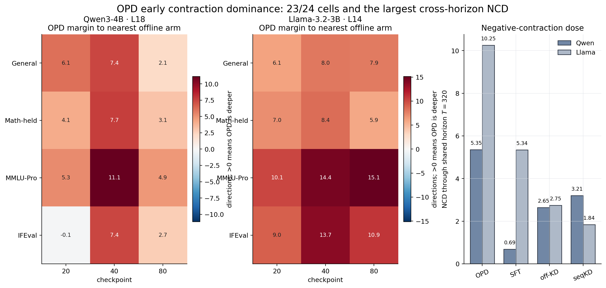

这张 v15 图仍绘制 equal-7 的23/24与归一化 NCD，不能覆盖本节 equal-5 的24/24、95/96和 raw
NCD 数值。它的保留价值是显示连续 margin，而非只展示成功计数：$M>0$ 表示 OPD 比最接近的
离线臂仍更深，蓝色或负值才是反例。当前 equal-5 的逐域连续轨迹见 §6.2 新图，完整 dominance
cells 见 B.10。

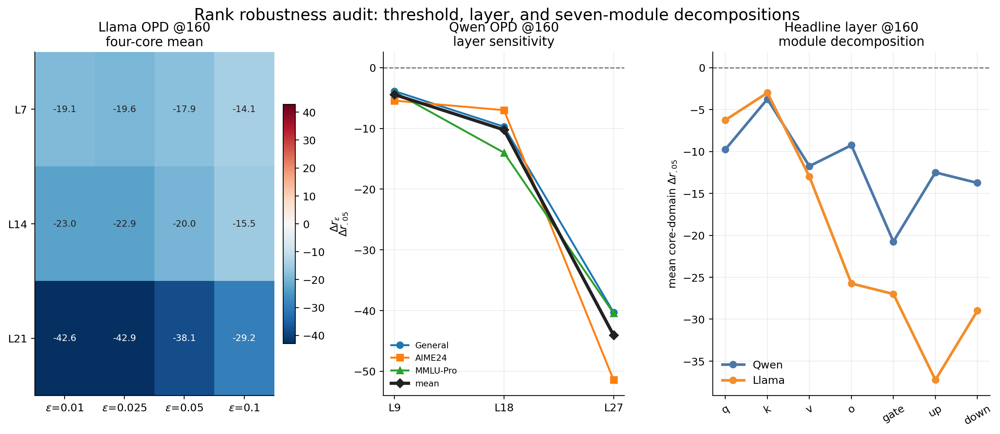

稳健性图把三个容易混淆的问题拆开：Llama 左图同时改变层与 $\varepsilon$；Qwen 中图在
$\varepsilon=.05$ 下展示三层而不假装拥有同一全阈值网格；右图在各自 headline 层拆开七模块。
不同层和模块的重组幅度明显不同，因此正文采用中层 non-QK equal-5 作为当前理论摘要，并把
equal-7、centered 和逐模块结果保留为敏感性；不宣称数值在层间恒定。

两个统计共同支持“OPD 更早且在共同 horizon 暴露于更深的跨域功能压缩”，但不要求终态仍排名第一，
也不要求两模型通过相同峰形实现。

底层结果：[附录 B.8 margin/NCD 完整审计](#b8-opd-早期跨域压缩支配与-ncd-的完整审计) ·
[附录 B.9 state-spectrum/centered/module 完整审计](#b9-reviewer-robustness-formal) ·
[附录 B.10 equal-5/equal-7 逐模块 JSON 入口](#b10-fat-r1-v2-与-equal-5-区域输出闭环) ·
[Qwen 逐域逐点表](#b1k-d10d105d11数值对齐output-link-与权重基线) ·
[Llama 逐域逐点表](#b1h-llama-32-3b-四臂至-step320-的完整交接表)

<a id="64-对应-24相对压缩与无符号-output-departure"></a>

## 6.4 对应 2.4：相对压缩与无符号 output departure

当前主结果使用 FAT-R1-v2 的 token-clean 区域 target：MMLU-Pro 的
$\mathrm{KL}_{A/F/T}$ 和 MATH500 的 $\mathrm{KL}_{B/T}$。在每个
`model×arm×domain×region` 内，对 checkpoint 序列计算 equal-5 $c_\varepsilon$ 与区域 KL
的 Spearman。48条序列的中位数为 **.943**，其中 **41/48** 满足
$|\rho_s|\ge .8$。逐臂原始结果如下：

| 模型/域 | off-KD | OPD | seqKD | SFT |
|---|---|---|---|---|
| Llama / MMLU-Pro：$\mathrm{KL}_{A/F/T}$ | .943/.943/.943 | 1/.829/1 | 1/1/1 | 1/1/1 |
| Llama / MATH500：$\mathrm{KL}_{B/T}$ | .943/.943 | 1/1 | .943/.829 | 1/1 |
| Qwen / MMLU-Pro：$\mathrm{KL}_{A/F/T}$ | .933/.933/.933 | .983/.983/.983 | .933/.933/.933 | .817/.800/.733 |
| Qwen / MATH500：$\mathrm{KL}_{B/T}$ | .867/.867 | .650/.950 | .883/.867 | .678/.678 |

这些高相关首先说明“随训练累计的相对压缩”和区域 output-distribution departure 同步，不足以
排除共同训练时钟。更严格的辅助诊断是在每个 `model×domain×checkpoint` 内，对四个训练臂同时
减去同期臂均值，再计算横向 Spearman：

| 模型/域 | 区域 KL 的同期四臂相关 |
|---|---|
| Llama / MMLU-Pro | $\mathrm{KL}_A=.826,\ \mathrm{KL}_F=.960,\ \mathrm{KL}_{F-A}=.930,\ \mathrm{KL}_T=.823$ |
| Llama / MATH500 | $\mathrm{KL}_B=.902,\ \mathrm{KL}_T=.938$ |
| Qwen / MMLU-Pro | $\mathrm{KL}_A=.594,\ \mathrm{KL}_F=.801,\ \mathrm{KL}_{F-A}=.791,\ \mathrm{KL}_T=.653$ |
| Qwen / MATH500 | $\mathrm{KL}_B=.440,\ \mathrm{KL}_T=.595$ |

这里 $\mathrm{KL}_{F-A}=\mathrm{KL}_F-\mathrm{KL}_A$ 只比较格式 token 与答案 token 的相对
漂移。上表与48条主统计冻结于后补 $\mathrm{KL}_C$ 之前，因此 MATH 主表只含 $B/T$，不能事后
把新 target 加入10/12或41/48计数。Llama 的同期臂间关系更强，Qwen 仍保留格式 KL 上的中等至强
关系；这比逐轨去掉 `log1p(step)` 更贴合论文问题，因为它固定训练进度，只问“同一时刻哪条臂
压缩更深、输出移动也更大”。

### 6.4.1 MATH $\mathrm{KL}_C$ 后补审计【PAPER_DEFERRED】

后补 completion 在原始500道 MATH500 gold solutions 的 token-clean CoT 区域 $C$ 上计算 exact
full-vocabulary $D_{\mathrm{KL}}(p_0\Vert p_t)$。它覆盖 Qwen base+四臂×9步与
Llama base+四臂×6步，共62个 model states、31,000条 sample rows；BF16 forward、FP32
`log_softmax`/KL，先在每题 $C$ tokens 内取均值，再对500题 sample-macro。旧 FAT 文件未被覆盖。

与 equal-5 $c_\varepsilon^{(5)}$ 严格连接后，逐臂 Spearman 为：

| 模型 | off-KD | OPD | seqKD | SFT |
|---|---:|---:|---:|---:|
| Llama $\mathrm{KL}_C$ | .943 | .771 | .943 | 1.000 |
| Qwen $\mathrm{KL}_C$ | .867 | .950 | .883 | .678 |

因此 $\mathrm{KL}_C$ 也复现“压缩与 output departure 随训练累计”的臂内关系。更严格的同
checkpoint 四臂去均值 Spearman 为：

| 模型 | $\mathrm{KL}_C$ | $\mathrm{KL}_B$ | $\mathrm{KL}_{B-C}$ |
|---|---:|---:|---:|
| Llama | **.875** | .902 | −.209 |
| Qwen | **.573** | .440 | −.183 |

$\mathrm{KL}_C$ 的同期关系在两模型均为正，且分别高于同期 $\mathrm{KL}_B$；但
$\mathrm{KL}_{B-C}:=\mathrm{KL}_B-\mathrm{KL}_C$ 与压缩为弱负关系。这说明 rank compression
更稳定地跟踪 CoT 与 boxed span 各自的无符号移动量，而不决定“最终答案相对 CoT 哪一段移动更多”。
区域差仍然属于 readout allocation，而不是一个新的 divergence。

该结果目前**不进入论文正文**，原因不是数值无效，而是它在原12个区域-KL targets、48条臂内
序列与 grouped-model protocol 冻结后才完成。若未来纳入论文，必须预先重定义 target family，
重新运行 equal-5 $C$–$p_k$ held-out 比较、epsilon sensitivity 和多重比较汇总；本版 human_read
只把它作为完整、可复现的补充审计保存。

下面保留旧整段 reference-stream 口径作为敏感性。它把数据集 reference completion 的全部
非 prompt token 聚合为 $R$，不能与 FAT 的 $P/F/A/C/B/T$ 区域记号混用。对每条 24/36 行
`domain×checkpoint` 序列，以“并列值采用平均次序”的 Spearman 计算
$c_\varepsilon$ 与三种 fixed-token 输出量。完整逐臂矩阵如下：

| 模型/训练臂 | rows | cumulative KL $\rho_s$ | signed NLL $\rho_s$ | absolute NLL $\rho_s$ |
|---|---:|---:|---:|---:|
| Llama OPD | 24 | .954 | .846 | .959 |
| Llama SFT | 24 | .954 | .152 | .928 |
| Llama off-KD | 24 | .901 | −.181 | .808 |
| Llama seqKD | 24 | .830 | .065 | .751 |
| Qwen OPD | 36 | .804 | .746 | .710 |
| Qwen SFT | 36 | .717 | .700 | .706 |
| Qwen off-KD | 36 | .807 | .802 | .729 |
| Qwen seqKD | 36 | .820 | .791 | .751 |

旧口径关注其中 cumulative KL 与 absolute NLL 两列：八条臂内相关均为正且较强。为删除共同训练
时钟，在每个 model×checkpoint 内分别减去 16 个 arm×domain cell 的同期均值后：

| checkpoint-demeaned scope | rows | cumulative KL | absolute NLL |
|---|---:|---:|---:|
| Llama | 96 | .703 | .744 |
| Qwen | 144 | .176 | .286 |

上表使用 D10.5 全 checkpoint availability。RR5 再将 Llama 收紧到与 $A/P_k$ 都严格可用的
5/20/40/160 exact common grid；减去每个 checkpoint 的16-cell同期均值后：

| feature | cumulative KL | absolute NLL | signed NLL |
|---|---:|---:|---:|
| $C=c_\varepsilon$ | **.797** | **.833** | .598 |
| $p_{32}$ | .715 | .693 | **.768** |
| raw activation entropy rank | −.371 | −.433 | .116 |
| raw activation PR | −.401 | −.471 | .080 |
| CKA vs step0 | −.139 | .052 | −.153 |

这张横向残差表与 nested held-out 结果相互补充：$C$ 对 unsigned drift 的关系在控制 checkpoint 后仍
很强；该旧 equal-7 表中 $p_k$ 对 signed readout 更强；raw activation suite 没有复现相同方向和幅度。

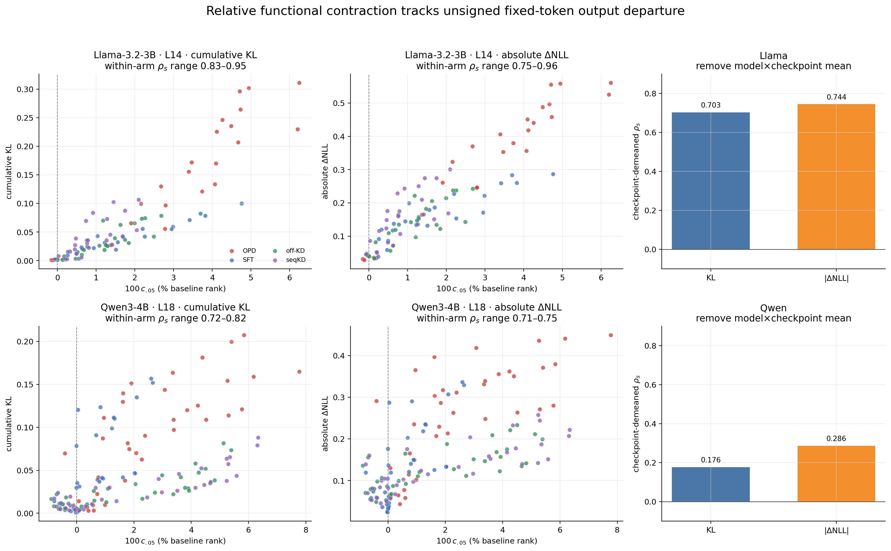

散点图使用 §6.4 的完整 D10.5 grid：Llama 每臂 24 cells，Qwen 每臂 36 cells；横轴把
$c_{.05}$ 乘100显示为相对 base rank 的百分数。右侧柱图不是“去除每条轨迹自己的均值”，而是
在每个 `model×checkpoint` 内，从同期16个 `arm×domain` cells 分别减去该量的横向均值，再做
Spearman。它直观显示：臂内累计关系跨模型存在，但去共同训练时钟后 Qwen 的横向关系明显变弱。

因此“压缩比例追踪 output departure”跨模型成立在臂内排序层；两模型现在也都获得
RR5/QRAW nested held-out 构念比较，但同-checkpoint 横向关联在 Llama 更强，Qwen 的 raw 高相关
仍有更大部分来自随训练进度累积的共同成分。这里没有跨模型固定斜率，也没有把本层 rank 压缩
等同任务准确率。

底层结果：[附录 B.1K D10.5 输出连接入口](#b1k-d10d105d11数值对齐output-link-与权重基线) ·
[附录 B.10 区域输出与 strict matched](#b10-fat-r1-v2-与-equal-5-区域输出闭环) ·
[附录 B.10.7 Math-$C$ completion](#b107-math-kl_c-completionpaper_deferred) ·
[附录 B.11 QRAW exact grid](#b11-qraw双模型-equal-5-raw-activation-严格共同网格) ·
[附录 B.9 旧 RR5 exact-grid](#b9-reviewer-robustness-formal) ·
[§1.4 fixed-token 输出定义](#14-输出与行为量)

<a id="65-对应-25signed-readout-的预注册分支"></a>

## 6.5 对应 2.5：signed readout 的预注册分支

FAT 将 signed NLL 拆成真正具有读出含义的区域：

- MMLU-Pro：$\Delta\mathrm{NLL}_F$、$\Delta\mathrm{NLL}_A$、
  $\Delta\mathrm{NLL}_{F-A}=\Delta\mathrm{NLL}_F-\Delta\mathrm{NLL}_A$ 与
  $\Delta\mathrm{NLL}_T$；
- MATH500：$\Delta\mathrm{NLL}_C$、$\Delta\mathrm{NLL}_B$、
  $\Delta\mathrm{NLL}_{B-C}=\Delta\mathrm{NLL}_B-\Delta\mathrm{NLL}_C$ 与
  $\Delta\mathrm{NLL}_T$。

其中 signed 表示“当前 checkpoint 相对 base 的 NLL 改变量”，正值是 gold tokens 变得更难，
负值是更容易；$F-A$ 或 $B-C$ 是两个 signed 区域改变量的差，不是 KL，也不是准确率。
同期四臂去均值后的 equal-5 结果显示：

| 模型/域 | 区域 signed NLL 与 $c_\varepsilon^{(5)}$ 的同期四臂相关 |
|---|---|
| Llama / MMLU-Pro | $\Delta A=.822,\ \Delta F=.500,\ F-A=.368,\ \Delta T=.788$ |
| Llama / MATH500 | $\Delta B=.144,\ B-C=-.296,\ \Delta C=.888,\ \Delta T=.927$ |
| Qwen / MMLU-Pro | $\Delta A=.417,\ \Delta F=.394,\ F-A=.145,\ \Delta T=.481$ |
| Qwen / MATH500 | $\Delta B=.403,\ B-C=.291,\ \Delta C=.529,\ \Delta T=-.079$ |

这组分叉给出更精确的边界：压缩对 KL departure 的关系最稳定；对 gold readout 的方向、答案与
终止分量则模型依赖。MMLU-Pro 行为配对进一步表明，$F-A$ 不是 strict–flexible gap 的通用代理：

| model/arm | $\rho_s(c,F-A)$ vs strict–flexible gap | $\rho_s(c,\Delta F)$ vs extract-fail |
|---|---:|---:|
| Llama off-KD / OPD / seqKD / SFT | −.029 / −.543 / .829 / −.086 | −.257 / .314 / .257 / .116 |
| Qwen off-KD / OPD / seqKD / SFT | .717 / −.217 / .717 / .667 | .550 / .383 / .717 / .510 |

因此 Qwen flexible 显著高于 strict 与格式失败一致，但不能由单一 $F-A$ 相关在所有训练臂上统一
解释；Llama 的符号结构又不同。这正是“功能压缩量不是完整行为充分统计量”的区域级证据。


下表是旧整段 reference-stream 的诊断性分支。progress-residual 是先分别去除 `log1p(step)` 线性趋势再做
Spearman；interaction 使用域固定效应与 checkpoint-grouped 256 次 bootstrap。

| 检验 | Llama | Qwen | 对分支的含义 |
|---|---:|---:|---|
| OPD raw $c$–signed NLL | .846 | .746 | 两模型 OPD 均有正累计关系 |
| SFT / off-KD / seqKD raw | .152 / −.181 / .065 | .700 / .802 / .791 | Qwen 明确不是 OPD-only |
| OPD progress-residual | .445 | .078 | 只有 Llama 留下明显非时钟关系 |
| 三条离线臂 progress-residual | 弱/混合 | 约 .289–.327 | Qwen residual 反而更多见于离线臂 |
| OPD×$c$ interaction $\beta_3$ | 2.988 [2.480,4.953] | .439 [.107,.776] | OPD 相对斜率均更正，但不覆盖臂内事实 |

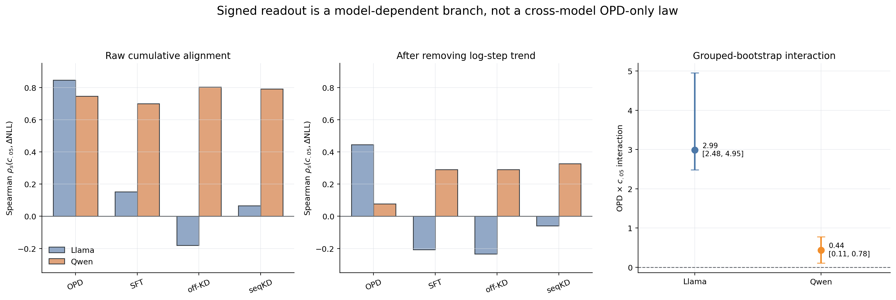

前两图把同一个 signed target 在“累计量”和“去训练进度残差”上的答案并列：Qwen 四臂 raw
相关都高，但去趋势后 OPD 近零；Llama 只有 OPD 保留明显正相关。第三图的正交互项只说明 OPD
相对其他臂的斜率更正，不等价于“只有 OPD 臂内相关”。因此交互项不能覆盖前两图的分叉事实。

旧口径同样选择 **branch C（模型依赖边界）**：Llama 中可描述 OPD-specific signed-readout
alignment；Qwen 中 $c_\varepsilon$ 更接近多训练范式共有的累计量。跨模型主张只能落在
unsigned KL/absolute-NLL departure，不能升级为 OPD-only signed damage。由于逐轨
progress-residual 同时移除了我们关心的累计训练效应，它只作为辅助过度控制诊断，不进入主证据。

底层结果：[附录 B.1K residual/interaction 产物](#b1k-d10d105d11数值对齐output-link-与权重基线)

<a id="66-对应-26supportreadout-的具体分叉"></a>

## 6.6 对应 2.6：support–readout 的具体分叉

先把 off-KD/seqKD 的全部匹配 `probe×checkpoint` rank cell 串接，计算 Pearson 与 direction-MAE；
再比较同一终点的行为读出。

### 6.6.1 Qwen：几何近似锁定，终止/格式明显分叉

| 派生量/终点行为 | off-KD | seqKD | 差异解释 |
|---|---:|---:|---|
| 四核心×九 checkpoint equal-5 rank path | $\mathbf z_{\mathrm{off}}$ | $\mathbf z_{\mathrm{seq}}$ | Pearson=.995；MAE=2.067 directions |
| MATH500 accuracy @624 | .794 | .724 | 数学收益不同 |
| MATH500 cap-hit @624 | .048 | .730 | 终止能力大幅分叉 |
| MATH500 mean tokens @624 | 1712 | 13021 | 与 cap-hit 同向 |
| MMLU-Pro strict / flexible @624 | .354 / .571 | .306 / .581 | flexible 近似，strict 分叉 |
| MMLU extract-fail @624 | .473 | .541 | 两臂都有病灶，seqKD 更重 |
| IFEval prompt / instruction strict @624 | .231 / .365 | .244 / .393 | 此任务没有同等方向/幅度分叉 |

### 6.6.2 Llama：几何接近得到复现，行为大分叉没有复现

| 派生量/终点行为 | off-KD | seqKD | 差异解释 |
|---|---:|---:|---|
| 四核心×六 checkpoint equal-5 rank path | $\mathbf z_{\mathrm{off}}$ | $\mathbf z_{\mathrm{seq}}$ | Pearson=.944；MAE=2.225 directions |
| MATH500 accuracy @320 | .082 | .102 | 小差异，方向与 Qwen 不同 |
| MATH500 cap-hit / mean tokens @320 | .918 / 15107 | .946 / 15531 | 两臂都高度截断 |
| MMLU-Pro strict / flexible @320 | .142 / .164 | .131 / .154 | 小幅接近 |
| MMLU extract-fail @320 | .503 | .516 | 接近 |
| IFEval prompt / instruction strict @320 | .196 / .332 | .192 / .315 | 接近 |

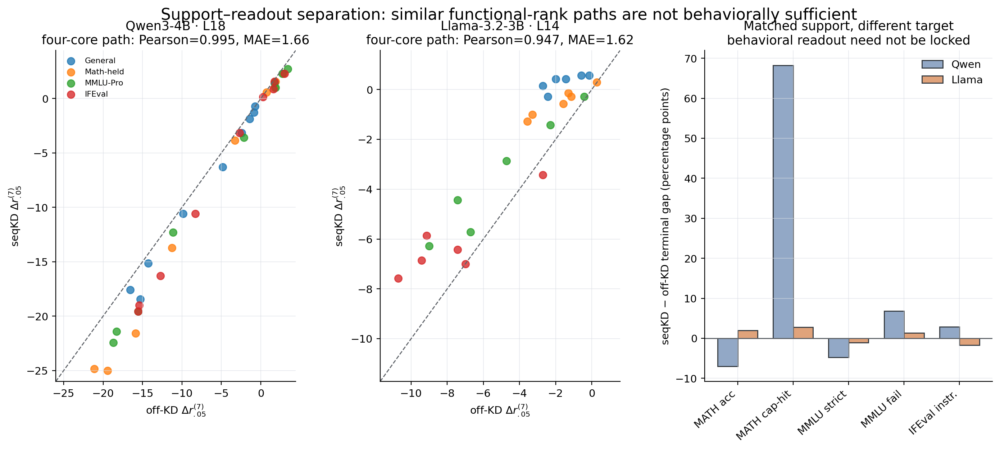

上表使用最新 non-QK equal-5 四核心 matched-state cells；现有旧图中的 Pearson/MAE
（Qwen .995/1.66，Llama .947/1.62）来自另一版 matched-state 聚合，方向一致但数值口径不同，
因此最终论文应由 equal-5 表重绘。右图统一画 `seqKD−off-KD` 的终态百分点差：Qwen 的主要分叉集中在
MATH cap-hit，而 Llama 相同读出差较小。这正是“几何接近不是行为充分统计量”的存在性例子，
不是跨模型固定的 KL/CE 行为律。

因此结果只支持存在性边界：相同 sequence support 可以组织近似 rank path，但 target distribution
仍可能改变具体读出；$r_\varepsilon$ 不是行为充分统计量。它不支持“KL/CE 在每个模型都产生固定
行为差异”，也不推翻 on-policy exposure 对主轨迹的组织作用。

底层结果：[Qwen 完整行为轨迹](#b1c-qwen-四臂完整行为轨迹) ·
[Llama 完整轨迹与行为](#b1h-llama-32-3b-四臂至-step320-的完整交接表)

<a id="67-对应-27有效但不升级为主理论的结果"></a>

## 6.7 对应 2.7：有效但不升级为主理论的结果

| 次级问题 | 计算 | 派生结果 | 底层入口 |
|---|---|---|---|
| 近期功能重组负荷 $V^{(3)}$ | 最近三个 landmark 区间的 $\Delta r$ 总变差，与行为 drawdown 做跨模型/逐域压力测试 | strict IFEval/MMLU 跨模型弱同向；Math、逐臂 DiD 和斜率不统一 | [B.7](#b7-近期功能重组负荷-v3-的完整探索审计) |
| Qwen 局部格式干预 | off-KD@624 分层 zeroing LoRA 模块，重跑 MATH/MMLU | L12–17 使 strict failure 降 .200；flexible 不变，MATH accuracy −.005 | [B.1C](#b1c-qwen-四臂完整行为轨迹) |
| MMLU 答案位概率逸出 | full-vocabulary entropy、legal-option mass、option-conditioned entropy | Qwen OPD@624 entropy 4.746 vs base 2.402；合法选项质量 .1915→.1301 | [B.1C](#b1c-qwen-四臂完整行为轨迹) |
| 训练样本记忆边界 | 配对 Math-CoT train/hold 的 4 arms×4 checkpoints 几何 | Pearson=.994、Spearman=.977、MAE=.813 directions | [B.1J](#b1j-m6math-cot-trainhold-与-numina-完整补充) |
| Numina horizon 边界 | 四臂 $E_{\mathrm{numina}}$ 在 40/160/624 的 rank 排序 | OPD@40 最深；160/624 被 off-KD/seqKD 超过 | [B.1J](#b1j-m6math-cot-trainhold-与-numina-完整补充) |
| general-adjusted 重分配 | $G_D=\Delta r_D-\Delta r_{\mathrm{general}}$ 逐 checkpoint | Qwen $\alpha=.5$ 中训练 support 较早转为相对压缩，外部域较晚 | [B.1L](#b1l-qwen-alpha-05-的-general-adjusted-逐-checkpoint-轨迹) |
| teacher top-32 fidelity | token-weighted retained/omitted mass 与分位数 | retained mean：Qwen off-KD .999987、Llama off-KD .999212、frozenSelf .998134；平均高保真但有稀有尾部 | [B.9](#b9-reviewer-robustness-formal) |
| current-refresh readout 路径 | OPD−frozenSelf 的500题 paired MATH500、2000 bootstrap | 长度/EOS/截断/boxed 随 checkpoint 翻转，没有稳定单一 readout mediator | [B.9](#b9-reviewer-robustness-formal) |

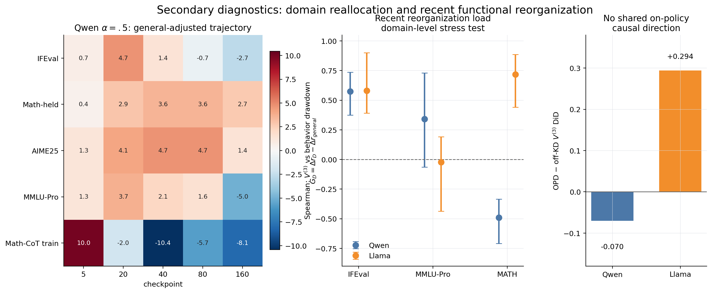

左图展示同一 checkpoint 内相对 general 的域重分配，不能替代绝对
$\Delta r_{\varepsilon,D,t}$；中图完整保留 $V^{(3)}$ 在 IFEval、MMLU-Pro 与 Math 上的
模型差异和 trajectory-bootstrap 区间；右图进一步显示 OPD−off-KD DiD 在 Qwen/Llama 中异号。
因此这些量适合作为次级诊断与后续假设生成，不能被重新包装成“on-policy 重组越多，行为越差”的
跨模型机制律。

这些结果用于解释机制、适用 horizon 和失败边界，不进入摘要主结论。

---

# 七、总结：论文当前能说什么

## 7.1 当前可以写入正文

1. $r_\varepsilon(W_tS_{D,t})$ 具有域条件最优低秩本层输出近似意义；
2. 不同后训练范式具有可分辨的 checkpoint-wise 功能轨迹；
3. OPD–offKD、$\alpha=.5$ 与更严格的 OPD–frozenSelf0-KD 共同支持 current support refresh
   组织主功能轨迹；
4. non-QK equal-5 下 Qwen/Llama 在 $\varepsilon=.05$ 为24/24、四阈值为95/96，且两模型 NCD 最大；
5. Llama 的 OPD 排序同时经受四阈值、stable/entropy rank、centered covariance 和模块分解；
   centered 非 q/k 五模块严格/并列为240/240，但 q/k 存在真实异质性；
6. 具体时间形态依赖模型，不存在统一正峰—过冲—回弹定律；
7. $c_\varepsilon^{(5)}$ 稳定追踪区域 KL：48条臂内序列的中位 Spearman=.943，41/48达到
   $|\rho_s|\ge.8$；同期四臂比较仍在两模型的多数区域保留正关系；
8. 严格 matched 的12个区域 KL targets 上，$C$ 对最佳 $p_k$ 的 $R^2$/MAE 各10/12胜；
   全48 targets 为29/48与30/48胜，故它在 output departure 上更稳定，但不是全面支配；
9. 双模型各64-state的 $A/C_5/P_{k,5}$ exact-grid 上，$C_5$ 对 raw activation 为8/8胜、
   对 $P_{k,5}$ 为7/8胜；但 Qwen absolute NLL 与 OPD 分类校准保留明确反例；
10. 区域 signed NLL、$F-A/B-C$ 与真实 strict–flexible/format failure 呈模型和训练臂依赖；
   相似 rank path 也不充分决定行为，二者共同界定 support–readout 边界；
11. Math-CoT train/hold 锁定、Numina late reversal、top-32 fidelity 与 matched-readout
    bootstrap 分别给出分布级、horizon、实现和作用路径边界。

## 7.2 当前必须保留条件语气

- 24/24、95/96、29/30 是单条训练轨迹上的相关 cells，不是随机性复现；
- current refresh 的总效应已识别，但 freshness、EOS、长度、重复和风格等中介尚未拆分；
- RR5/QRAW 已完成双模型 $A/C_5/P_{k,5}$，但每模型仍只有四个 checkpoint groups、每臂一条
  训练轨迹；它是跨模型构念复现，不是随机性复现；
- centered covariance 已闭环 Llama 早期四臂网格，但 Qwen 对应网格仍缺正式 profiles；
- 模块级“OPD 最深”必须区分严格胜出与并列，尤其不能把 centered q/k 写成普遍规律；
- RR1 finite-sample bootstrap 仍未完成；现有 exact-rank 排序不等于已有抽样置信区间；
- Numina behavior 的 seqKD 与旧三臂来自分批 campaign；protocol parity 闭环前不作严格四臂行为排序。
- MATH $\mathrm{KL}_C$ 虽已覆盖62 states，但属于原 FAT target family 冻结后的后补审计；
  当前只进 human_read/附录，不进入论文正文或重算原10/12胜负。

## 7.3 论文不主张

- 不主张一个 rank 标量预测所有准确率、格式和终止行为；
- 不主张压缩必然导致能力下降；
- 不主张具体正峰、负过冲或回弹跨模型普遍存在；
- 不主张 current-self refresh 的总效应已经拆成纯 freshness 单通道；
- 不主张 $r_\varepsilon$ 全面优于 strict $p_k$，也不主张 TPNT 在全参 RLVR 中无效；
- 不把 probe×checkpoint 当作独立 seed；
- 不把 LoRA 结果自动推广为全参训练定律。

---

<a id="附录-a域条件功能秩的数学性质与证明"></a>

# 附录 A：域条件功能秩的数学性质与证明

本附录承载正文省略的推导。它证明观察空间和稳定条件，不替代 OPD 的经验比较。

## A.1 功能能量恒等式

若 $\Sigma_D=\mathbb E[hh^\top]=S_DS_D^\top$，则

$$
\begin{aligned}
\mathbb E\|(W-\widetilde W)h\|_2^2
&=\mathbb E\,\mathrm{tr}\left((W-\widetilde W)hh^\top(W-\widetilde W)^\top\right)\\
&=\mathrm{tr}\left((W-\widetilde W)\Sigma_D(W-\widetilde W)^\top\right)\\
&=\|(W-\widetilde W)S_D\|_F^2.
\end{aligned}
$$

取 $\widetilde W=0$ 得

$$
\|WS_D\|_F^2=\mathbb E\|Wh\|_2^2.
$$

因此 $WS_D$ 的谱能量具有明确的域条件本层输出意义。

更直接地，令 $z=S_D^\dagger h$。由于
$h$ 几乎处处位于 $\Sigma_D$ 的支撑空间，
$h=S_Dz$ 且 $\mathbb E[zz^\top]$ 在该支撑空间内为恒等映射，于是
$Wh=(WS_D)z$。这说明 $WS_D$ 是同一权重映射在白化输入坐标中的表示，而不是权重与激活的
经验拼接。并且

$$
(WS_D)(WS_D)^\top
=W\Sigma_DW^\top
=\mathbb E[(Wh)(Wh)^\top],
$$

故 $WS_D$ 的平方奇异值正是模块输出二阶矩的特征值。

## A.2 最优 rank-$k$ 功能近似

令 $A=WS_D$。Eckart–Young–Mirsky 给出

$$
\min_{\operatorname{rank}(\widehat A)\le k}\|A-\widehat A\|_F^2
=\sum_{i>k}\sigma_i^2(A).
$$

所以 $r_\varepsilon(A)$ 是使最优 rank-$k$ 近似的相对输出能量损失不超过 $\varepsilon$ 的最小秩。
这就是本文“局部最优、局部完备”的严格范围。

## A.3 尺度与正交坐标性质

对任意非零标量 $\alpha$，归一化尾能量不变，因此

$$
r_\varepsilon(\alpha A)=r_\varepsilon(A).
$$

对任意相容的正交矩阵 $Q_1,Q_2$，奇异值不变，因此

$$
r_\varepsilon(Q_1AQ_2)=r_\varepsilon(A).
$$

$r_\varepsilon$ 已经对整体尺度不敏感；$c_\varepsilon$ 进一步将绝对 directions 变化除以该模型、层、
域自己的基线功能秩，从而适合跨基线比较。

## A.4 current 与 fixed whitening 的状态分解

令 $\Delta W_t=W_t-W_0$、$\Delta S_t=S_t-S_0$，则

$$
W_tS_t-W_0S_0
=
\Delta W_tS_0+W_0\Delta S_t+\Delta W_t\Delta S_t.
$$

等价地，

$$
W_tS_t-W_0S_0
=
\underbrace{(W_t-W_0)S_0}_{\text{fixed-input weight-mediated}}
+
\underbrace{W_t(S_t-S_0)}_{\text{activation-associated}}.
$$

这是代数分解，不是因果 mediation。$S_t$ 是当前模型前层计算的内生结果，不是应从
$W_tS_t$ 中排除的外生混杂；而 $r_\varepsilon$ 是奇异谱的非线性阈值函数，不对上述两项可加。
因此不能把 current/fixed rank 的差解释为“权重贡献比例”或“激活贡献比例”。current-state
$W_tS_t$ 是主研究对象；fixed-$S_0$、centered covariance 和 cross-arm ruler 只检查结论对输入
度量选择、均值方向和共同坐标尺的敏感性。

## A.5 Weyl：单个奇异值的扰动稳定性

若 $\widetilde A=A+E$，则

$$
|\sigma_i(\widetilde A)-\sigma_i(A)|\le\|E\|_2.
$$

它为 dtype 物化误差、有限样本 whitening 和数值近似提供逐奇异值上界，但不单独保证离散的
$r_\varepsilon$ 不变。

## A.6 Mirsky：完整奇异谱的扰动稳定性

Mirsky 不等式给出

$$
\sum_i\left(\sigma_i(\widetilde A)-\sigma_i(A)\right)^2
\le\|E\|_F^2.
$$

由于 $r_\varepsilon$ 依赖累计谱能量，Mirsky 比只观察最大奇异值更直接。它仍需要阈值安全边际，
不能自动排除 rank 在 $\varepsilon$ 边界处跳变。

## A.7 $r_\varepsilon$ 的阈值稳定条件

定义归一化尾能量

$$
T_k(A)=\frac{\sum_{i>k}\sigma_i^2(A)}{\|A\|_F^2}.
$$

设 $r=r_\varepsilon(A)$。如果存在 $m>0$ 使

$$
T_{r-1}(A)>\varepsilon+m,
\qquad
T_r(A)<\varepsilon-m,
$$

且扰动造成的所有相关 $T_k$ 变化都小于 $m$，则

$$
r_\varepsilon(\widetilde A)=r_\varepsilon(A).
$$

因此 precision/sample parity 必须检查阈值 margin、模块级 rank 和多个 $\varepsilon$ 的排序。相对定义
不会自动消除阈值不连续，但基线秩较大时，偶发一位变化对 $c_\varepsilon$ 的比例影响较小。

## A.8 Wedin 与 Davis–Kahan：功能子空间稳定性

对矩形功能矩阵，若 top-$k$ 奇异子空间与其余谱之间存在 gap $\delta$，Wedin 型界给出

$$
\|\sin\Theta(\widetilde U_k,U_k)\|
\lesssim
\frac{\|E\|}{\delta}.
$$

Davis–Kahan 可应用于 $AA^\top$ 或 $A^\top A$ 的对称特征子空间。它们适合解释 $\theta_U$、PABS、
source-principal 和功能方向比较；不直接证明 $r_\varepsilon$ 稳定，也不证明 OPD 的经验排序。

## A.9 相对排序能够获得什么保证

上述结果支持的是条件稳定性：当数值/采样扰动相对于总能量、阈值 margin 和子空间 gap 足够小时，
奇异谱、$r_\varepsilon$、$c_\varepsilon$ 与功能子空间排序可保持稳定。它们不能由数学定理推出 OPD
一定比离线训练压缩更多；后者仍由冻结实验网格决定。

---

# 附录 B：完整域条件功能秩、行为与有效补充结果

## B.1 完整表格路由

| 完整/次要表 | 位置 | 不进入正文主表的原因 |
|---|---|---|
| MATH500 十点 acc/trunc/length/cap | three_arm_full_trajectory.csv、block2_final_g2_behavior.csv | 正文只需关键行为分叉 |
| MMLU strict/flexible/extract 十点 | S1_mmlupro_flexible.csv、S1_mmlupro_extract_audit.csv、block2_final_g2_* | 类别全网格用于审计 |
| IFEval 九类别十点 | S1_ifeval_breakdown.csv、block2_final_g2_ifeval_breakdown.csv | 正文保留总体时序 |
| GPQA/TruthfulQA 十点 | three_arm_full_trajectory.csv | 只锚定知识未同步坍塌 |
| 六探针逐模块逐 checkpoint | R4_m1_tail_ec.csv、C5_eif_m1_geometry.csv | 正文展示预注册七模块均值 |
| M2/$\theta$ 网格 | R4_m2_output_drift.csv、R5_theta_reps.csv | 辅助量，不独立形成理论 |
| 答案位熵逐类/逐样本 | C11_mmlupro_answer_token_entropy_by_category.csv、*_samples.csv | 正文只需总体构念 |
| alpha=.5 全 epsilon/逐类 | qwen_alpha05_r_epsilon.csv、qwen_alpha05_mmlupro_*、qwen_alpha05_ifeval_breakdown.csv | 主文只放 .05 关键点 |
| Llama 四臂全 probe/epsilon/layer/behavior/native suite | llama_early_320_* | 正文只放跨模型排序、差异与边界 |
| Llama frozenSelf0-KD | llama_frozen_self_r_epsilon.csv、behavior/raw/tail/spectra 四表；顶层 H5 manifest | 正文放 29/30、25/25 与行为端点 |
| Math-CoT train/hold、Numina | M6_geometry_r_epsilon.csv、M6_behavior.csv、M6 manifest | 正文只放 train/hold 锁定与 late-horizon 边界 |
| D10/D10.5 matched state-output | d10_llama_numeric_parity_*、d10_5_* | 正文放正式四核心、KL/NLL 与数值 parity |
| D11 strict $p_k$/TPNT/PABS/NSS | d11_* | 正文放同-cell held-out 增量比较 |
| non-QK equal-5 全轨迹/阈值/dominance | `mini/equal5_non_qk/EQUAL5_*.csv` | 正文只放24/24、95/96、NCD与四域均值 |
| FAT MMLU/Math 区域输出 | `mini/fat_outlink_round1_v2/fat_r1_v2_*.csv` | 正文只放直接对理论负责的区域聚合 |
| equal-5/FAT/$p_k$/behavior join | `mini/fat_outlink_round1_v2_link_equal5/*.csv` | 完整 grouped/foldwise/epsilon/canonical join 留在附录 |

<!-- BEGIN AUTO-GENERATED FULL TABLES -->

## B.1A 完整表的覆盖契约

本自动生成块恢复所有曾用于 human_read 判断、且当前协议仍有效的论文级聚合表。完整性的分析单位是：
行为按数据集/类别聚合；旧表几何按七个 projection module 等权，当前 headline 按 non-QK 五模块
等权。逐样本行、逐模块奇异值、完整 tail curve 和 bootstrap draws 仍由正式 CSV/NPZ 保存，因为
它们是原始数据而不是人类可读结果表。

表中“当前值（相对 step0 变化）”同时保留绝对标尺与论文使用的 $\Delta r_\varepsilon$，从而不再需要在两个重复大表之间切换。符号 — 表示该协议没有运行，而不是零。

旧版中三类表不按“有效表”恢复：以已废弃 whitened entropy ER 为核心的 dose-response/有限样本表；误筛 `frozen_base` track 的旧 G3 compact 表；把不配对的 4k/24k cap 运行解释为逐题因果效应的表述。淘汰原因只在附录 E.4 登记，不能继续充当论文证据。

## B.1B Qwen legacy 六固定探针的完整 $r_\varepsilon$ 轨迹

口径：Qwen、L18、per-checkpoint、$\varepsilon=.05$、七模块等权均值。单元格为当前值（相对本臂
step0 的变化）。本节保留 broad-domain 六 probe 原始证据；正式跨模型 headline 已由 D4
matched 四核心轨替换，见 B.1K。两节不可混用 cell count。

### $D_{\mathrm{mathCoTtrain}}$

| step | OPD | SFT | off-KD | seqKD |
|---|---|---|---|---|
| 0 | 632.286 (+0.000) | 632.286 (+0.000) | 632.286 (+0.000) | 632.286 (+0.000) |
| 5 | 631.714 (-0.571) | 632.286 (+0.000) | 638.429 (+6.143) | 636.286 (+4.000) |
| 10 | 628.143 (-4.143) | 632.857 (+0.571) | 634.714 (+2.429) | 630.571 (-1.714) |
| 20 | 617.714 (-14.571) | 636.143 (+3.857) | 625.857 (-6.429) | 624.429 (-7.857) |
| 40 | 607.286 (-25.000) | 629.571 (-2.714) | 626.286 (-6.000) | 625.286 (-7.000) |
| 80 | 620.571 (-11.714) | 630.429 (-1.857) | 622.714 (-9.571) | 621.857 (-10.429) |
| 160 | 623.429 (-8.857) | 628.857 (-3.429) | 619.286 (-13.000) | 619.571 (-12.714) |
| 320 | 622.857 (-9.429) | 627.429 (-4.857) | 617.429 (-14.857) | 617.143 (-15.143) |
| 480 | 622.857 (-9.429) | 627.429 (-4.857) | 618.286 (-14.000) | 619.143 (-13.143) |
| 624 | 621.857 (-10.429) | 627.429 (-4.857) | 618.000 (-14.286) | 620.000 (-12.286) |

### $E_{\mathrm{mmluPro}}$

| step | OPD | SFT | off-KD | seqKD |
|---|---|---|---|---|
| 0 | 716.000 (+0.000) | 716.000 (+0.000) | 716.000 (+0.000) | 716.000 (+0.000) |
| 5 | 714.429 (-1.571) | 716.143 (+0.143) | 717.714 (+1.714) | 717.429 (+1.429) |
| 10 | 713.000 (-3.000) | 716.286 (+0.286) | 718.714 (+2.714) | 718.143 (+2.143) |
| 20 | 711.429 (-4.571) | 717.000 (+1.000) | 719.143 (+3.143) | 718.714 (+2.714) |
| 40 | 706.000 (-10.000) | 718.714 (+2.714) | 717.857 (+1.857) | 717.000 (+1.000) |
| 80 | 707.429 (-8.571) | 716.714 (+0.714) | 713.714 (-2.286) | 712.429 (-3.571) |
| 160 | 702.000 (-14.000) | 713.857 (-2.143) | 704.857 (-11.143) | 704.000 (-12.000) |
| 320 | 696.857 (-19.143) | 710.571 (-5.429) | 700.429 (-15.571) | 696.429 (-19.571) |
| 480 | 694.143 (-21.857) | 708.857 (-7.143) | 697.714 (-18.286) | 694.714 (-21.286) |
| 624 | 691.714 (-24.286) | 709.571 (-6.429) | 697.429 (-18.571) | 693.571 (-22.429) |

### $E_{\mathrm{general}}$

| step | OPD | SFT | off-KD | seqKD |
|---|---|---|---|---|
| 0 | 744.714 (+0.000) | 744.714 (+0.000) | 744.714 (+0.000) | 744.714 (+0.000) |
| 5 | 742.571 (-2.143) | 744.714 (+0.000) | 744.286 (-0.429) | 743.857 (-0.857) |
| 10 | 740.286 (-4.429) | 744.714 (+0.000) | 743.857 (-0.857) | 743.571 (-1.143) |
| 20 | 736.857 (-7.857) | 744.571 (-0.143) | 743.429 (-1.286) | 743.143 (-1.571) |
| 40 | 734.143 (-10.571) | 745.000 (+0.286) | 742.429 (-2.286) | 741.714 (-3.000) |
| 80 | 736.571 (-8.143) | 744.571 (-0.143) | 739.714 (-5.000) | 738.571 (-6.143) |
| 160 | 735.000 (-9.714) | 744.714 (+0.000) | 735.143 (-9.571) | 734.429 (-10.286) |
| 320 | 730.571 (-14.143) | 741.571 (-3.143) | 731.000 (-13.714) | 729.857 (-14.857) |
| 480 | 728.714 (-16.000) | 741.571 (-3.143) | 728.429 (-16.286) | 727.143 (-17.571) |
| 624 | 727.143 (-17.571) | 741.429 (-3.286) | 729.714 (-15.000) | 726.857 (-17.857) |

### $E_{\mathrm{aime24}}$

| step | OPD | SFT | off-KD | seqKD |
|---|---|---|---|---|
| 0 | 498.000 (+0.000) | 498.000 (+0.000) | 498.000 (+0.000) | 498.000 (+0.000) |
| 5 | 497.429 (-0.571) | 498.000 (+0.000) | 498.857 (+0.857) | 498.714 (+0.714) |
| 10 | 496.857 (-1.143) | 498.000 (+0.000) | 499.429 (+1.429) | 499.143 (+1.143) |
| 20 | 495.857 (-2.143) | 498.429 (+0.429) | 499.857 (+1.857) | 499.286 (+1.286) |
| 40 | 493.571 (-4.429) | 499.286 (+1.286) | 498.429 (+0.429) | 497.857 (-0.143) |
| 80 | 493.857 (-4.143) | 498.143 (+0.143) | 495.714 (-2.286) | 495.143 (-2.857) |
| 160 | 491.000 (-7.000) | 495.143 (-2.857) | 489.857 (-8.143) | 488.143 (-9.857) |
| 320 | 486.714 (-11.286) | 493.429 (-4.571) | 486.143 (-11.857) | 481.571 (-16.429) |
| 480 | 483.286 (-14.714) | 494.143 (-3.857) | 482.571 (-15.429) | 479.857 (-18.143) |
| 624 | 481.143 (-16.857) | 494.714 (-3.286) | 483.714 (-14.286) | 479.571 (-18.429) |

### legacy BOS control

| step | OPD | SFT | off-KD | seqKD |
|---|---|---|---|---|
| 0 | 571.095 (+0.000) | 571.095 (+0.000) | 571.095 (+0.000) | 571.095 (+0.000) |
| 5 | 570.714 (-0.381) | 571.143 (+0.048) | 572.286 (+1.190) | 572.000 (+0.905) |
| 10 | 570.048 (-1.048) | 571.238 (+0.143) | 572.619 (+1.524) | 572.095 (+1.000) |
| 20 | 568.476 (-2.619) | 571.667 (+0.571) | 572.524 (+1.429) | 572.190 (+1.095) |
| 40 | 565.857 (-5.238) | 572.476 (+1.381) | 572.238 (+1.143) | 572.000 (+0.905) |
| 80 | 568.381 (-2.714) | 572.476 (+1.381) | 569.524 (-1.571) | 568.905 (-2.190) |
| 160 | 570.333 (-0.762) | 570.143 (-0.952) | 566.952 (-4.143) | 565.000 (-6.095) |
| 320 | 567.524 (-3.571) | 567.619 (-3.476) | 564.143 (-6.952) | 562.190 (-8.905) |
| 480 | 562.381 (-8.714) | 567.286 (-3.810) | 562.286 (-8.810) | 564.667 (-6.429) |
| 624 | 560.333 (-10.762) | 567.333 (-3.762) | 562.143 (-8.952) | 560.857 (-10.238) |

### $E_{\mathrm{ifeval}}$

| step | OPD | SFT | off-KD | seqKD |
|---|---|---|---|---|
| 0 | 575.857 (+0.000) | 575.857 (+0.000) | 575.857 (+0.000) | 575.857 (+0.000) |
| 5 | 575.714 (-0.143) | 576.000 (+0.143) | 576.571 (+0.714) | 576.286 (+0.429) |
| 10 | 575.857 (+0.000) | 576.000 (+0.143) | 577.857 (+2.000) | 577.143 (+1.286) |
| 20 | 576.143 (+0.286) | 576.286 (+0.429) | 579.000 (+3.143) | 578.571 (+2.714) |
| 40 | 570.000 (-5.857) | 578.286 (+2.429) | 577.857 (+2.000) | 577.571 (+1.714) |
| 80 | 570.571 (-5.286) | 574.286 (-1.571) | 573.714 (-2.143) | 573.143 (-2.714) |
| 160 | 566.286 (-9.571) | 571.571 (-4.286) | 567.857 (-8.000) | 566.000 (-9.857) |
| 320 | 559.143 (-16.714) | 567.714 (-8.143) | 563.571 (-12.286) | 560.000 (-15.857) |
| 480 | 555.857 (-20.000) | 566.000 (-9.857) | 560.714 (-15.143) | 556.714 (-19.143) |
| 624 | 549.286 (-26.571) | 566.143 (-9.714) | 560.571 (-15.286) | 557.143 (-18.714) |

### 六探针终态的三层敏感性

单元格为 $\Delta r_\varepsilon$；L18 是正文层，L9/L27 是边界检查。

| probe | arm | L9 | L18 | L27 |
|---|---|---|---|---|
| $D_{\mathrm{mathCoTtrain}}$ | OPD | -35.000 | -10.429 | -44.714 |
| $D_{\mathrm{mathCoTtrain}}$ | SFT | -26.857 | -4.857 | -31.714 |
| $D_{\mathrm{mathCoTtrain}}$ | off-KD | -33.714 | -14.286 | -40.143 |
| $D_{\mathrm{mathCoTtrain}}$ | seqKD | -31.143 | -12.286 | -36.286 |
| $E_{\mathrm{mmluPro}}$ | OPD | -7.000 | -24.286 | -49.143 |
| $E_{\mathrm{mmluPro}}$ | SFT | -1.143 | -6.429 | -5.571 |
| $E_{\mathrm{mmluPro}}$ | off-KD | -5.857 | -18.571 | -26.286 |
| $E_{\mathrm{mmluPro}}$ | seqKD | -4.714 | -22.429 | -26.000 |
| $E_{\mathrm{general}}$ | OPD | -6.571 | -17.571 | -46.000 |
| $E_{\mathrm{general}}$ | SFT | +0.143 | -3.286 | -6.571 |
| $E_{\mathrm{general}}$ | off-KD | -5.286 | -15.000 | -27.143 |
| $E_{\mathrm{general}}$ | seqKD | -4.000 | -17.857 | -28.000 |
| $E_{\mathrm{aime24}}$ | OPD | -9.429 | -16.857 | -82.571 |
| $E_{\mathrm{aime24}}$ | SFT | -2.143 | -3.286 | +8.429 |
| $E_{\mathrm{aime24}}$ | off-KD | -5.571 | -14.286 | -41.571 |
| $E_{\mathrm{aime24}}$ | seqKD | -5.143 | -18.429 | -48.714 |
| legacy BOS control | OPD | -10.619 | -10.762 | -28.952 |
| legacy BOS control | SFT | -4.238 | -3.762 | -10.190 |
| legacy BOS control | off-KD | -7.762 | -8.952 | -15.905 |
| legacy BOS control | seqKD | -7.810 | -10.238 | -14.810 |
| $E_{\mathrm{ifeval}}$ | OPD | -12.429 | -26.571 | -65.714 |
| $E_{\mathrm{ifeval}}$ | SFT | -1.286 | -9.714 | +27.429 |
| $E_{\mathrm{ifeval}}$ | off-KD | -7.857 | -15.286 | -5.143 |
| $E_{\mathrm{ifeval}}$ | seqKD | -7.000 | -18.714 | +0.857 |

<a id="b1c-qwen-四臂完整行为轨迹"></a>

## B.1C Qwen 四臂完整行为轨迹

### MATH500：accuracy / cap-hit / mean response length

每个单元格依次为 accuracy / truncation-or-cap-hit rate / mean response tokens。

| step | OPD | SFT | off-KD | seqKD |
|---|---|---|---|---|
| 0 | 0.652 / 0.046 / 627 | 0.636 / 0.060 / 674 | 0.652 / 0.046 / 627 | 0.652 / 0.046 / 627 |
| 5 | 0.552 / 0.086 / 791 | 0.656 / 0.058 / 675 | 0.574 / 0.064 / 685 | 0.522 / 0.118 / 884 |
| 10 | 0.614 / 0.092 / 1021 | 0.642 / 0.066 / 687 | 0.580 / 0.092 / 814 | 0.544 / 0.182 / 1125 |
| 20 | 0.744 / 0.148 / 1661 | 0.572 / 0.068 / 669 | 0.672 / 0.150 / 1081 | 0.620 / 0.632 / 2831 |
| 40 | 0.830 / 0.218 / 5404 | 0.590 / 0.138 / 2783 | 0.736 / 0.288 / 5365 | 0.552 / 0.968 / 16013 |
| 80 | 0.836 / 0.508 / 10176 | 0.648 / 0.756 / 13167 | 0.764 / 0.202 / 4102 | 0.530 / 0.980 / 16199 |
| 160 | 0.832 / 0.458 / 8753 | 0.692 / 0.448 / 8851 | 0.778 / 0.244 / 5413 | 0.736 / 0.940 / 15621 |
| 320 | 0.866 / 0.908 / 15379 | 0.728 / 0.368 / 7901 | 0.794 / 0.088 / 2411 | 0.728 / 0.870 / 14746 |
| 480 | 0.856 / 0.936 / 15675 | 0.738 / 0.326 / 7518 | 0.800 / 0.046 / 1672 | 0.750 / 0.874 / 14865 |
| 624 | 0.848 / 0.918 / 15293 | 0.752 / 0.352 / 7858 | 0.794 / 0.048 / 1712 | 0.724 / 0.730 / 13021 |

### MATH500：各 checkpoint 的实际 generation cap

该表把生成预算本身显式列出，避免把 cap 改变与训练效应混淆；数值单位为 response tokens。

| step | OPD | SFT | off-KD | seqKD |
|---|---|---|---|---|
| 0 | 4096 | 4096 | 4096 | 4096 |
| 5 | 4096 | 4096 | 4096 | 4096 |
| 10 | 4096 | 4096 | 4096 | 4096 |
| 20 | 4096 | 4096 | 4096 | 4096 |
| 40 | 16384 | 16384 | 16384 | 16384 |
| 80 | 16384 | 16384 | 16384 | 16384 |
| 160 | 16384 | 16384 | 16384 | 16384 |
| 320 | 16384 | 16384 | 16384 | 16384 |
| 480 | 16384 | 16384 | 16384 | 16384 |
| 624 | 16384 | 16384 | 16384 | 16384 |

### MMLU-Pro：strict / flexible / extract-fail

| step | OPD | SFT | off-KD | seqKD |
|---|---|---|---|---|
| 0 | 0.489 / 0.524 / 0.121 | 0.489 / 0.524 / 0.121 | 0.489 / 0.524 / 0.121 | 0.489 / 0.521 / 0.126 |
| 5 | 0.484 / 0.512 / 0.126 | 0.484 / 0.524 / 0.126 | 0.461 / 0.482 / 0.127 | 0.472 / 0.492 / 0.140 |
| 10 | 0.491 / 0.501 / 0.109 | 0.481 / 0.514 / 0.124 | 0.456 / 0.493 / 0.170 | 0.456 / 0.502 / 0.173 |
| 20 | 0.483 / 0.552 / 0.266 | 0.476 / 0.501 / 0.126 | 0.374 / 0.521 / 0.374 | 0.389 / 0.539 / 0.373 |
| 40 | 0.399 / 0.574 / 0.429 | 0.444 / 0.499 / 0.168 | 0.365 / 0.531 / 0.451 | 0.339 / 0.544 / 0.490 |
| 80 | 0.344 / 0.567 / 0.524 | 0.475 / 0.543 / 0.227 | 0.395 / 0.544 / 0.392 | 0.396 / 0.551 / 0.402 |
| 160 | 0.486 / 0.588 / 0.302 | 0.502 / 0.566 / 0.200 | 0.391 / 0.554 / 0.410 | 0.366 / 0.554 / 0.441 |
| 320 | 0.494 / 0.581 / 0.287 | 0.496 / 0.569 / 0.224 | 0.368 / 0.562 / 0.436 | 0.328 / 0.573 / 0.496 |
| 480 | 0.502 / 0.580 / 0.274 | 0.438 / 0.568 / 0.305 | 0.377 / 0.569 / 0.446 | 0.274 / 0.572 / 0.571 |
| 624 | 0.480 / 0.581 / 0.303 | 0.440 / 0.566 / 0.286 | 0.354 / 0.571 / 0.473 | 0.306 / 0.581 / 0.541 |

### IFEval：prompt-strict / instruction-strict

| step | OPD | SFT | off-KD | seqKD |
|---|---|---|---|---|
| 0 | 0.272 / 0.414 | 0.272 / 0.412 | 0.272 / 0.412 | 0.274 / 0.416 |
| 5 | 0.275 / 0.409 | 0.275 / 0.418 | 0.274 / 0.394 | 0.248 / 0.387 |
| 10 | 0.251 / 0.396 | 0.264 / 0.404 | 0.292 / 0.429 | 0.226 / 0.361 |
| 20 | 0.301 / 0.433 | 0.253 / 0.398 | 0.314 / 0.438 | 0.246 / 0.394 |
| 40 | 0.348 / 0.483 | 0.275 / 0.398 | 0.176 / 0.308 | 0.192 / 0.330 |
| 80 | 0.392 / 0.524 | 0.211 / 0.356 | 0.176 / 0.307 | 0.194 / 0.331 |
| 160 | 0.355 / 0.498 | 0.196 / 0.343 | 0.189 / 0.320 | 0.200 / 0.335 |
| 320 | 0.342 / 0.477 | 0.205 / 0.359 | 0.190 / 0.325 | 0.237 / 0.378 |
| 480 | 0.327 / 0.454 | 0.205 / 0.353 | 0.194 / 0.331 | 0.227 / 0.360 |
| 624 | 0.316 / 0.456 | 0.214 / 0.356 | 0.231 / 0.365 | 0.244 / 0.393 |

### GPQA-Diamond / TruthfulQA-MC1

| step | OPD | SFT | off-KD | seqKD |
|---|---|---|---|---|
| 0 | 0.343 / 0.366 | 0.394 / 0.366 | 0.343 / 0.366 | 0.343 / 0.366 |
| 5 | 0.384 / 0.368 | 0.369 / 0.365 | 0.379 / 0.365 | 0.399 / 0.367 |
| 10 | 0.399 / 0.370 | 0.379 / 0.362 | 0.379 / 0.368 | 0.379 / 0.376 |
| 20 | 0.404 / 0.366 | 0.379 / 0.367 | 0.399 / 0.372 | 0.379 / 0.377 |
| 40 | 0.389 / 0.368 | 0.369 / 0.373 | 0.384 / 0.357 | 0.394 / 0.379 |
| 80 | 0.384 / 0.356 | 0.399 / 0.378 | 0.394 / 0.349 | 0.399 / 0.377 |
| 160 | 0.414 / 0.364 | 0.399 / 0.357 | 0.374 / 0.354 | 0.399 / 0.367 |
| 320 | 0.404 / 0.368 | 0.389 / 0.364 | 0.404 / 0.351 | 0.419 / 0.357 |
| 480 | 0.409 / 0.365 | 0.414 / 0.367 | 0.384 / 0.349 | 0.399 / 0.355 |
| 624 | 0.419 / 0.348 | 0.399 / 0.366 | 0.389 / 0.343 | 0.394 / 0.355 |

### IFEval 九类别完整 pass-rate 轨迹

**OPD**

| step | change_case | combination | detectable_content | detectable_format | keywords | language | length_constraints | punctuation | startend |
|---|---|---|---|---|---|---|---|---|---|
| 0 | 0.083 | 0.200 | 0.154 | 0.310 | 0.243 | 0.097 | 0.203 | 0.303 | 0.258 |
| 5 | 0.048 | 0.200 | 0.173 | 0.265 | 0.257 | 0.194 | 0.188 | 0.303 | 0.242 |
| 10 | 0.036 | 0.123 | 0.173 | 0.226 | 0.277 | 0.161 | 0.195 | 0.288 | 0.182 |
| 20 | 0.083 | 0.138 | 0.269 | 0.368 | 0.250 | 0.355 | 0.211 | 0.167 | 0.197 |
| 40 | 0.167 | 0.215 | 0.519 | 0.394 | 0.270 | 0.452 | 0.256 | 0.061 | 0.167 |
| 80 | 0.214 | 0.292 | 0.462 | 0.477 | 0.324 | 0.452 | 0.271 | 0.121 | 0.242 |
| 160 | 0.226 | 0.323 | 0.481 | 0.426 | 0.304 | 0.387 | 0.226 | 0.106 | 0.091 |
| 320 | 0.190 | 0.262 | 0.481 | 0.426 | 0.338 | 0.387 | 0.211 | 0.091 | 0.076 |
| 480 | 0.190 | 0.200 | 0.519 | 0.413 | 0.318 | 0.452 | 0.195 | 0.015 | 0.045 |
| 624 | 0.167 | 0.154 | 0.558 | 0.400 | 0.311 | 0.355 | 0.188 | 0.045 | 0.061 |

**SFT**

| step | change_case | combination | detectable_content | detectable_format | keywords | language | length_constraints | punctuation | startend |
|---|---|---|---|---|---|---|---|---|---|
| 0 | 0.071 | 0.200 | 0.154 | 0.303 | 0.250 | 0.097 | 0.195 | 0.288 | 0.258 |
| 5 | 0.060 | 0.231 | 0.173 | 0.297 | 0.250 | 0.097 | 0.203 | 0.288 | 0.273 |
| 10 | 0.048 | 0.185 | 0.192 | 0.290 | 0.236 | 0.097 | 0.211 | 0.258 | 0.242 |
| 20 | 0.036 | 0.154 | 0.154 | 0.271 | 0.243 | 0.097 | 0.211 | 0.273 | 0.258 |
| 40 | 0.048 | 0.138 | 0.269 | 0.284 | 0.243 | 0.097 | 0.180 | 0.258 | 0.364 |
| 80 | 0.107 | 0.000 | 0.250 | 0.232 | 0.216 | 0.097 | 0.195 | 0.061 | 0.152 |
| 160 | 0.119 | 0.000 | 0.288 | 0.232 | 0.230 | 0.097 | 0.150 | 0.000 | 0.030 |
| 320 | 0.095 | 0.015 | 0.269 | 0.245 | 0.223 | 0.161 | 0.195 | 0.000 | 0.136 |
| 480 | 0.131 | 0.046 | 0.250 | 0.232 | 0.243 | 0.194 | 0.165 | 0.000 | 0.091 |
| 624 | 0.131 | 0.062 | 0.250 | 0.232 | 0.236 | 0.161 | 0.195 | 0.015 | 0.152 |

**off-KD**

| step | change_case | combination | detectable_content | detectable_format | keywords | language | length_constraints | punctuation | startend |
|---|---|---|---|---|---|---|---|---|---|
| 0 | 0.071 | 0.200 | 0.154 | 0.303 | 0.250 | 0.097 | 0.195 | 0.288 | 0.258 |
| 5 | 0.036 | 0.200 | 0.115 | 0.290 | 0.284 | 0.161 | 0.203 | 0.288 | 0.242 |
| 10 | 0.036 | 0.185 | 0.192 | 0.310 | 0.304 | 0.323 | 0.211 | 0.273 | 0.242 |
| 20 | 0.060 | 0.200 | 0.154 | 0.374 | 0.324 | 0.387 | 0.218 | 0.303 | 0.273 |
| 40 | 0.095 | 0.000 | 0.269 | 0.161 | 0.230 | 0.129 | 0.128 | 0.000 | 0.076 |
| 80 | 0.095 | 0.015 | 0.192 | 0.194 | 0.223 | 0.097 | 0.150 | 0.000 | 0.061 |
| 160 | 0.095 | 0.015 | 0.250 | 0.194 | 0.250 | 0.097 | 0.143 | 0.000 | 0.061 |
| 320 | 0.095 | 0.015 | 0.288 | 0.200 | 0.216 | 0.194 | 0.150 | 0.000 | 0.061 |
| 480 | 0.107 | 0.015 | 0.346 | 0.200 | 0.209 | 0.161 | 0.173 | 0.000 | 0.045 |
| 624 | 0.107 | 0.031 | 0.346 | 0.271 | 0.284 | 0.258 | 0.165 | 0.030 | 0.121 |

**seqKD**

| step | change_case | combination | detectable_content | detectable_format | keywords | language | length_constraints | punctuation | startend |
|---|---|---|---|---|---|---|---|---|---|
| 0 | 0.083 | 0.231 | 0.154 | 0.303 | 0.250 | 0.097 | 0.203 | 0.303 | 0.258 |
| 5 | 0.048 | 0.169 | 0.077 | 0.239 | 0.284 | 0.129 | 0.188 | 0.288 | 0.273 |
| 10 | 0.036 | 0.169 | 0.096 | 0.219 | 0.257 | 0.161 | 0.165 | 0.288 | 0.182 |
| 20 | 0.131 | 0.092 | 0.365 | 0.290 | 0.209 | 0.194 | 0.173 | 0.121 | 0.197 |
| 40 | 0.107 | 0.031 | 0.269 | 0.219 | 0.230 | 0.129 | 0.158 | 0.015 | 0.015 |
| 80 | 0.107 | 0.031 | 0.250 | 0.213 | 0.270 | 0.161 | 0.158 | 0.030 | 0.000 |
| 160 | 0.131 | 0.062 | 0.250 | 0.181 | 0.243 | 0.226 | 0.173 | 0.030 | 0.000 |
| 320 | 0.167 | 0.077 | 0.385 | 0.265 | 0.264 | 0.258 | 0.180 | 0.030 | 0.015 |
| 480 | 0.119 | 0.092 | 0.385 | 0.284 | 0.250 | 0.161 | 0.165 | 0.000 | 0.030 |
| 624 | 0.131 | 0.108 | 0.442 | 0.284 | 0.236 | 0.290 | 0.180 | 0.030 | 0.015 |

### MMLU-Pro extract failure 的完整构成

各失败子类均以全体 1,400 道题为分母；它们用于区分 bad-format 与 truncation，不作为知识分数。

**OPD**

| step | all extract-fail | no standalone A–J | bad format | truncated |
|---|---|---|---|---|
| 0 | 0.121 | 0.024 | 0.083 | 0.014 |
| 5 | 0.126 | 0.019 | 0.087 | 0.020 |
| 10 | 0.109 | 0.015 | 0.051 | 0.043 |
| 20 | 0.266 | 0.000 | 0.075 | 0.191 |
| 40 | 0.429 | 0.000 | 0.227 | 0.202 |
| 80 | 0.524 | 0.000 | 0.250 | 0.274 |
| 160 | 0.302 | 0.000 | 0.051 | 0.251 |
| 320 | 0.287 | 0.000 | 0.003 | 0.284 |
| 480 | 0.274 | 0.001 | 0.004 | 0.269 |
| 624 | 0.303 | 0.000 | 0.001 | 0.302 |

**SFT**

| step | all extract-fail | no standalone A–J | bad format | truncated |
|---|---|---|---|---|
| 0 | 0.121 | 0.024 | 0.083 | 0.014 |
| 5 | 0.126 | 0.023 | 0.083 | 0.020 |
| 10 | 0.124 | 0.026 | 0.079 | 0.019 |
| 20 | 0.126 | 0.037 | 0.064 | 0.025 |
| 40 | 0.168 | 0.026 | 0.098 | 0.044 |
| 80 | 0.227 | 0.003 | 0.101 | 0.124 |
| 160 | 0.200 | 0.001 | 0.061 | 0.138 |
| 320 | 0.224 | 0.000 | 0.089 | 0.135 |
| 480 | 0.305 | 0.000 | 0.178 | 0.127 |
| 624 | 0.286 | 0.000 | 0.160 | 0.126 |

**off-KD**

| step | all extract-fail | no standalone A–J | bad format | truncated |
|---|---|---|---|---|
| 0 | 0.121 | 0.024 | 0.083 | 0.014 |
| 5 | 0.127 | 0.047 | 0.051 | 0.029 |
| 10 | 0.170 | 0.046 | 0.081 | 0.043 |
| 20 | 0.374 | 0.012 | 0.227 | 0.134 |
| 40 | 0.451 | 0.000 | 0.222 | 0.229 |
| 80 | 0.392 | 0.000 | 0.171 | 0.221 |
| 160 | 0.410 | 0.000 | 0.174 | 0.236 |
| 320 | 0.436 | 0.000 | 0.227 | 0.209 |
| 480 | 0.446 | 0.000 | 0.221 | 0.224 |
| 624 | 0.473 | 0.000 | 0.254 | 0.219 |

**seqKD**

| step | all extract-fail | no standalone A–J | bad format | truncated |
|---|---|---|---|---|
| 0 | 0.126 | 0.022 | 0.084 | 0.019 |
| 5 | 0.140 | 0.050 | 0.061 | 0.029 |
| 10 | 0.173 | 0.036 | 0.094 | 0.044 |
| 20 | 0.373 | 0.003 | 0.224 | 0.146 |
| 40 | 0.490 | 0.000 | 0.286 | 0.204 |
| 80 | 0.402 | 0.000 | 0.169 | 0.233 |
| 160 | 0.441 | 0.001 | 0.244 | 0.196 |
| 320 | 0.496 | 0.000 | 0.305 | 0.191 |
| 480 | 0.571 | 0.000 | 0.391 | 0.180 |
| 624 | 0.541 | 0.000 | 0.336 | 0.205 |

### 三个冻结训练文本 corpus 的完整 response-only PPL

**X_OPD_reconstructed**

| step | OPD | SFT | off-KD | seqKD |
|---|---|---|---|---|
| 0 | 1.0384 | 1.0384 | 1.0384 | 1.0384 |
| 5 | 1.0524 | 1.0384 | 1.0436 | 1.0424 |
| 10 | 1.0906 | 1.0386 | 1.0438 | 1.0433 |
| 20 | 1.1865 | 1.0407 | 1.0508 | 1.0534 |
| 40 | 1.1966 | 1.0454 | 1.0608 | 1.0637 |
| 80 | 1.1811 | 1.0723 | 1.0702 | 1.0740 |
| 160 | 1.1737 | 1.0909 | 1.0803 | 1.0854 |
| 320 | 1.1714 | 1.1003 | 1.0821 | 1.0931 |
| 480 | 1.1806 | 1.1064 | 1.0841 | 1.0921 |
| 624 | 1.1876 | 1.1074 | 1.0840 | 1.0982 |

**X_SFT_dataset**

| step | OPD | SFT | off-KD | seqKD |
|---|---|---|---|---|
| 0 | 1.8680 | 1.8680 | 1.8680 | 1.8680 |
| 5 | 1.8301 | 1.8665 | 1.8148 | 1.7840 |
| 10 | 1.8591 | 1.8498 | 1.7485 | 1.7288 |
| 20 | 2.1110 | 1.8057 | 1.6961 | 1.6760 |
| 40 | 2.0652 | 1.7084 | 1.6461 | 1.6318 |
| 80 | 1.9944 | 1.6036 | 1.6064 | 1.5956 |
| 160 | 1.9038 | 1.5556 | 1.5790 | 1.5706 |
| 320 | 1.8299 | 1.5253 | 1.5586 | 1.5544 |
| 480 | 1.8060 | 1.5128 | 1.5480 | 1.5465 |
| 624 | 1.7852 | 1.5106 | 1.5403 | 1.5395 |

**X_teacher**

| step | OPD | SFT | off-KD | seqKD |
|---|---|---|---|---|
| 0 | 1.6848 | 1.6848 | 1.6848 | 1.6848 |
| 5 | 1.6540 | 1.6836 | 1.6398 | 1.6135 |
| 10 | 1.6762 | 1.6709 | 1.5832 | 1.5633 |
| 20 | 1.9322 | 1.6324 | 1.5332 | 1.5117 |
| 40 | 1.9284 | 1.5492 | 1.4871 | 1.4659 |
| 80 | 1.8649 | 1.4637 | 1.4509 | 1.4293 |
| 160 | 1.7854 | 1.4269 | 1.4244 | 1.4014 |
| 320 | 1.7166 | 1.4063 | 1.4003 | 1.3763 |
| 480 | 1.6941 | 1.3984 | 1.3874 | 1.3624 |
| 624 | 1.6734 | 1.3974 | 1.3783 | 1.3513 |

### off-KD@624 的完整 adapter 层组消融

| config | closed layers | MATH acc | MATH trunc | strict fail | strict acc | flexible |
|---|---|---|---|---|---|---|
| all_open | [] | 0.755 | 0.070 | 0.502 | 0.326 | 0.538 |
| close_00_05 | [0, 1, 2, 3, 4, 5] | 0.780 | 0.085 | 0.508 | 0.352 | 0.572 |
| close_06_11 | [6, 7, 8, 9, 10, 11] | 0.735 | 0.115 | 0.336 | 0.430 | 0.548 |
| close_12_17 | [12, 13, 14, 15, 16, 17] | 0.750 | 0.095 | 0.302 | 0.440 | 0.538 |
| close_18_23 | [18, 19, 20, 21, 22, 23] | 0.750 | 0.040 | 0.588 | 0.272 | 0.572 |
| close_24_29 | [24, 25, 26, 27, 28, 29] | 0.760 | 0.060 | 0.530 | 0.304 | 0.542 |
| close_30_35 | [30, 31, 32, 33, 34, 35] | 0.780 | 0.060 | 0.554 | 0.296 | 0.542 |
| all_closed | [0, 1, 2, 3, 4, 5, 6, 7, 8, 9, 10, 11, 12, 13, 14, 15, 16, 17, 18, 19, 20, 21, 22, 23, 24, 25, 26, 27, 28, 29, 30, 31, 32, 33, 34, 35] | 0.600 | 0.035 | 0.138 | 0.464 | 0.510 |

### MMLU-Pro 答案位熵的终点类别分解

单元格为 full-vocabulary entropy / legal-option mass。为控制篇幅，这里保留正文机制所需的 14 类终点；完整 560 行十点表仍在 C11_mmlupro_answer_token_entropy_by_category.csv。

| category | OPD | SFT | off-KD | seqKD |
|---|---|---|---|---|
| biology | 4.654 / 0.061 | 2.413 / 0.085 | 2.480 / 0.082 | 2.457 / 0.083 |
| business | 4.399 / 0.091 | 2.357 / 0.139 | 2.538 / 0.125 | 2.341 / 0.126 |
| chemistry | 4.070 / 0.282 | 2.283 / 0.419 | 2.455 / 0.390 | 2.492 / 0.392 |
| computer science | 4.527 / 0.159 | 2.403 / 0.213 | 2.465 / 0.207 | 2.413 / 0.208 |
| economics | 4.996 / 0.015 | 2.871 / 0.019 | 2.940 / 0.019 | 2.912 / 0.019 |
| engineering | 4.122 / 0.253 | 2.447 / 0.362 | 2.583 / 0.341 | 2.562 / 0.344 |
| health | 5.034 / 0.067 | 2.805 / 0.085 | 2.918 / 0.084 | 3.105 / 0.084 |
| history | 5.572 / 0.037 | 3.117 / 0.056 | 3.336 / 0.053 | 3.392 / 0.054 |
| law | 5.413 / 0.000 | 3.415 / 0.000 | 3.489 / 0.000 | 3.613 / 0.000 |
| math | 3.809 / 0.372 | 1.964 / 0.555 | 2.115 / 0.527 | 2.333 / 0.488 |
| other | 5.055 / 0.104 | 2.700 / 0.128 | 2.824 / 0.126 | 2.847 / 0.127 |
| philosophy | 5.588 / 0.006 | 3.211 / 0.008 | 3.321 / 0.008 | 3.405 / 0.008 |
| physics | 3.867 / 0.352 | 2.006 / 0.504 | 2.141 / 0.474 | 2.297 / 0.452 |
| psychology | 5.335 / 0.023 | 3.227 / 0.038 | 3.267 / 0.036 | 3.175 / 0.036 |

## B.1D Qwen 次级功能几何的完整轨迹

### M2：$\|\Delta W S_D\|_F/\|W_0S_D\|_F$

口径：L18、X0_primary、七模块等权；BOS control 另对三个冻结 generation seeds 等权。

**$D_{\mathrm{mathCoTtrain}}$**

| step | OPD | SFT | off-KD | seqKD |
|---|---|---|---|---|
| 0 | 0.0000 | 0.0000 | 0.0000 | 0.0000 |
| 5 | 0.0010 | 0.0001 | 0.0022 | 0.0021 |
| 10 | 0.0025 | 0.0003 | 0.0035 | 0.0037 |
| 20 | 0.0057 | 0.0011 | 0.0067 | 0.0067 |
| 40 | 0.0091 | 0.0041 | 0.0090 | 0.0092 |
| 80 | 0.0108 | 0.0089 | 0.0123 | 0.0126 |
| 160 | 0.0133 | 0.0146 | 0.0171 | 0.0172 |
| 320 | 0.0188 | 0.0200 | 0.0230 | 0.0223 |
| 480 | 0.0227 | 0.0240 | 0.0280 | 0.0276 |
| 624 | 0.0244 | 0.0245 | 0.0312 | 0.0305 |

**$E_{\mathrm{mmluPro}}$**

| step | OPD | SFT | off-KD | seqKD |
|---|---|---|---|---|
| 0 | 0.0000 | 0.0000 | 0.0000 | 0.0000 |
| 5 | 0.0009 | 0.0000 | 0.0015 | 0.0015 |
| 10 | 0.0021 | 0.0002 | 0.0024 | 0.0024 |
| 20 | 0.0044 | 0.0008 | 0.0040 | 0.0042 |
| 40 | 0.0065 | 0.0026 | 0.0057 | 0.0060 |
| 80 | 0.0071 | 0.0059 | 0.0073 | 0.0076 |
| 160 | 0.0085 | 0.0085 | 0.0095 | 0.0099 |
| 320 | 0.0115 | 0.0112 | 0.0127 | 0.0128 |
| 480 | 0.0139 | 0.0129 | 0.0153 | 0.0156 |
| 624 | 0.0152 | 0.0131 | 0.0173 | 0.0176 |

**$E_{\mathrm{general}}$**

| step | OPD | SFT | off-KD | seqKD |
|---|---|---|---|---|
| 0 | 0.0000 | 0.0000 | 0.0000 | 0.0000 |
| 5 | 0.0008 | 0.0000 | 0.0014 | 0.0014 |
| 10 | 0.0018 | 0.0002 | 0.0022 | 0.0022 |
| 20 | 0.0037 | 0.0008 | 0.0035 | 0.0036 |
| 40 | 0.0054 | 0.0023 | 0.0048 | 0.0049 |
| 80 | 0.0062 | 0.0046 | 0.0060 | 0.0061 |
| 160 | 0.0073 | 0.0065 | 0.0076 | 0.0078 |
| 320 | 0.0098 | 0.0085 | 0.0100 | 0.0100 |
| 480 | 0.0118 | 0.0098 | 0.0122 | 0.0123 |
| 624 | 0.0130 | 0.0099 | 0.0138 | 0.0139 |

**$E_{\mathrm{aime24}}$**

| step | OPD | SFT | off-KD | seqKD |
|---|---|---|---|---|
| 0 | 0.0000 | 0.0000 | 0.0000 | 0.0000 |
| 5 | 0.0008 | 0.0000 | 0.0014 | 0.0013 |
| 10 | 0.0019 | 0.0002 | 0.0021 | 0.0022 |
| 20 | 0.0038 | 0.0007 | 0.0036 | 0.0037 |
| 40 | 0.0056 | 0.0022 | 0.0051 | 0.0053 |
| 80 | 0.0063 | 0.0048 | 0.0068 | 0.0070 |
| 160 | 0.0079 | 0.0072 | 0.0091 | 0.0093 |
| 320 | 0.0110 | 0.0095 | 0.0120 | 0.0121 |
| 480 | 0.0132 | 0.0109 | 0.0145 | 0.0147 |
| 624 | 0.0146 | 0.0111 | 0.0163 | 0.0165 |

**legacy BOS control**

| step | OPD | SFT | off-KD | seqKD |
|---|---|---|---|---|
| 0 | 0.0000 | 0.0000 | 0.0000 | 0.0000 |
| 5 | 0.0009 | 0.0000 | 0.0015 | 0.0015 |
| 10 | 0.0021 | 0.0002 | 0.0024 | 0.0024 |
| 20 | 0.0044 | 0.0008 | 0.0041 | 0.0042 |
| 40 | 0.0064 | 0.0025 | 0.0057 | 0.0058 |
| 80 | 0.0072 | 0.0056 | 0.0073 | 0.0075 |
| 160 | 0.0085 | 0.0082 | 0.0096 | 0.0099 |
| 320 | 0.0113 | 0.0107 | 0.0126 | 0.0127 |
| 480 | 0.0135 | 0.0124 | 0.0153 | 0.0155 |
| 624 | 0.0147 | 0.0126 | 0.0172 | 0.0173 |

### $\theta_U$：base 与 checkpoint 左奇异子空间最大主夹角

口径：L18、frozen-base reference、$\varepsilon=.05$、七模块等权；这是次级转角仪器，不替代 per-checkpoint $r_\varepsilon$。

**$D_{\mathrm{mathCoTtrain}}$**

| step | OPD | SFT | off-KD | seqKD |
|---|---|---|---|---|
| 5 | 0.56 | 0.01 | 0.69 | 0.71 |
| 10 | 1.52 | 0.06 | 1.32 | 1.25 |
| 20 | 2.87 | 0.43 | 2.70 | 2.64 |
| 40 | 4.24 | 1.44 | 4.00 | 4.25 |
| 80 | 4.84 | 4.42 | 5.72 | 6.17 |
| 160 | 6.56 | 7.93 | 7.56 | 7.93 |
| 320 | 8.52 | 8.77 | 10.42 | 10.39 |
| 480 | 10.40 | 10.56 | 12.64 | 12.64 |
| 624 | 11.54 | 10.45 | 13.69 | 13.44 |

**$E_{\mathrm{mmluPro}}$**

| step | OPD | SFT | off-KD | seqKD |
|---|---|---|---|---|
| 5 | 0.59 | 0.01 | 0.87 | 0.89 |
| 10 | 1.45 | 0.06 | 1.50 | 1.56 |
| 20 | 3.05 | 0.44 | 2.90 | 2.70 |
| 40 | 4.51 | 1.66 | 5.03 | 4.75 |
| 80 | 5.14 | 4.75 | 6.42 | 6.16 |
| 160 | 6.27 | 7.13 | 8.32 | 8.29 |
| 320 | 8.90 | 8.17 | 10.24 | 10.27 |
| 480 | 11.04 | 9.53 | 12.63 | 11.94 |
| 624 | 12.57 | 9.59 | 13.55 | 13.51 |

**$E_{\mathrm{general}}$**

| step | OPD | SFT | off-KD | seqKD |
|---|---|---|---|---|
| 5 | 0.85 | 0.01 | 1.05 | 0.82 |
| 10 | 1.73 | 0.08 | 1.68 | 1.53 |
| 20 | 3.25 | 0.62 | 2.85 | 2.58 |
| 40 | 5.45 | 1.99 | 3.76 | 4.27 |
| 80 | 7.42 | 4.27 | 5.71 | 5.80 |
| 160 | 8.30 | 6.07 | 8.01 | 7.40 |
| 320 | 10.97 | 8.44 | 12.56 | 11.69 |
| 480 | 11.42 | 11.11 | 15.69 | 13.50 |
| 624 | 12.30 | 10.08 | 17.47 | 17.08 |

**$E_{\mathrm{aime24}}$**

| step | OPD | SFT | off-KD | seqKD |
|---|---|---|---|---|
| 5 | 0.54 | 0.01 | 0.63 | 0.65 |
| 10 | 1.38 | 0.06 | 1.23 | 1.29 |
| 20 | 3.04 | 0.31 | 2.28 | 2.33 |
| 40 | 4.19 | 1.29 | 3.33 | 3.58 |
| 80 | 4.55 | 3.11 | 4.34 | 4.33 |
| 160 | 5.40 | 4.66 | 5.44 | 5.39 |
| 320 | 6.73 | 6.31 | 7.13 | 7.02 |
| 480 | 8.00 | 7.22 | 8.56 | 8.60 |
| 624 | 9.22 | 7.39 | 9.77 | 9.75 |

**legacy BOS control**

| step | OPD | SFT | off-KD | seqKD |
|---|---|---|---|---|
| 5 | — | — | 0.88 | 0.90 |
| 10 | — | — | 1.62 | 1.75 |
| 20 | — | — | 2.90 | 2.82 |
| 40 | — | — | 4.47 | 4.20 |
| 80 | 5.50 | 3.73 | 6.35 | 6.15 |
| 160 | — | — | 8.52 | 7.96 |
| 320 | 8.57 | 8.42 | 11.40 | 10.58 |
| 480 | 10.74 | 9.20 | 13.19 | 12.86 |
| 624 | — | — | 17.29 | 15.34 |

<a id="b1e-相关工作与-native-space-仪器完整表"></a>

## B.1E 相关工作与 native-space 仪器完整表

### normalized raw ER 的逐步 bootstrap

单元格为 point delta [95% CI]；这是 raw activation 构念，量纲不能与 directions 直接比较。

| step | OPD | SFT | off-KD | seqKD |
|---|---|---|---|---|
| 0 | 0.00e+00 [0.00e+00,0.00e+00] | 0.00e+00 [0.00e+00,0.00e+00] | 0.00e+00 [0.00e+00,0.00e+00] | 0.00e+00 [0.00e+00,0.00e+00] |
| 5 | -2.83e-07 [-9.15e-07,3.11e-07] | 2.21e-08 [-4.23e-08,8.13e-08] | -3.11e-07 [-9.46e-07,1.52e-07] | -1.40e-07 [-5.46e-07,1.36e-07] |
| 10 | -9.54e-08 [-5.77e-07,3.57e-07] | -2.03e-08 [-1.53e-07,9.90e-08] | 1.63e-07 [-1.69e-07,4.71e-07] | 5.01e-07 [6.64e-08,8.67e-07] |
| 20 | 7.27e-07 [1.25e-07,1.33e-06] | -2.45e-07 [-7.86e-07,1.48e-07] | 7.05e-07 [2.28e-07,1.13e-06] | 6.27e-07 [-3.10e-07,1.53e-06] |
| 40 | 3.60e-07 [-7.49e-07,1.23e-06] | 3.58e-07 [-1.48e-07,7.94e-07] | 5.93e-07 [-1.42e-07,1.32e-06] | 7.00e-07 [-2.36e-07,1.46e-06] |
| 80 | 1.94e-06 [7.70e-07,3.11e-06] | 2.97e-07 [-8.62e-07,1.20e-06] | -5.70e-07 [-1.67e-06,4.25e-07] | -7.58e-07 [-2.33e-06,5.90e-07] |

### R5 activation-suite：CKA、raw ER、PR 与 anisotropy

口径：L18；现有正式表只覆盖 OPD/SFT、四个旧协议 probes 和七个 landmarks。raw-ER 列按产物定义复刻，仅作构念审计。

| probe | arm | step | CKA | raw ER norm | PR norm | top1 share | centered anis. |
|---|---|---|---|---|---|---|---|
| $D_{\mathrm{mathCoTtrain}}$ | OPD | 0 | 1.0000 | 6.07e-04 | 4.33e-04 | 0.9493 | 0.0275 |
| $D_{\mathrm{mathCoTtrain}}$ | OPD | 5 | 0.8695 | 6.08e-04 | 4.33e-04 | 0.9492 | 0.0289 |
| $D_{\mathrm{mathCoTtrain}}$ | OPD | 10 | 0.7597 | 6.06e-04 | 4.33e-04 | 0.9495 | 0.0283 |
| $D_{\mathrm{mathCoTtrain}}$ | OPD | 20 | 0.7870 | 6.00e-04 | 4.32e-04 | 0.9504 | 0.0303 |
| $D_{\mathrm{mathCoTtrain}}$ | OPD | 40 | 0.7169 | 6.05e-04 | 4.33e-04 | 0.9495 | 0.0295 |
| $D_{\mathrm{mathCoTtrain}}$ | OPD | 160 | 0.4353 | 6.02e-04 | 4.33e-04 | 0.9501 | 0.0294 |
| $D_{\mathrm{mathCoTtrain}}$ | OPD | 624 | 0.4115 | 5.93e-04 | 4.31e-04 | 0.9516 | 0.0283 |
| $D_{\mathrm{mathCoTtrain}}$ | SFT | 5 | 0.9988 | 6.08e-04 | 4.33e-04 | 0.9492 | 0.0281 |
| $D_{\mathrm{mathCoTtrain}}$ | SFT | 10 | 0.9899 | 6.08e-04 | 4.33e-04 | 0.9493 | 0.0296 |
| $D_{\mathrm{mathCoTtrain}}$ | SFT | 20 | 0.9004 | 6.16e-04 | 4.35e-04 | 0.9480 | 0.0250 |
| $D_{\mathrm{mathCoTtrain}}$ | SFT | 40 | 0.7706 | 6.01e-04 | 4.32e-04 | 0.9502 | 0.0285 |
| $D_{\mathrm{mathCoTtrain}}$ | SFT | 160 | 0.5376 | 5.99e-04 | 4.32e-04 | 0.9506 | 0.0318 |
| $D_{\mathrm{mathCoTtrain}}$ | SFT | 624 | 0.4155 | 6.17e-04 | 4.35e-04 | 0.9478 | 0.0229 |
| $X_{\mathrm{mathCoTtrain}}$ | OPD | 0 | 1.0000 | 5.50e-04 | 4.23e-04 | 0.9614 | 0.0591 |
| $X_{\mathrm{mathCoTtrain}}$ | OPD | 5 | 0.9332 | 5.40e-04 | 4.21e-04 | 0.9632 | 0.0608 |
| $X_{\mathrm{mathCoTtrain}}$ | OPD | 10 | 0.9176 | 5.35e-04 | 4.20e-04 | 0.9639 | 0.0674 |
| $X_{\mathrm{mathCoTtrain}}$ | OPD | 20 | 0.8474 | 5.42e-04 | 4.22e-04 | 0.9615 | 0.0689 |
| $X_{\mathrm{mathCoTtrain}}$ | OPD | 40 | 0.8518 | 5.63e-04 | 4.26e-04 | 0.9574 | 0.0564 |
| $X_{\mathrm{mathCoTtrain}}$ | OPD | 160 | 0.7409 | 5.16e-04 | 4.17e-04 | 0.9673 | 0.0822 |
| $X_{\mathrm{mathCoTtrain}}$ | OPD | 624 | 0.7061 | 4.94e-04 | 4.14e-04 | 0.9713 | 0.1080 |
| $X_{\mathrm{mathCoTtrain}}$ | SFT | 5 | 0.9962 | 5.50e-04 | 4.23e-04 | 0.9613 | 0.0540 |
| $X_{\mathrm{mathCoTtrain}}$ | SFT | 10 | 0.9971 | 5.50e-04 | 4.23e-04 | 0.9612 | 0.0563 |
| $X_{\mathrm{mathCoTtrain}}$ | SFT | 20 | 0.9784 | 5.49e-04 | 4.23e-04 | 0.9609 | 0.0598 |
| $X_{\mathrm{mathCoTtrain}}$ | SFT | 40 | 0.9238 | 5.34e-04 | 4.20e-04 | 0.9640 | 0.0668 |
| $X_{\mathrm{mathCoTtrain}}$ | SFT | 160 | 0.7768 | 5.04e-04 | 4.15e-04 | 0.9702 | 0.0894 |
| $X_{\mathrm{mathCoTtrain}}$ | SFT | 624 | 0.8059 | 4.90e-04 | 4.11e-04 | 0.9744 | 0.0896 |
| $E_{\mathrm{mmluPro}}$ | OPD | 0 | 1.0000 | 4.49e-04 | 4.02e-04 | 0.9860 | 0.3326 |
| $E_{\mathrm{mmluPro}}$ | OPD | 5 | 0.9974 | 4.51e-04 | 4.03e-04 | 0.9847 | 0.3375 |
| $E_{\mathrm{mmluPro}}$ | OPD | 10 | 0.9986 | 4.50e-04 | 4.02e-04 | 0.9854 | 0.3325 |
| $E_{\mathrm{mmluPro}}$ | OPD | 20 | 0.9253 | 4.51e-04 | 4.03e-04 | 0.9845 | 0.3401 |
| $E_{\mathrm{mmluPro}}$ | OPD | 40 | 0.9706 | 4.46e-04 | 4.00e-04 | 0.9876 | 0.3091 |
| $E_{\mathrm{mmluPro}}$ | OPD | 160 | 0.9311 | 4.51e-04 | 4.03e-04 | 0.9851 | 0.3289 |
| $E_{\mathrm{mmluPro}}$ | OPD | 624 | 0.9884 | 4.54e-04 | 4.04e-04 | 0.9832 | 0.3352 |
| $E_{\mathrm{mmluPro}}$ | SFT | 5 | 0.9994 | 4.48e-04 | 4.02e-04 | 0.9863 | 0.3271 |
| $E_{\mathrm{mmluPro}}$ | SFT | 10 | 0.9981 | 4.48e-04 | 4.01e-04 | 0.9865 | 0.3235 |
| $E_{\mathrm{mmluPro}}$ | SFT | 20 | 0.9707 | 4.46e-04 | 4.01e-04 | 0.9872 | 0.3153 |
| $E_{\mathrm{mmluPro}}$ | SFT | 40 | 0.9697 | 4.48e-04 | 4.01e-04 | 0.9866 | 0.3135 |
| $E_{\mathrm{mmluPro}}$ | SFT | 160 | 0.8781 | 4.47e-04 | 4.01e-04 | 0.9865 | 0.3184 |
| $E_{\mathrm{mmluPro}}$ | SFT | 624 | 0.9264 | 4.39e-04 | 3.99e-04 | 0.9897 | 0.3081 |
| $E_{\mathrm{general}}$ | OPD | 0 | 1.0000 | 4.38e-04 | 3.99e-04 | 0.9890 | 0.3789 |
| $E_{\mathrm{general}}$ | OPD | 5 | 1.0000 | 4.38e-04 | 3.99e-04 | 0.9890 | 0.3788 |
| $E_{\mathrm{general}}$ | OPD | 10 | 1.0000 | 4.38e-04 | 3.99e-04 | 0.9890 | 0.3808 |
| $E_{\mathrm{general}}$ | OPD | 20 | 1.0000 | 4.38e-04 | 3.99e-04 | 0.9890 | 0.3821 |
| $E_{\mathrm{general}}$ | OPD | 40 | 1.0000 | 4.39e-04 | 3.99e-04 | 0.9889 | 0.3767 |
| $E_{\mathrm{general}}$ | OPD | 160 | 0.9999 | 4.39e-04 | 4.00e-04 | 0.9887 | 0.3782 |
| $E_{\mathrm{general}}$ | OPD | 624 | 0.9996 | 4.40e-04 | 4.00e-04 | 0.9884 | 0.3744 |
| $E_{\mathrm{general}}$ | SFT | 5 | 1.0000 | 4.38e-04 | 3.99e-04 | 0.9890 | 0.3845 |
| $E_{\mathrm{general}}$ | SFT | 10 | 1.0000 | 4.38e-04 | 3.99e-04 | 0.9890 | 0.3789 |
| $E_{\mathrm{general}}$ | SFT | 20 | 1.0000 | 4.38e-04 | 3.99e-04 | 0.9890 | 0.3804 |
| $E_{\mathrm{general}}$ | SFT | 40 | 1.0000 | 4.39e-04 | 3.99e-04 | 0.9889 | 0.3805 |
| $E_{\mathrm{general}}$ | SFT | 160 | 0.9999 | 4.38e-04 | 3.99e-04 | 0.9890 | 0.3809 |
| $E_{\mathrm{general}}$ | SFT | 624 | 0.9999 | 4.37e-04 | 3.99e-04 | 0.9891 | 0.3838 |

### weight-only canonical cosine（rank32）

单元格为七模块平均 left-min-cos / right-min-cos。数值接近 1 表示 source weight 的 rank-32 canonical directions 转角小。

| step | OPD | SFT | off-KD |
|---|---|---|---|
| 0 | 0.9996 / 0.9996 | 0.9996 / 0.9996 | — |
| 5 | 0.9996 / 0.9996 | 0.9996 / 0.9996 | 1.0000 / 1.0000 |
| 10 | 0.9996 / 0.9996 | 0.9996 / 0.9996 | 1.0000 / 1.0000 |
| 20 | 0.9996 / 0.9996 | 0.9996 / 0.9996 | 1.0000 / 1.0000 |
| 40 | 0.9996 / 0.9996 | 0.9996 / 0.9996 | 0.9999 / 1.0000 |
| 80 | — | — | 0.9999 / 0.9999 |
| 160 | 0.9995 / 0.9996 | 0.9995 / 0.9996 | 0.9997 / 0.9999 |
| 320 | — | — | 0.9994 / 0.9997 |
| 480 | — | — | 0.9992 / 0.9996 |
| 624 | 0.9991 / 0.9996 | 0.9991 / 0.9996 | 0.9990 / 0.9994 |

### 现有 left-only source-principal 投影（不是严格 $p_k$）

口径：L18、$k=32$、七模块等权。SFT/off-KD 使用 fp32 BA；OPD 使用 top32 approximation。单元格为 $\rho_U^2$ / matched random-null mean。seqKD 与 joint right projection 缺失。

| step | OPD approx | SFT fp32 | off-KD fp32 |
|---|---|---|---|
| 5 | 0.0171 / 0.0147 | 0.0208 / 0.0147 | 0.0208 / 0.0149 |
| 10 | 0.0174 / 0.0147 | 0.0213 / 0.0146 | 0.0224 / 0.0143 |
| 20 | 0.0191 / 0.0143 | 0.0229 / 0.0148 | 0.0239 / 0.0144 |
| 40 | 0.0206 / 0.0144 | 0.0258 / 0.0144 | 0.0237 / 0.0144 |
| 80 | 0.0206 / 0.0147 | 0.0225 / 0.0148 | 0.0235 / 0.0147 |
| 160 | 0.0208 / 0.0146 | 0.0206 / 0.0146 | 0.0217 / 0.0145 |
| 320 | 0.0230 / 0.0146 | 0.0194 / 0.0146 | 0.0213 / 0.0145 |
| 480 | 0.0238 / 0.0142 | 0.0195 / 0.0143 | 0.0217 / 0.0145 |
| 624 | 0.0241 / 0.0147 | 0.0195 / 0.0143 | 0.0223 / 0.0147 |

### 大转动方向的 endpoint overlap

口径：L18、U-space、$\varepsilon=.05$、step624。单元格为非空模块的 overlap-coefficient 均值（有效模块数/7）；空集合不当作零。

| probe/task | OPD–off-KD | OPD–SFT | SFT–off-KD |
|---|---|---|---|
| $E_{\mathrm{general}}$ | 0.83 (4/7) | 0.79 (4/7) | 1.00 (4/7) |
| $E_{\mathrm{aime24}}$ | 1.00 (2/7) | 0.00 (1/7) | 0.00 (1/7) |
| $E_{\mathrm{mmluPro}}$ | 0.94 (4/7) | 0.75 (4/7) | 0.95 (5/7) |
| S_bos__g17 | 0.90 (5/7) | 1.00 (3/7) | 0.72 (3/7) |
| S_bos__g3 | 1.00 (4/7) | 1.00 (3/7) | 1.00 (3/7) |
| S_bos__g31 | 1.00 (4/7) | 0.75 (2/7) | 0.75 (2/7) |
| $D_{\mathrm{mathCoTtrain}}$ | 1.00 (5/7) | 0.88 (4/7) | 0.83 (4/7) |


<a id="b1g-qwen-alpha-05-的完整-epsilon-敏感性"></a>

## B.1G Qwen alpha 0.5 的完整 epsilon 敏感性

口径：L18、per-checkpoint、七模块等权。单元格均为相对 step0 的 $\Delta r_\varepsilon$；主文仍只使用 $\varepsilon=.05$。

**$D_{\mathrm{mathCoTtrain}}$**

| step | eps=0.01 | eps=0.025 | eps=0.05 | eps=0.1 |
|---|---|---|---|---|
| 0 | +0.000 | +0.000 | +0.000 | +0.000 |
| 5 | +10.000 | +10.286 | +9.286 | +6.857 |
| 20 | -3.571 | -4.286 | -4.571 | -4.286 |
| 40 | -14.000 | -15.143 | -14.286 | -11.571 |
| 80 | -12.000 | -12.143 | -10.857 | -8.286 |
| 160 | -18.000 | -18.429 | -16.000 | -12.000 |
| 320 | -22.143 | -22.000 | -19.429 | -14.286 |

**$E_{\mathrm{mathHeld}}$**

| step | eps=0.01 | eps=0.025 | eps=0.05 | eps=0.1 |
|---|---|---|---|---|
| 0 | +0.000 | +0.000 | +0.000 | +0.000 |
| 5 | -0.143 | -0.286 | -0.286 | -0.143 |
| 20 | +0.714 | +0.429 | +0.286 | +0.286 |
| 40 | -0.143 | -0.429 | -0.286 | -0.429 |
| 80 | -1.571 | -1.571 | -1.571 | -1.286 |
| 160 | -5.857 | -5.857 | -5.143 | -4.143 |
| 320 | -9.571 | -9.143 | -8.000 | -6.286 |

**$E_{\mathrm{aime25}}$**

| step | eps=0.01 | eps=0.025 | eps=0.05 | eps=0.1 |
|---|---|---|---|---|
| 0 | +0.000 | +0.000 | +0.000 | +0.000 |
| 5 | +0.714 | +0.714 | +0.571 | +0.429 |
| 20 | +2.000 | +2.000 | +1.571 | +1.143 |
| 40 | +0.857 | +1.143 | +0.857 | +0.571 |
| 80 | -0.571 | -0.429 | -0.429 | -0.143 |
| 160 | -7.571 | -7.286 | -6.429 | -4.857 |
| 320 | -13.571 | -12.857 | -11.286 | -8.714 |

**$E_{\mathrm{mmluPro}}$**

| step | eps=0.01 | eps=0.025 | eps=0.05 | eps=0.1 |
|---|---|---|---|---|
| 0 | +0.000 | +0.000 | +0.000 | +0.000 |
| 5 | +0.714 | +0.571 | +0.571 | +0.429 |
| 20 | +0.714 | +1.000 | +1.143 | +0.857 |
| 40 | -2.143 | -2.000 | -1.714 | -1.286 |
| 80 | -4.571 | -4.286 | -3.571 | -2.857 |
| 160 | -13.429 | -14.286 | -12.857 | -10.857 |
| 320 | -19.429 | -20.571 | -18.857 | -15.571 |

**$E_{\mathrm{ifeval}}$**

| step | eps=0.01 | eps=0.025 | eps=0.05 | eps=0.1 |
|---|---|---|---|---|
| 0 | +0.000 | +0.000 | +0.000 | +0.000 |
| 5 | -0.143 | -0.286 | +0.000 | +0.000 |
| 20 | +1.714 | +1.714 | +2.143 | +1.857 |
| 40 | -3.000 | -2.714 | -2.429 | -1.714 |
| 80 | -6.714 | -6.714 | -5.857 | -4.857 |
| 160 | -11.857 | -11.714 | -10.571 | -8.571 |
| 320 | -17.714 | -17.571 | -15.857 | -12.857 |

**$E_{\mathrm{general}}$**

| step | eps=0.01 | eps=0.025 | eps=0.05 | eps=0.1 |
|---|---|---|---|---|
| 0 | +0.000 | +0.000 | +0.000 | +0.000 |
| 5 | -0.857 | -1.143 | -0.714 | -0.714 |
| 20 | -2.571 | -2.857 | -2.571 | -1.714 |
| 40 | -4.000 | -4.143 | -3.857 | -3.143 |
| 80 | -5.429 | -5.714 | -5.143 | -4.143 |
| 160 | -8.143 | -8.857 | -7.857 | -6.714 |
| 320 | -12.286 | -13.000 | -12.143 | -10.143 |

<a id="b1h-llama-32-3b-四臂至-step320-的完整交接表"></a>

## B.1H Llama-3.2-3B 四臂至 step320 的完整交接表

口径：OPD/SFT/off-KD/seqKD 四臂，checkpoint {0,5,20,40,80,160,320}；几何正文层为 L14，稳健性层为 L7/L21。step0 是四臂共享 base。

### L14、epsilon=.05 的六探针四臂轨迹

**$X_{\mathrm{mathHeld}}$**

| step | OPD | SFT | off-KD | seqKD |
|---|---|---|---|---|
| 0 | 304.857 (+0.000) | 304.857 (+0.000) | 304.857 (+0.000) | 304.857 (+0.000) |
| 5 | 310.714 (+5.857) | 299.857 (-5.000) | 306.286 (+1.429) | 299.714 (-5.143) |
| 20 | 292.000 (-12.857) | 297.143 (-7.714) | 305.857 (+1.000) | 302.286 (-2.571) |
| 40 | 288.857 (-16.000) | 302.571 (-2.286) | 306.429 (+1.571) | 303.143 (-1.714) |
| 80 | 287.429 (-17.429) | 299.857 (-5.000) | 306.286 (+1.429) | 306.286 (+1.429) |
| 160 | 289.000 (-15.857) | 296.286 (-8.571) | 302.286 (-2.571) | 302.000 (-2.857) |
| 320 | 285.000 (-19.857) | 293.429 (-11.429) | 299.857 (-5.000) | 301.571 (-3.286) |

**$E_{\mathrm{mathHeld}}$**

| step | OPD | SFT | off-KD | seqKD |
|---|---|---|---|---|
| 0 | 347.857 (+0.000) | 347.857 (+0.000) | 347.857 (+0.000) | 347.857 (+0.000) |
| 5 | 347.429 (-0.429) | 347.143 (-0.714) | 347.857 (+0.000) | 348.286 (+0.429) |
| 20 | 336.429 (-11.429) | 343.286 (-4.571) | 346.714 (-1.143) | 347.714 (-0.143) |
| 40 | 334.429 (-13.429) | 342.714 (-5.143) | 346.143 (-1.714) | 347.571 (-0.286) |
| 80 | 333.857 (-14.000) | 339.571 (-8.286) | 344.429 (-3.429) | 346.714 (-1.143) |
| 160 | 333.714 (-14.143) | 337.286 (-10.571) | 346.286 (-1.571) | 347.143 (-0.714) |
| 320 | 330.857 (-17.000) | 334.714 (-13.143) | 344.143 (-3.714) | 346.714 (-1.143) |

**$E_{\mathrm{aime25}}$**

| step | OPD | SFT | off-KD | seqKD |
|---|---|---|---|---|
| 0 | 485.571 (+0.000) | 485.571 (+0.000) | 485.571 (+0.000) | 485.571 (+0.000) |
| 5 | 485.143 (-0.429) | 483.000 (-2.571) | 485.857 (+0.286) | 486.286 (+0.714) |
| 20 | 466.714 (-18.857) | 477.714 (-7.857) | 483.000 (-2.571) | 484.429 (-1.143) |
| 40 | 461.286 (-24.286) | 475.429 (-10.143) | 480.571 (-5.000) | 483.000 (-2.571) |
| 80 | 458.143 (-27.429) | 470.286 (-15.286) | 477.429 (-8.143) | 480.714 (-4.857) |
| 160 | 456.286 (-29.286) | 465.857 (-19.714) | 479.286 (-6.286) | 480.857 (-4.714) |
| 320 | 451.571 (-34.000) | 462.714 (-22.857) | 475.857 (-9.714) | 480.000 (-5.571) |

**$E_{\mathrm{mmluPro}}$**

| step | OPD | SFT | off-KD | seqKD |
|---|---|---|---|---|
| 0 | 717.714 (+0.000) | 717.714 (+0.000) | 717.714 (+0.000) | 717.714 (+0.000) |
| 5 | 717.857 (+0.143) | 716.429 (-1.286) | 717.429 (-0.286) | 717.429 (-0.286) |
| 20 | 702.143 (-15.571) | 712.143 (-5.571) | 715.571 (-2.143) | 716.429 (-1.286) |
| 40 | 697.286 (-20.429) | 712.000 (-5.714) | 712.857 (-4.857) | 714.714 (-3.000) |
| 80 | 693.143 (-24.571) | 707.857 (-9.857) | 710.143 (-7.571) | 713.143 (-4.571) |
| 160 | 693.000 (-24.714) | 703.286 (-14.429) | 711.143 (-6.571) | 712.143 (-5.571) |
| 320 | 689.857 (-27.857) | 699.571 (-18.143) | 708.714 (-9.000) | 711.571 (-6.143) |

**$E_{\mathrm{ifeval}}$**

| step | OPD | SFT | off-KD | seqKD |
|---|---|---|---|---|
| 0 | 691.429 (+0.000) | 691.429 (+0.000) | 691.429 (+0.000) | 691.429 (+0.000) |
| 5 | 691.429 (+0.000) | 689.143 (-2.286) | 688.857 (-2.571) | 688.143 (-3.286) |
| 20 | 675.571 (-15.857) | 685.143 (-6.286) | 684.571 (-6.857) | 684.857 (-6.571) |
| 40 | 670.286 (-21.143) | 684.000 (-7.429) | 684.000 (-7.429) | 685.143 (-6.286) |
| 80 | 667.714 (-23.714) | 678.857 (-12.571) | 682.429 (-9.000) | 685.571 (-5.857) |
| 160 | 665.143 (-26.286) | 672.286 (-19.143) | 682.000 (-9.429) | 684.571 (-6.857) |
| 320 | 658.857 (-32.571) | 671.286 (-20.143) | 681.000 (-10.429) | 684.000 (-7.429) |

**$E_{\mathrm{general}}$**

| step | OPD | SFT | off-KD | seqKD |
|---|---|---|---|---|
| 0 | 776.714 (+0.000) | 776.714 (+0.000) | 776.714 (+0.000) | 776.714 (+0.000) |
| 5 | 776.571 (-0.143) | 775.714 (-1.000) | 776.714 (+0.000) | 777.143 (+0.429) |
| 20 | 767.429 (-9.286) | 773.714 (-3.000) | 776.000 (-0.714) | 777.143 (+0.429) |
| 40 | 764.857 (-11.857) | 773.286 (-3.429) | 775.143 (-1.571) | 777.143 (+0.429) |
| 80 | 763.429 (-13.286) | 771.571 (-5.143) | 774.857 (-1.857) | 777.000 (+0.286) |
| 160 | 761.714 (-15.000) | 768.857 (-7.857) | 774.143 (-2.571) | 776.286 (-0.429) |
| 320 | 758.571 (-18.143) | 767.143 (-9.571) | 773.857 (-2.857) | 776.571 (-0.143) |

### step160 的四臂 epsilon×layer 敏感性

| probe | arm | layer | eps=0.01 | eps=0.025 | eps=0.05 | eps=0.1 |
|---|---|---|---|---|---|---|
| $X_{\mathrm{mathHeld}}$ | OPD | 7 | -40.571 | -29.857 | -21.429 | -13.286 |
| $X_{\mathrm{mathHeld}}$ | OPD | 14 | -35.286 | -24.000 | -15.857 | -8.857 |
| $X_{\mathrm{mathHeld}}$ | OPD | 21 | -48.286 | -34.143 | -23.714 | -14.286 |
| $X_{\mathrm{mathHeld}}$ | SFT | 7 | -23.000 | -15.714 | -10.429 | -5.714 |
| $X_{\mathrm{mathHeld}}$ | SFT | 14 | -19.714 | -13.429 | -8.571 | -4.714 |
| $X_{\mathrm{mathHeld}}$ | SFT | 21 | +2.143 | +1.857 | +1.571 | +1.000 |
| $X_{\mathrm{mathHeld}}$ | off-KD | 7 | -13.000 | -14.143 | -13.000 | -10.143 |
| $X_{\mathrm{mathHeld}}$ | off-KD | 14 | -4.571 | -3.571 | -2.571 | -1.857 |
| $X_{\mathrm{mathHeld}}$ | off-KD | 21 | +1.571 | +1.000 | +0.571 | +0.286 |
| $X_{\mathrm{mathHeld}}$ | seqKD | 7 | -10.000 | -11.286 | -10.571 | -8.571 |
| $X_{\mathrm{mathHeld}}$ | seqKD | 14 | -4.429 | -4.000 | -2.857 | -2.000 |
| $X_{\mathrm{mathHeld}}$ | seqKD | 21 | +11.429 | +8.286 | +6.000 | +3.571 |
| $E_{\mathrm{mathHeld}}$ | OPD | 7 | -20.429 | -18.857 | -15.571 | -11.143 |
| $E_{\mathrm{mathHeld}}$ | OPD | 14 | -19.571 | -17.286 | -14.143 | -10.286 |
| $E_{\mathrm{mathHeld}}$ | OPD | 21 | -46.714 | -41.000 | -33.429 | -23.429 |
| $E_{\mathrm{mathHeld}}$ | SFT | 7 | -14.571 | -13.714 | -11.714 | -8.429 |
| $E_{\mathrm{mathHeld}}$ | SFT | 14 | -14.000 | -12.714 | -10.571 | -8.000 |
| $E_{\mathrm{mathHeld}}$ | SFT | 21 | -14.571 | -13.000 | -10.857 | -7.286 |
| $E_{\mathrm{mathHeld}}$ | off-KD | 7 | -9.286 | -9.143 | -7.857 | -6.000 |
| $E_{\mathrm{mathHeld}}$ | off-KD | 14 | -3.143 | -2.571 | -1.571 | -0.714 |
| $E_{\mathrm{mathHeld}}$ | off-KD | 21 | -13.571 | -11.857 | -9.714 | -6.571 |
| $E_{\mathrm{mathHeld}}$ | seqKD | 7 | -7.143 | -7.429 | -6.571 | -4.857 |
| $E_{\mathrm{mathHeld}}$ | seqKD | 14 | -2.000 | -1.429 | -0.714 | +0.143 |
| $E_{\mathrm{mathHeld}}$ | seqKD | 21 | -9.571 | -8.000 | -6.857 | -4.714 |
| $E_{\mathrm{aime25}}$ | OPD | 7 | -30.143 | -26.286 | -21.714 | -15.714 |
| $E_{\mathrm{aime25}}$ | OPD | 14 | -41.000 | -36.143 | -29.286 | -20.857 |
| $E_{\mathrm{aime25}}$ | OPD | 21 | -98.571 | -86.000 | -68.571 | -47.286 |
| $E_{\mathrm{aime25}}$ | SFT | 7 | -21.571 | -19.143 | -15.857 | -12.286 |
| $E_{\mathrm{aime25}}$ | SFT | 14 | -26.286 | -23.857 | -19.714 | -14.286 |
| $E_{\mathrm{aime25}}$ | SFT | 21 | -37.714 | -32.714 | -26.429 | -18.286 |
| $E_{\mathrm{aime25}}$ | off-KD | 7 | -13.000 | -12.571 | -10.857 | -8.571 |
| $E_{\mathrm{aime25}}$ | off-KD | 14 | -9.286 | -8.429 | -6.286 | -3.714 |
| $E_{\mathrm{aime25}}$ | off-KD | 21 | -34.143 | -29.857 | -24.143 | -16.571 |
| $E_{\mathrm{aime25}}$ | seqKD | 7 | -10.571 | -10.286 | -9.000 | -7.286 |
| $E_{\mathrm{aime25}}$ | seqKD | 14 | -7.143 | -6.286 | -4.714 | -2.429 |
| $E_{\mathrm{aime25}}$ | seqKD | 21 | -27.429 | -24.286 | -19.857 | -13.714 |
| $E_{\mathrm{mmluPro}}$ | OPD | 7 | -25.429 | -26.857 | -25.000 | -19.857 |
| $E_{\mathrm{mmluPro}}$ | OPD | 14 | -27.286 | -28.000 | -24.714 | -19.286 |
| $E_{\mathrm{mmluPro}}$ | OPD | 21 | -40.286 | -42.286 | -38.714 | -30.571 |
| $E_{\mathrm{mmluPro}}$ | SFT | 7 | -16.000 | -16.714 | -15.286 | -11.857 |
| $E_{\mathrm{mmluPro}}$ | SFT | 14 | -14.857 | -15.857 | -14.429 | -12.143 |
| $E_{\mathrm{mmluPro}}$ | SFT | 21 | -12.000 | -11.714 | -10.714 | -7.714 |
| $E_{\mathrm{mmluPro}}$ | off-KD | 7 | -16.571 | -18.429 | -17.857 | -13.571 |
| $E_{\mathrm{mmluPro}}$ | off-KD | 14 | -7.714 | -7.714 | -6.571 | -4.714 |
| $E_{\mathrm{mmluPro}}$ | off-KD | 21 | -5.143 | -5.429 | -4.857 | -3.286 |
| $E_{\mathrm{mmluPro}}$ | seqKD | 7 | -15.286 | -17.000 | -16.286 | -13.000 |
| $E_{\mathrm{mmluPro}}$ | seqKD | 14 | -6.571 | -6.857 | -5.571 | -4.143 |
| $E_{\mathrm{mmluPro}}$ | seqKD | 21 | -0.143 | +0.286 | +0.571 | +1.286 |
| $E_{\mathrm{ifeval}}$ | OPD | 7 | -22.143 | -23.857 | -22.286 | -18.429 |
| $E_{\mathrm{ifeval}}$ | OPD | 14 | -29.286 | -29.714 | -26.286 | -20.714 |
| $E_{\mathrm{ifeval}}$ | OPD | 21 | -57.714 | -60.286 | -54.429 | -42.286 |
| $E_{\mathrm{ifeval}}$ | SFT | 7 | -13.000 | -13.714 | -12.714 | -10.143 |
| $E_{\mathrm{ifeval}}$ | SFT | 14 | -20.714 | -21.286 | -19.143 | -15.000 |
| $E_{\mathrm{ifeval}}$ | SFT | 21 | -20.000 | -19.857 | -17.571 | -13.286 |
| $E_{\mathrm{ifeval}}$ | off-KD | 7 | -10.857 | -12.143 | -11.571 | -9.429 |
| $E_{\mathrm{ifeval}}$ | off-KD | 14 | -10.429 | -10.714 | -9.429 | -7.000 |
| $E_{\mathrm{ifeval}}$ | off-KD | 21 | -13.857 | -14.429 | -13.143 | -10.000 |
| $E_{\mathrm{ifeval}}$ | seqKD | 7 | -8.000 | -9.000 | -8.429 | -7.000 |
| $E_{\mathrm{ifeval}}$ | seqKD | 14 | -7.714 | -7.857 | -6.857 | -5.000 |
| $E_{\mathrm{ifeval}}$ | seqKD | 21 | -7.000 | -7.000 | -6.286 | -4.286 |
| $E_{\mathrm{general}}$ | OPD | 7 | -8.286 | -8.857 | -8.714 | -7.000 |
| $E_{\mathrm{general}}$ | OPD | 14 | -16.000 | -16.429 | -15.000 | -11.714 |
| $E_{\mathrm{general}}$ | OPD | 21 | -25.714 | -27.857 | -26.000 | -20.714 |
| $E_{\mathrm{general}}$ | SFT | 7 | -3.143 | -3.000 | -3.000 | -2.429 |
| $E_{\mathrm{general}}$ | SFT | 14 | -8.143 | -8.571 | -7.857 | -6.429 |
| $E_{\mathrm{general}}$ | SFT | 21 | -10.143 | -10.143 | -9.000 | -6.714 |
| $E_{\mathrm{general}}$ | off-KD | 7 | -2.429 | -2.571 | -2.571 | -1.857 |
| $E_{\mathrm{general}}$ | off-KD | 14 | -3.000 | -3.286 | -2.571 | -1.286 |
| $E_{\mathrm{general}}$ | off-KD | 21 | -5.000 | -5.714 | -4.857 | -2.857 |
| $E_{\mathrm{general}}$ | seqKD | 7 | -1.286 | -1.143 | -1.286 | -0.286 |
| $E_{\mathrm{general}}$ | seqKD | 14 | -1.143 | -1.000 | -0.429 | +0.429 |
| $E_{\mathrm{general}}$ | seqKD | 21 | -2.143 | -2.000 | -1.286 | +0.000 |

### Llama 四臂行为

| arm | step | MATH acc/cap-hit/len | MMLU strict/flex/fail | IFEval prompt/instruction |
|---|---|---|---|---|
| OPD | 0 | 0.034 / 0.702 / 2966 | 0.141 / 0.162 / 0.439 | 0.196 / 0.324 |
| OPD | 5 | 0.066 / 0.538 / 2328 | 0.135 / 0.153 / 0.455 | 0.166 / 0.285 |
| OPD | 20 | 0.042 / 0.472 / 2423 | 0.078 / 0.099 / 0.776 | 0.109 / 0.233 |
| OPD | 40 | 0.038 / 0.434 / 7740 | 0.147 / 0.159 / 0.533 | 0.104 / 0.223 |
| OPD | 80 | 0.040 / 0.630 / 10866 | 0.111 / 0.123 / 0.640 | 0.137 / 0.258 |
| OPD | 160 | 0.046 / 0.710 / 12057 | 0.144 / 0.157 / 0.569 | 0.174 / 0.302 |
| OPD | 320 | 0.056 / 0.810 / 13482 | 0.159 / 0.169 / 0.508 | 0.201 / 0.338 |
| SFT | 0 | 0.034 / 0.702 / 2966 | 0.141 / 0.162 / 0.439 | 0.196 / 0.324 |
| SFT | 5 | 0.056 / 0.632 / 2646 | 0.125 / 0.142 / 0.467 | 0.203 / 0.326 |
| SFT | 20 | 0.068 / 0.496 / 2210 | 0.161 / 0.188 / 0.467 | 0.170 / 0.278 |
| SFT | 40 | 0.052 / 0.962 / 15869 | 0.134 / 0.183 / 0.557 | 0.118 / 0.241 |
| SFT | 80 | 0.084 / 0.888 / 14989 | 0.130 / 0.193 / 0.546 | 0.118 / 0.239 |
| SFT | 160 | 0.054 / 0.900 / 15080 | 0.144 / 0.213 / 0.573 | 0.111 / 0.243 |
| SFT | 320 | 0.062 / 0.802 / 13780 | 0.169 / 0.208 / 0.417 | 0.126 / 0.259 |
| off-KD | 0 | 0.034 / 0.702 / 2966 | 0.141 / 0.162 / 0.439 | 0.196 / 0.324 |
| off-KD | 5 | 0.078 / 0.600 / 2508 | 0.129 / 0.151 / 0.513 | 0.207 / 0.330 |
| off-KD | 20 | 0.078 / 0.502 / 2359 | 0.146 / 0.164 / 0.521 | 0.152 / 0.276 |
| off-KD | 40 | 0.074 / 0.520 / 8765 | 0.131 / 0.160 / 0.554 | 0.144 / 0.264 |
| off-KD | 80 | 0.074 / 0.672 / 11331 | 0.140 / 0.161 / 0.520 | 0.170 / 0.308 |
| off-KD | 160 | 0.088 / 0.818 / 13558 | 0.145 / 0.170 / 0.511 | 0.165 / 0.306 |
| off-KD | 320 | 0.082 / 0.918 / 15107 | 0.142 / 0.164 / 0.503 | 0.196 / 0.332 |
| seqKD | 0 | 0.034 / 0.702 / 2966 | 0.141 / 0.162 / 0.439 | 0.196 / 0.324 |
| seqKD | 5 | 0.048 / 0.462 / 1940 | 0.131 / 0.152 / 0.501 | 0.227 / 0.351 |
| seqKD | 20 | 0.070 / 0.684 / 2963 | 0.131 / 0.151 / 0.546 | 0.192 / 0.318 |
| seqKD | 40 | 0.072 / 0.802 / 13301 | 0.129 / 0.150 / 0.529 | 0.140 / 0.255 |
| seqKD | 80 | 0.082 / 0.904 / 14941 | 0.136 / 0.161 / 0.526 | 0.165 / 0.299 |
| seqKD | 160 | 0.076 / 0.920 / 15207 | 0.132 / 0.164 / 0.577 | 0.172 / 0.306 |
| seqKD | 320 | 0.102 / 0.946 / 15531 | 0.131 / 0.154 / 0.516 | 0.192 / 0.315 |

### Llama L14 可用的 raw representation suite

这张表是 native activation-space 对照，按产物字段原样展示；其 entropy-ER 命名/尺度与 Qwen R5 的 normalized convention 不同，禁止直接横向比较数值。正式 suite 覆盖共享 base 与四臂的 5/20/40/160；没有 80/320 行，不作插值。

| probe | arm | step | CKA | entropy ER | PR | top1 share | centered anis. |
|---|---|---|---|---|---|---|---|
| $X_{\mathrm{mathHeld}}$ | base | 0 | 1.0000 | 177.272 | 32.763 | 0.1498 | -0.0138 |
| $X_{\mathrm{mathHeld}}$ | OPD | 5 | 0.2421 | 16.112 | 2.768 | 0.5971 | 0.0843 |
| $X_{\mathrm{mathHeld}}$ | OPD | 20 | 0.1524 | 2.221 | 1.218 | 0.9060 | 0.4023 |
| $X_{\mathrm{mathHeld}}$ | OPD | 40 | 0.1539 | 2.341 | 1.238 | 0.8986 | 0.3826 |
| $X_{\mathrm{mathHeld}}$ | OPD | 160 | 0.1571 | 2.560 | 1.273 | 0.8862 | 0.3553 |
| $X_{\mathrm{mathHeld}}$ | SFT | 5 | 0.9996 | 175.166 | 32.710 | 0.1497 | -0.0139 |
| $X_{\mathrm{mathHeld}}$ | SFT | 20 | 0.9967 | 172.755 | 32.392 | 0.1503 | -0.0149 |
| $X_{\mathrm{mathHeld}}$ | SFT | 40 | 0.9949 | 174.539 | 32.698 | 0.1493 | -0.0155 |
| $X_{\mathrm{mathHeld}}$ | SFT | 160 | 0.9886 | 167.335 | 32.093 | 0.1493 | -0.0167 |
| $X_{\mathrm{mathHeld}}$ | off-KD | 5 | 0.9996 | 177.326 | 32.583 | 0.1506 | -0.0136 |
| $X_{\mathrm{mathHeld}}$ | off-KD | 20 | 0.9984 | 176.867 | 32.193 | 0.1521 | -0.0128 |
| $X_{\mathrm{mathHeld}}$ | off-KD | 40 | 0.9979 | 179.340 | 33.036 | 0.1495 | -0.0138 |
| $X_{\mathrm{mathHeld}}$ | off-KD | 160 | 0.9965 | 177.425 | 32.994 | 0.1491 | -0.0136 |
| $X_{\mathrm{mathHeld}}$ | seqKD | 5 | 0.9994 | 174.298 | 32.077 | 0.1518 | -0.0129 |
| $X_{\mathrm{mathHeld}}$ | seqKD | 20 | 0.9984 | 172.029 | 30.658 | 0.1567 | -0.0129 |
| $X_{\mathrm{mathHeld}}$ | seqKD | 40 | 0.9983 | 174.072 | 31.382 | 0.1544 | -0.0135 |
| $X_{\mathrm{mathHeld}}$ | seqKD | 160 | 0.9961 | 175.661 | 32.366 | 0.1509 | -0.0141 |
| $E_{\mathrm{mathHeld}}$ | base | 0 | 1.0000 | 1.046 | 1.007 | 0.9964 | 0.0666 |
| $E_{\mathrm{mathHeld}}$ | OPD | 5 | 1.0000 | 1.045 | 1.007 | 0.9964 | 0.0668 |
| $E_{\mathrm{mathHeld}}$ | OPD | 20 | 1.0000 | 1.045 | 1.007 | 0.9964 | 0.0668 |
| $E_{\mathrm{mathHeld}}$ | OPD | 40 | 1.0000 | 1.046 | 1.007 | 0.9963 | 0.0660 |
| $E_{\mathrm{mathHeld}}$ | OPD | 160 | 1.0000 | 1.045 | 1.007 | 0.9964 | 0.0663 |
| $E_{\mathrm{mathHeld}}$ | SFT | 5 | 1.0000 | 1.046 | 1.007 | 0.9963 | 0.0658 |
| $E_{\mathrm{mathHeld}}$ | SFT | 20 | 1.0000 | 1.046 | 1.007 | 0.9963 | 0.0650 |
| $E_{\mathrm{mathHeld}}$ | SFT | 40 | 1.0000 | 1.046 | 1.007 | 0.9964 | 0.0663 |
| $E_{\mathrm{mathHeld}}$ | SFT | 160 | 1.0000 | 1.045 | 1.007 | 0.9964 | 0.0676 |
| $E_{\mathrm{mathHeld}}$ | off-KD | 5 | 1.0000 | 1.046 | 1.007 | 0.9964 | 0.0666 |
| $E_{\mathrm{mathHeld}}$ | off-KD | 20 | 1.0000 | 1.046 | 1.007 | 0.9963 | 0.0667 |
| $E_{\mathrm{mathHeld}}$ | off-KD | 40 | 1.0000 | 1.047 | 1.007 | 0.9963 | 0.0661 |
| $E_{\mathrm{mathHeld}}$ | off-KD | 160 | 1.0000 | 1.046 | 1.007 | 0.9963 | 0.0687 |
| $E_{\mathrm{mathHeld}}$ | seqKD | 5 | 1.0000 | 1.046 | 1.007 | 0.9964 | 0.0666 |
| $E_{\mathrm{mathHeld}}$ | seqKD | 20 | 1.0000 | 1.046 | 1.007 | 0.9964 | 0.0664 |
| $E_{\mathrm{mathHeld}}$ | seqKD | 40 | 1.0000 | 1.046 | 1.007 | 0.9963 | 0.0658 |
| $E_{\mathrm{mathHeld}}$ | seqKD | 160 | 1.0000 | 1.046 | 1.007 | 0.9963 | 0.0673 |
| $E_{\mathrm{aime25}}$ | base | 0 | 1.0000 | 1.119 | 1.020 | 0.9903 | -0.0118 |
| $E_{\mathrm{aime25}}$ | OPD | 5 | 1.0000 | 1.118 | 1.020 | 0.9904 | -0.0120 |
| $E_{\mathrm{aime25}}$ | OPD | 20 | 1.0000 | 1.117 | 1.020 | 0.9904 | -0.0124 |
| $E_{\mathrm{aime25}}$ | OPD | 40 | 1.0000 | 1.121 | 1.020 | 0.9901 | -0.0121 |
| $E_{\mathrm{aime25}}$ | OPD | 160 | 0.9999 | 1.119 | 1.020 | 0.9902 | -0.0118 |
| $E_{\mathrm{aime25}}$ | SFT | 5 | 1.0000 | 1.119 | 1.020 | 0.9902 | -0.0120 |
| $E_{\mathrm{aime25}}$ | SFT | 20 | 1.0000 | 1.121 | 1.020 | 0.9901 | -0.0120 |
| $E_{\mathrm{aime25}}$ | SFT | 40 | 1.0000 | 1.120 | 1.020 | 0.9902 | -0.0119 |
| $E_{\mathrm{aime25}}$ | SFT | 160 | 0.9999 | 1.118 | 1.020 | 0.9903 | -0.0120 |
| $E_{\mathrm{aime25}}$ | off-KD | 5 | 1.0000 | 1.118 | 1.020 | 0.9903 | -0.0118 |
| $E_{\mathrm{aime25}}$ | off-KD | 20 | 1.0000 | 1.120 | 1.020 | 0.9902 | -0.0117 |
| $E_{\mathrm{aime25}}$ | off-KD | 40 | 1.0000 | 1.122 | 1.020 | 0.9900 | -0.0116 |
| $E_{\mathrm{aime25}}$ | off-KD | 160 | 1.0000 | 1.121 | 1.020 | 0.9901 | -0.0117 |
| $E_{\mathrm{aime25}}$ | seqKD | 5 | 1.0000 | 1.119 | 1.020 | 0.9903 | -0.0118 |
| $E_{\mathrm{aime25}}$ | seqKD | 20 | 1.0000 | 1.119 | 1.020 | 0.9903 | -0.0117 |
| $E_{\mathrm{aime25}}$ | seqKD | 40 | 1.0000 | 1.121 | 1.020 | 0.9901 | -0.0117 |
| $E_{\mathrm{aime25}}$ | seqKD | 160 | 1.0000 | 1.121 | 1.020 | 0.9901 | -0.0118 |
| $E_{\mathrm{mmluPro}}$ | base | 0 | 1.0000 | 1.207 | 1.034 | 0.9836 | -0.0027 |
| $E_{\mathrm{mmluPro}}$ | OPD | 5 | 1.0000 | 1.206 | 1.034 | 0.9836 | -0.0027 |
| $E_{\mathrm{mmluPro}}$ | OPD | 20 | 0.9998 | 1.204 | 1.033 | 0.9837 | -0.0028 |
| $E_{\mathrm{mmluPro}}$ | OPD | 40 | 0.9998 | 1.209 | 1.034 | 0.9833 | -0.0029 |
| $E_{\mathrm{mmluPro}}$ | OPD | 160 | 0.9997 | 1.207 | 1.034 | 0.9835 | -0.0028 |
| $E_{\mathrm{mmluPro}}$ | SFT | 5 | 1.0000 | 1.208 | 1.034 | 0.9834 | -0.0028 |
| $E_{\mathrm{mmluPro}}$ | SFT | 20 | 0.9999 | 1.213 | 1.035 | 0.9831 | -0.0030 |
| $E_{\mathrm{mmluPro}}$ | SFT | 40 | 0.9998 | 1.212 | 1.035 | 0.9831 | -0.0028 |
| $E_{\mathrm{mmluPro}}$ | SFT | 160 | 0.9997 | 1.209 | 1.034 | 0.9833 | -0.0026 |
| $E_{\mathrm{mmluPro}}$ | off-KD | 5 | 1.0000 | 1.207 | 1.034 | 0.9836 | -0.0027 |
| $E_{\mathrm{mmluPro}}$ | off-KD | 20 | 0.9999 | 1.210 | 1.034 | 0.9833 | -0.0027 |
| $E_{\mathrm{mmluPro}}$ | off-KD | 40 | 0.9999 | 1.213 | 1.035 | 0.9830 | -0.0027 |
| $E_{\mathrm{mmluPro}}$ | off-KD | 160 | 0.9997 | 1.212 | 1.035 | 0.9831 | -0.0027 |
| $E_{\mathrm{mmluPro}}$ | seqKD | 5 | 1.0000 | 1.207 | 1.034 | 0.9835 | -0.0027 |
| $E_{\mathrm{mmluPro}}$ | seqKD | 20 | 1.0000 | 1.209 | 1.034 | 0.9834 | -0.0026 |
| $E_{\mathrm{mmluPro}}$ | seqKD | 40 | 0.9999 | 1.212 | 1.035 | 0.9832 | -0.0027 |
| $E_{\mathrm{mmluPro}}$ | seqKD | 160 | 0.9997 | 1.212 | 1.035 | 0.9832 | -0.0026 |
| $E_{\mathrm{ifeval}}$ | base | 0 | 1.0000 | 1.058 | 1.009 | 0.9956 | 0.0122 |
| $E_{\mathrm{ifeval}}$ | OPD | 5 | 1.0000 | 1.058 | 1.009 | 0.9956 | 0.0123 |
| $E_{\mathrm{ifeval}}$ | OPD | 20 | 1.0000 | 1.058 | 1.009 | 0.9956 | 0.0124 |
| $E_{\mathrm{ifeval}}$ | OPD | 40 | 1.0000 | 1.058 | 1.009 | 0.9956 | 0.0124 |
| $E_{\mathrm{ifeval}}$ | OPD | 160 | 0.9999 | 1.057 | 1.009 | 0.9956 | 0.0124 |
| $E_{\mathrm{ifeval}}$ | SFT | 5 | 1.0000 | 1.058 | 1.009 | 0.9955 | 0.0122 |
| $E_{\mathrm{ifeval}}$ | SFT | 20 | 1.0000 | 1.059 | 1.009 | 0.9955 | 0.0121 |
| $E_{\mathrm{ifeval}}$ | SFT | 40 | 1.0000 | 1.058 | 1.009 | 0.9955 | 0.0122 |
| $E_{\mathrm{ifeval}}$ | SFT | 160 | 0.9999 | 1.057 | 1.009 | 0.9956 | 0.0122 |
| $E_{\mathrm{ifeval}}$ | off-KD | 5 | 1.0000 | 1.058 | 1.009 | 0.9956 | 0.0123 |
| $E_{\mathrm{ifeval}}$ | off-KD | 20 | 1.0000 | 1.058 | 1.009 | 0.9955 | 0.0123 |
| $E_{\mathrm{ifeval}}$ | off-KD | 40 | 1.0000 | 1.059 | 1.009 | 0.9955 | 0.0122 |
| $E_{\mathrm{ifeval}}$ | off-KD | 160 | 0.9999 | 1.058 | 1.009 | 0.9955 | 0.0123 |
| $E_{\mathrm{ifeval}}$ | seqKD | 5 | 1.0000 | 1.058 | 1.009 | 0.9956 | 0.0122 |
| $E_{\mathrm{ifeval}}$ | seqKD | 20 | 1.0000 | 1.058 | 1.009 | 0.9955 | 0.0123 |
| $E_{\mathrm{ifeval}}$ | seqKD | 40 | 1.0000 | 1.059 | 1.009 | 0.9955 | 0.0122 |
| $E_{\mathrm{ifeval}}$ | seqKD | 160 | 0.9999 | 1.058 | 1.009 | 0.9955 | 0.0122 |
| $E_{\mathrm{general}}$ | base | 0 | 1.0000 | 1.218 | 1.035 | 0.9832 | -0.0025 |
| $E_{\mathrm{general}}$ | OPD | 5 | 1.0000 | 1.217 | 1.034 | 0.9832 | -0.0024 |
| $E_{\mathrm{general}}$ | OPD | 20 | 1.0000 | 1.216 | 1.034 | 0.9833 | -0.0024 |
| $E_{\mathrm{general}}$ | OPD | 40 | 1.0000 | 1.217 | 1.034 | 0.9832 | -0.0025 |
| $E_{\mathrm{general}}$ | OPD | 160 | 0.9999 | 1.215 | 1.034 | 0.9833 | -0.0024 |
| $E_{\mathrm{general}}$ | SFT | 5 | 1.0000 | 1.219 | 1.035 | 0.9831 | -0.0025 |
| $E_{\mathrm{general}}$ | SFT | 20 | 1.0000 | 1.221 | 1.035 | 0.9830 | -0.0026 |
| $E_{\mathrm{general}}$ | SFT | 40 | 1.0000 | 1.221 | 1.035 | 0.9829 | -0.0025 |
| $E_{\mathrm{general}}$ | SFT | 160 | 0.9999 | 1.219 | 1.035 | 0.9830 | -0.0025 |
| $E_{\mathrm{general}}$ | off-KD | 5 | 1.0000 | 1.218 | 1.035 | 0.9831 | -0.0024 |
| $E_{\mathrm{general}}$ | off-KD | 20 | 1.0000 | 1.220 | 1.035 | 0.9830 | -0.0025 |
| $E_{\mathrm{general}}$ | off-KD | 40 | 1.0000 | 1.222 | 1.035 | 0.9829 | -0.0025 |
| $E_{\mathrm{general}}$ | off-KD | 160 | 0.9999 | 1.221 | 1.035 | 0.9829 | -0.0024 |
| $E_{\mathrm{general}}$ | seqKD | 5 | 1.0000 | 1.218 | 1.035 | 0.9831 | -0.0024 |
| $E_{\mathrm{general}}$ | seqKD | 20 | 1.0000 | 1.220 | 1.035 | 0.9830 | -0.0024 |
| $E_{\mathrm{general}}$ | seqKD | 40 | 1.0000 | 1.221 | 1.035 | 0.9829 | -0.0025 |
| $E_{\mathrm{general}}$ | seqKD | 160 | 0.9999 | 1.221 | 1.035 | 0.9830 | -0.0024 |

<!-- END AUTO-GENERATED FULL TABLES -->

<a id="b1i-llama-frozenself0-kdcurrent-refresh-的完整直接对照"></a>

## B.1I Llama frozenSelf0-KD：current refresh 的完整直接对照

### 设计与 coverage

frozenSelf0-KD 在 Llama-3.2-3B 上先由 step0 student 对与 OPD 相同的 prompt pool 生成一次 rollout，
随后全程冻结该 support；teacher top-32 dense forward-KL、LoRA r32/$\alpha=64$、optimizer、
schedule 和 checkpoint 均与 Llama OPD 相同。正式 coverage 为：

| 产物 | coverage |
|---|---:|
| $r_\varepsilon$ | 2856 module rows；L7/L14/L21；6 probes；4 eps；7 checkpoints |
| raw representation suite | 90 rows |
| behavior | MATH500/MMLU-Pro/IFEval × base+6 checkpoints，共21 rows |
| OPD–frozen total-effect table | 72 rows |

### L14、$\varepsilon=.05$ 的完整六 probe 几何

表内为 $\Delta r_\varepsilon$；最后一列是 OPD−frozenSelf，负值表示 OPD 更压缩。

| probe | step | OPD | frozenSelf0-KD | OPD−frozen |
|---|---:|---:|---:|---:|
| $E_{\mathrm{general}}$ | 5 | −.143 | −.143 | .000 |
|  | 20 | −9.286 | −2.857 | −6.429 |
|  | 40 | −11.857 | −5.000 | −6.857 |
|  | 80 | −13.286 | −6.857 | −6.429 |
|  | 160 | −15.000 | −6.714 | −8.286 |
|  | 320 | −18.143 | −11.571 | −6.571 |
| $E_{\mathrm{ifeval}}$ | 5 | .000 | −.714 | +.714 |
|  | 20 | −15.857 | −6.429 | −9.429 |
|  | 40 | −21.143 | −10.857 | −10.286 |
|  | 80 | −23.714 | −14.857 | −8.857 |
|  | 160 | −26.286 | −15.714 | −10.571 |
|  | 320 | −32.571 | −25.000 | −7.571 |
| $E_{\mathrm{mathHeld}}$ | 5 | −.429 | −.857 | +.429 |
|  | 20 | −11.429 | −5.286 | −6.143 |
|  | 40 | −13.429 | −7.571 | −5.857 |
|  | 80 | −14.000 | −8.571 | −5.429 |
|  | 160 | −14.143 | −9.286 | −4.857 |
|  | 320 | −17.000 | −13.143 | −3.857 |
| $E_{\mathrm{aime25}}$ | 5 | −.429 | −1.429 | +1.000 |
|  | 20 | −18.857 | −7.286 | −11.571 |
|  | 40 | −24.286 | −10.857 | −13.429 |
|  | 80 | −27.429 | −13.143 | −14.286 |
|  | 160 | −29.286 | −15.857 | −13.429 |
|  | 320 | −34.000 | −22.857 | −11.143 |
| $E_{\mathrm{mmluPro}}$ | 5 | +.143 | −.714 | +.857 |
|  | 20 | −15.571 | −5.000 | −10.571 |
|  | 40 | −20.429 | −9.286 | −11.143 |
|  | 80 | −24.571 | −11.714 | −12.857 |
|  | 160 | −24.714 | −13.714 | −11.000 |
|  | 320 | −27.857 | −19.286 | −8.571 |
| $X_{\mathrm{mathHeld}}$ | 5 | +5.857 | +3.571 | +2.286 |
|  | 20 | −12.857 | −1.000 | −11.857 |
|  | 40 | −16.000 | −14.857 | −1.143 |
|  | 80 | −17.429 | −13.571 | −3.857 |
|  | 160 | −15.857 | −13.429 | −2.429 |
|  | 320 | −19.857 | −21.714 | +1.857 |

### 完整行为关键量

| step | MATH acc OPD/frozen | MMLU strict OPD/frozen | MMLU flexible OPD/frozen | IFEval prompt OPD/frozen | IFEval instruction OPD/frozen |
|---:|---:|---:|---:|---:|---:|
| 5 | .066/.070 | .135/.144 | .153/.161 | .166/.187 | .285/.297 |
| 20 | .042/.066 | .078/.116 | .099/.132 | .109/.131 | .233/.264 |
| 40 | .038/.036 | .147/.088 | .159/.109 | .104/.120 | .223/.243 |
| 80 | .040/.036 | .111/.094 | .123/.123 | .137/.150 | .258/.258 |
| 160 | .046/.036 | .144/.107 | .157/.137 | .174/.120 | .302/.231 |
| 320 | .056/.044 | .159/.130 | .169/.149 | .201/.113 | .338/.243 |

后期 current-self OPD 同时具有更深功能压缩与更高的 MMLU/IFEval readout，直接说明“更深压缩=
更差行为”不成立。正确解释是 refresh 组织出不同功能制度，行为还取决于方向与 readout。

正式根目录为
`/root/autodl-tmp/cycle09_stage3_followup/H5_frozen_self/`；其中
`FROZEN_SELF_manifest.json`、`training_manifest.json`、`frozen_support_manifest.json` 和
`frozen_self_total_effect.csv` 是完成性入口。mini 目录只镜像了组件表，没有镜像顶层 total-effect
表；任何只扫描 mini 的 inventory 都会误判该任务未完成。

<a id="b1j-m6math-cot-trainhold-与-numina-完整补充"></a>

## B.1J M6：Math-CoT train/hold 与 Numina 完整补充

### Math-CoT train/hold 几何

Qwen L18、$\varepsilon=.05$、七模块均值。M6 CSV 的历史列名是 `E_mathCoTtrain/hold`，下表按
§1.2 统一为数据集 reference probe 的 $D_{\mathrm{mathCoTtrain/hold}}$：

| arm | step | $D_{\mathrm{mathCoTtrain}}$ | $D_{\mathrm{mathCoThold}}$ |
|---|---:|---:|---:|
| OPD | 20 | −19.000 | −19.714 |
|  | 40 | −29.857 | −31.000 |
|  | 160 | −12.571 | −13.286 |
|  | 624 | −14.286 | −12.857 |
| SFT | 20 | +4.714 | +4.143 |
|  | 40 | −3.429 | −4.429 |
|  | 160 | −7.143 | −6.857 |
|  | 624 | −8.714 | −7.857 |
| off-KD | 20 | −8.000 | −9.143 |
|  | 40 | −7.714 | −8.714 |
|  | 160 | −17.143 | −17.000 |
|  | 624 | −18.571 | −17.571 |
| seqKD | 20 | −8.571 | −9.857 |
|  | 40 | −9.286 | −10.000 |
|  | 160 | −16.286 | −16.429 |
|  | 624 | −17.000 | −16.143 |

16 个配对格的 Pearson=.9936、Spearman=.9765、MAE=.8125 directions、最大差异=1.4286。

### Eval$_{\mathrm{mathCoThold}}$ 完整行为

| arm | step | accuracy | boxed | truncation | mean tokens |
|---|---:|---:|---:|---:|---:|
| base | 0 | .352 | .965 | .160 | 3349 |
| OPD | 20 | .547 | .930 | .102 | 5125 |
| OPD | 40 | .660 | .914 | .262 | 7450 |
| OPD | 160 | .594 | .832 | .480 | 9489 |
| OPD | 624 | .691 | .852 | .941 | 15784 |
| SFT | 20 | .344 | .957 | .156 | 3277 |
| SFT | 40 | .379 | .820 | .246 | 4918 |
| SFT | 160 | .480 | .344 | .684 | 12528 |
| SFT | 624 | .520 | .465 | .555 | 11368 |
| off-KD | 20 | .445 | .777 | .258 | 5193 |
| off-KD | 40 | .445 | .582 | .469 | 8561 |
| off-KD | 160 | .555 | .707 | .391 | 7945 |
| off-KD | 624 | .531 | .922 | .105 | 3030 |
| seqKD | 20 | .418 | .414 | .727 | 12714 |
| seqKD | 40 | .336 | .211 | .914 | 15164 |
| seqKD | 160 | .531 | .402 | .965 | 16072 |
| seqKD | 624 | .512 | .395 | .859 | 14898 |

尤其 OPD@624 accuracy=.691 但 truncation=.941，不能只用单一 accuracy 解释生成状态。

### $E_{\mathrm{numina}}$ 几何与现有 behavior

| arm | step40 | step160 | step624 |
|---|---:|---:|---:|
| OPD | **−27.571** | −48.143 | −75.000 |
| SFT | −5.429 | −28.571 | −32.857 |
| off-KD | −2.286 | **−53.714** | **−93.571** |
| seqKD | −4.000 | −39.286 | −93.143 |

M6 新增的 Eval$_{\mathrm{numina}}$ 覆盖 seqKD：accuracy 为 .435/.580/.535，
truncation-rate 为 .920/.920/.760（step40/160/624）；旧 campaign 已有 OPD/SFT/off-KD，合并表见
B.5。严格比较四臂行为后果前仍需核对 generation/extractor manifest parity。

正式入口为 `M6_geometry_r_epsilon.csv`、`M6_behavior.csv`、
`M6_supplement_manifest.json` 与 `mini_cycle09_m6_b0b2_theory_handoff.md`。

<a id="b1k-d10d105d11数值对齐output-link-与权重基线"></a>

## B.1K D10/D10.5/D11：数值对齐、output link 与权重基线

### D10 matched numeric parity

| 审计 | rows/cells | 结果 |
|---|---:|---:|
| Llama matched state-output | 100/100 cells | complete |
| legacy vs matched，全部 eps | 384 | Pearson=.998746；Spearman=.995661；MAE=.000460 |
| legacy vs matched，eps=.05 | 96 | Pearson=.998991；Spearman=.996622；MAE=.000500 |
| matched 四核心 early dominance | 12/12 | mean margin=9.714；min=5.857 |

### Qwen D4 matched 四核心完整 headline 轨

口径：L18、$\varepsilon=.05$、current whitening、equal-7。单元格为当前绝对 rank
（相对 step0 的 $\Delta r_\varepsilon$）。

**$E_{\mathrm{general}}$**

| step | OPD | SFT | off-KD | seqKD |
|---:|---:|---:|---:|---:|
| 0 | 744.714 (.000) | 744.714 (.000) | 744.714 (.000) | 744.714 (.000) |
| 5 | 742.143 (−2.571) | 744.714 (.000) | 744.000 (−.714) | 744.000 (−.714) |
| 10 | 740.286 (−4.429) | 744.714 (.000) | 743.857 (−.857) | 743.429 (−1.286) |
| 20 | 736.714 (−8.000) | 744.429 (−.286) | 743.286 (−1.429) | 742.857 (−1.857) |
| 40 | 734.143 (−10.571) | 745.000 (+.286) | 742.286 (−2.429) | 741.571 (−3.143) |
| 80 | 736.286 (−8.429) | 744.143 (−.571) | 739.857 (−4.857) | 738.429 (−6.286) |
| 160 | 734.714 (−10.000) | 744.857 (+.143) | 734.857 (−9.857) | 734.143 (−10.571) |
| 320 | 730.286 (−14.429) | 741.429 (−3.286) | 730.429 (−14.286) | 729.571 (−15.143) |
| 480 | 728.571 (−16.143) | 741.000 (−3.714) | 728.143 (−16.571) | 727.143 (−17.571) |
| 624 | 727.000 (−17.714) | 741.286 (−3.429) | 729.429 (−15.286) | 726.286 (−18.429) |

**$E_{\mathrm{mathHeld}}$（artifact `E_math`）**

| step | OPD | SFT | off-KD | seqKD |
|---:|---:|---:|---:|---:|
| 0 | 758.143 (.000) | 758.143 (.000) | 758.143 (.000) | 758.143 (.000) |
| 5 | 756.429 (−1.714) | 758.143 (.000) | 758.857 (+.714) | 758.714 (+.571) |
| 10 | 755.429 (−2.714) | 758.143 (.000) | 760.000 (+1.857) | 759.714 (+1.571) |
| 20 | 754.429 (−3.714) | 758.571 (+.429) | 761.000 (+2.857) | 760.429 (+2.286) |
| 40 | 751.429 (−6.714) | 760.286 (+2.143) | 759.857 (+1.714) | 759.143 (+1.000) |
| 80 | 751.143 (−7.000) | 758.857 (+.714) | 754.857 (−3.286) | 754.286 (−3.857) |
| 160 | 745.571 (−12.571) | 755.857 (−2.286) | 746.857 (−11.286) | 744.429 (−13.714) |
| 320 | 741.571 (−16.571) | 754.000 (−4.143) | 742.286 (−15.857) | 736.571 (−21.571) |
| 480 | 737.857 (−20.286) | 754.143 (−4.000) | 737.000 (−21.143) | 733.286 (−24.857) |
| 624 | 735.143 (−23.000) | 754.429 (−3.714) | 738.714 (−19.429) | 733.143 (−25.000) |

**$E_{\mathrm{mmluPro}}$**

| step | OPD | SFT | off-KD | seqKD |
|---:|---:|---:|---:|---:|
| 0 | 715.571 (.000) | 715.571 (.000) | 715.571 (.000) | 715.571 (.000) |
| 5 | 713.857 (−1.714) | 715.714 (+.143) | 717.286 (+1.714) | 717.000 (+1.429) |
| 10 | 712.571 (−3.000) | 715.857 (+.286) | 718.286 (+2.714) | 717.857 (+2.286) |
| 20 | 711.143 (−4.429) | 716.429 (+.857) | 719.000 (+3.429) | 718.286 (+2.714) |
| 40 | 705.429 (−10.143) | 718.000 (+2.429) | 717.429 (+1.857) | 716.571 (+1.000) |
| 80 | 707.143 (−8.429) | 716.000 (+.429) | 713.429 (−2.143) | 712.000 (−3.571) |
| 160 | 701.571 (−14.000) | 713.429 (−2.143) | 704.429 (−11.143) | 703.286 (−12.286) |
| 320 | 696.571 (−19.000) | 710.286 (−5.286) | 700.000 (−15.571) | 696.000 (−19.571) |
| 480 | 693.714 (−21.857) | 708.571 (−7.000) | 697.286 (−18.286) | 694.143 (−21.429) |
| 624 | 691.286 (−24.286) | 708.714 (−6.857) | 696.857 (−18.714) | 693.143 (−22.429) |

**$E_{\mathrm{ifeval}}$**

| step | OPD | SFT | off-KD | seqKD |
|---:|---:|---:|---:|---:|
| 0 | 575.714 (.000) | 575.714 (.000) | 575.714 (.000) | 575.714 (.000) |
| 5 | 575.143 (−.571) | 575.571 (−.143) | 576.000 (+.286) | 575.857 (+.143) |
| 10 | 575.286 (−.429) | 575.571 (−.143) | 577.286 (+1.571) | 576.571 (+.857) |
| 20 | 575.714 (.000) | 575.571 (−.143) | 578.714 (+3.000) | 578.000 (+2.286) |
| 40 | 569.857 (−5.857) | 577.857 (+2.143) | 577.429 (+1.714) | 577.286 (+1.571) |
| 80 | 569.857 (−5.857) | 573.714 (−2.000) | 573.000 (−2.714) | 572.571 (−3.143) |
| 160 | 565.714 (−10.000) | 571.143 (−4.571) | 567.429 (−8.286) | 565.143 (−10.571) |
| 320 | 558.429 (−17.286) | 567.143 (−8.571) | 563.000 (−12.714) | 559.429 (−16.286) |
| 480 | 555.429 (−20.286) | 565.286 (−10.429) | 560.143 (−15.571) | 556.143 (−19.571) |
| 624 | 548.857 (−26.857) | 565.429 (−10.286) | 560.286 (−15.429) | 556.714 (−19.000) |

### D11 同 cell 权重/功能比较

以下完整表中，All 表示 $p_k+\mathrm{TPNT}+C$。
这些回归使用旧固定正则，仅作为双模型广覆盖 parity/descriptive track；正式 nested
checkpoint-held-out 结论已经由 B.9 RR5 替代。表内数值本身保留有效，但不得再引用为最终
模型选择结果。
Llama 旧 adapter-$BA$ 与正式 deployed merged-BF16 $p_k$ 的 672 个 fixed-$k$ 单元平均绝对差为
$1.93\times10^{-5}$、最大为 $2.56\times10^{-4}$。因此统一 merged 协议对公平性是必要的，但
此前看到的 Llama $p_k$ 结构并不是由这条数值路径差异制造的。

| target | W | $p_k$ | $C$ | W+$C$ | $p_k+C$ | TPNT | TPNT+$C$ | All |
|---|---:|---:|---:|---:|---:|---:|---:|---:|
| pooled cumulative KL $R^2$ | −.054 | .578 | .504 | .579 | .598 | .230 | .460 | .579 |
| pooled absolute NLL $R^2$ | −.114 | .619 | .501 | .551 | .628 | .318 | .455 | .585 |
| pooled signed NLL $R^2$ | −.012 | .523 | .336 | .410 | .509 | .106 | .314 | **.573** |
| pooled OPD AUC | .514 | .836 | .720 | **.894** | **.894** | .479 | .875 | .873 |

相应的 held-out MAE 为：

| target | W | $p_k$ | $C$ | W+$C$ | $p_k+C$ | TPNT | TPNT+$C$ | All |
|---|---:|---:|---:|---:|---:|---:|---:|---:|
| cumulative KL | .0477 | .0303 | .0310 | .0318 | **.0281** | .0380 | .0352 | .0306 |
| absolute NLL | .0998 | .0567 | .0648 | .0644 | **.0543** | .0750 | .0693 | .0604 |
| signed NLL | .0347 | .0256 | .0293 | .0281 | .0265 | .0310 | .0316 | **.0251** |

模型分开的完整 $R^2$ 表显示 pooled 增益主要由 Llama 驱动，而 Qwen 的组合关系不同：

| model/target | W | $p_k$ | $C$ | W+$C$ | $p_k+C$ | TPNT | TPNT+$C$ | All |
|---|---:|---:|---:|---:|---:|---:|---:|---:|
| Llama KL | −.077 | .628 | .778 | **.813** | .802 | .089 | .780 | .698 |
| Llama absolute NLL | −.146 | .751 | .809 | .832 | **.853** | .249 | .835 | .826 |
| Llama signed NLL | −.016 | .520 | .495 | .539 | **.547** | −.080 | .523 | .502 |
| Qwen KL | −.003 | .251 | .225 | .230 | .195 | .164 | .014 | **.343** |
| Qwen absolute NLL | −.068 | **.288** | .218 | .197 | .242 | .201 | .137 | .220 |
| Qwen signed NLL | −.003 | .215 | .150 | .093 | .177 | .295 | .190 | **.348** |

OPD-vs-nonOPD 分类按 model×arm×checkpoint 聚合为48个 arm-checkpoint 单元；每格为
AUC / balanced accuracy：

| scope | W | $p_k$ | $C$ | W+$C$ | $p_k+C$ | TPNT | TPNT+$C$ | All |
|---|---:|---:|---:|---:|---:|---:|---:|---:|
| pooled | .514/.514 | .836/.556 | .720/.528 | **.894/.625** | **.894/.611** | .479/.514 | .875/.625 | .873/.597 |
| Llama | .500/.528 | .861/.611 | .796/.500 | .843/.556 | .852/.611 | .694/.556 | **.917/.667** | .861/.611 |
| Qwen | .528/.500 | .611/.528 | .722/.500 | **.972/.667** | .528/.444 | .194/.417 | .750/.583 | .620/.639 |

增加特征并不保证 held-out 分数单调上升；这是按 checkpoint 分组、样本量有限时的真实泛化结果，
不能用训练集拟合优度替换。

TPNT principal mask core 共 2016 rows，PABS/NSS core 共 1344 rows。新增 E5–E7 的 coverage 为：

| 增强 | raw rows | summary rows | 关键读数 |
|---|---:|---:|---|
| E5 layer robustness | 3024 | 432 | PABS joint cos mean=.999640；NSS L1 mean=$6.51\times10^{-5}$ |
| E6 source-rank/mask-density | 2016 | 288 | overlap-lift mean=.803779，范围 .310753–.970437 |
| E7 spectrum-matched null | 1008 aggregates + 10080 seed rows | 144 | real/null=.749852/.747134；mean $z=.712$，范围 −2.228–3.002 |

E7 每个 landmark cell 使用10个固定随机子空间 seed，并保留真实 update 的正奇异值。结果比简单
Frobenius-matched null 更严格：TPNT real overlap 在部分早期单元显著高于 null，但方向随
model×arm×checkpoint 翻转，不能形成稳定 OPD 特异定律。两模型各臂 headline PABS joint mean cosine
仍约 .99975–.99979。该结果只说明当前 LoRA/deployed-BF16 更新中这些量的训练特异性有限，不能
否定全参量 TPNT。

正式入口为 `d10_llama_numeric_parity_handoff.md`、`d10_5_a2_a4_handoff.md`、
`d11_pk_tpnt_full_handoff.md`、`d11_e5_e7_optional_handoff.md` 及对应 manifests。

<a id="b1l-qwen-alpha-05-的-general-adjusted-逐-checkpoint-轨迹"></a>

## B.1L Qwen alpha 0.5 的 general-adjusted 逐 checkpoint 轨迹

定义

$$
G_{D,t}=\Delta r_{\varepsilon,D,t}
-\Delta r_{\varepsilon,\mathrm{general},t}.
$$

$G_{D,t}>0$ 表示该域相对 general 保留了更多功能方向，$G_{D,t}<0$ 表示该域相对 general
压缩更深。下表是 H1 resync 的 L18、$\varepsilon=.05$ 正式逐 checkpoint 结果；step0 均为0，
因此省略。

| probe | step5 | step20 | step40 | step80 | step160 |
|---|---:|---:|---:|---:|---:|
| $E_{\mathrm{ifeval}}$ | +.714 | +4.714 | +1.429 | −.714 | −2.714 |
| $E_{\mathrm{mathHeld}}$ | +.429 | +2.857 | +3.571 | +3.571 | +2.714 |
| $E_{\mathrm{aime25}}$ | +1.286 | +4.143 | +4.714 | +4.714 | +1.429 |
| $E_{\mathrm{mmluPro}}$ | +1.286 | +3.714 | +2.143 | +1.571 | −5.000 |
| $D_{\mathrm{mathCoTtrain}}$ | +10.000 | −2.000 | −10.429 | −5.714 | −8.143 |

这张表显示 general-adjusted 量能揭示绝对压缩表没有直接表达的域重分配：外部数学轴在该窗口大多
相对 general 保留，而训练 support 很早转为相对压缩；IFEval/MMLU-Pro 到晚期也发生符号反转。
它目前只有 Qwen $\alpha=.5$ 单臂，故是 `SUPPORTING`，不能宣称为 on-policy 的跨模型普遍规律。
正式入口为
`/root/autodl-tmp/cycle09_stage3_followup/H1_resync/T_DID_geometry.csv`。

## B.2 raw ER 与其他表征谱指标：保留，但不冒充主权重对照

raw ER 是未白化激活协方差的 entropy effective rank。Stage-3 的“normalized raw ER 最大暂态均值”具体是：对每次样本 bootstrap，在 steps {5,10,20,40,80} 中取**最大的 signed positive base-relative delta**，再汇总 bootstrap 均值与 CI；它不是绝对值最大、不是原始 ER，也没有和 $r_\varepsilon$ 统一量纲。

| 臂 | normalized raw ER 最大正暂态均值 [95% CI] | 峰步分布 | 同域 L18 $r_\varepsilon$ 事件 |
|---|---:|---|---|
| OPD | $1.969\times10^{-6}$ [$0.770,3.105\times10^{-6}$] | 251/256 次 @80 | MMLU −10.000 @40 |
| SFT | $0.539\times10^{-6}$ [$0.001,1.201\times10^{-6}$] | @40/@80 混合 | MMLU +2.714 @40 |
| off-KD | $0.763\times10^{-6}$ [$0.307,1.361\times10^{-6}$] | 171/256 次 @20 | MMLU +3.143 @20 |
| seqKD | $0.763\times10^{-6}$ [$0.144,1.527\times10^{-6}$] | @10/@20/@40 混合 | MMLU +2.714 @20 |

这只能说明两个构念给出的暂态排序/符号不同，不能通过原始数值大小宣称谁“更敏感”。真正横向判别比较必须统一任务和标准化统计量。完整 related-work 指标按附录 F 的六类构念整理；正文一级对照是 strict $p_k$、PABS/NSS、raw representation suite 与 $r_\varepsilon$，其余尺度、稀疏、mask、output 和优化器量留作附录定位。

## B.3 C10：每单位功能移动的子空间转动

C10 定义为七模块平均最大主夹角除以七模块平均 M2：

$$
\frac{\bar\theta_{U,\max}}{\overline{M2}},
\qquad
M2=\frac{\|\Delta W S_D\|_F}{\|W_0S_D\|_F}.
$$

它测量“每单位相对功能移动伴随多少左奇异子空间转向”，不是压缩效率、准确率或训练效率；也不是逐模块比值再平均。

| probe@624 | off-KD | OPD | seqKD | SFT |
|---|---:|---:|---:|---:|
| $E_{\mathrm{general}}$ | 1265.3 | 949.4 | 1231.7 | 1015.4 |
| $E_{\mathrm{aime24}}$ | 599.9 | 632.5 | 592.5 | 666.4 |
| $E_{\mathrm{mmluPro}}$ | 781.7 | 829.1 | 767.0 | 733.3 |
| legacy BOS | 1006.6 | NA | 884.9 | NA |
| $D_{\mathrm{mathCoTtrain}}$ | 439.0 | 473.0 | 441.0 | 426.2 |

五探针排序混合；C10 只支持否定性结果：控制移动量后，没有稳定的“某臂拒绝转向”排序。它没有样本级 CI/等价界限，早期 M2 分母还可能过小，因此不进入正文机制链。

## B.4 三种冻结训练文本的终点 PPL

| corpus@624 | OPD | SFT | off-KD | seqKD |
|---|---:|---:|---:|---:|
| $X_{\mathrm{OPD,reconstructed}}$ | 1.1876 | 1.1074 | 1.0840 | 1.0982 |
| $D_{\mathrm{mathCoTtrain}}$ | 1.7852 | 1.5106 | 1.5403 | 1.5395 |
| $X_{\mathrm{teacher}}$ | 1.6734 | 1.3974 | 1.3783 | 1.3513 |

$X_{\mathrm{teacher}}$ 是 matched-teacher 的直接控制；其余为交叉语料诊断。X_OPD_reconstructed 不是逐步在线 rollout 的完全等价副本，不能由其 PPL 直接推断 OPD 没有拟合自身训练分布。

## B.5 Numina 与 AIME 补充行为结果

### Numina（N=200，cap=12288）

| step | OPD acc/trunc | SFT acc/trunc | off-KD acc/trunc | seqKD |
|---:|---:|---:|---:|---:|
| 40 | .640/.250 | .540/.150 | .520/.390 | .435/.920 |
| 160 | .670/.490 | .535/.510 | .565/.310 | .580/.920 |
| 624 | .610/.955 | .560/.400 | .620/.080 | .535/.760 |

### AIME24（N=30×10 seeds，cap=24576）

| 臂 | 已有 checkpoint | acc | trunc |
|---|---|---:|---:|
| OPD | 320 / 624 | .270 / .240 | .970 / .970 |
| SFT | 624 | .187 | .797 |
| off-KD | 480 / 624 | .177 / .153 | .430 / .393 |
| seqKD | 无 | — | — |

Numina 的 seqKD behavior 与四臂 $E_{\mathrm{numina}}$ 已由 M6 补齐；完整几何见 B.1J。由于四臂行为
来自不同到达批次，正式写作应先核对 generation/extractor manifest parity，再把该表用于严格臂间
统计。AIME24 仍缺完整 checkpoint/seqKD，且 $E_{\mathrm{aime24}}$ 与 eval 共用题面，只作补充。

## B.6 alpha=.5 完整至 step320 的六探针读数

下表为 L18、per-checkpoint、$\varepsilon=.05$、七模块等权均值。它完整描述 alpha=.5 自身，但只有 MMLU-Pro/IFEval 能与旧两端严格拼接。

| 统一 probe | 0 | 5 | 20 | 40 | 80 | 160 | 320 |
|---|---:|---:|---:|---:|---:|---:|---:|
| $E_{\mathrm{general}}$ | .000 | −.714 | −2.571 | −3.857 | −5.143 | −7.857 | −12.143 |
| $E_{\mathrm{ifeval}}$ | .000 | .000 | +2.143 | −2.429 | −5.857 | −10.571 | −15.857 |
| $E_{\mathrm{mathHeld}}$（artifact `E_math`） | .000 | −.286 | +.286 | −.286 | −1.571 | −5.143 | −8.000 |
| $E_{\mathrm{aime25}}$ | .000 | +.571 | +1.571 | +.857 | −.429 | −6.429 | −11.286 |
| $E_{\mathrm{mmluPro}}$ | .000 | +.571 | +1.143 | −1.714 | −3.571 | −12.857 | −18.857 |
| $D_{\mathrm{mathCoTtrain}}$ | .000 | +9.286 | −4.571 | −14.286 | −10.857 | −16.000 | −19.429 |

对应的完整行为 landmark 为：

| step | MATH acc / cap-hit / mean length | MMLU strict / flexible / extract-fail | IFEval prompt / instruction strict |
|---:|---:|---:|---:|
| 0 | .652 / .046 / 627 | .489 / .524 / .121 | .274 / .414 |
| 5 | .518 / .106 / 841 | .471 / .486 / .101 | .244 / .372 |
| 20 | .638 / .226 / 1,722 | .479 / .512 / .197 | .275 / .408 |
| 40 | .804 / .148 / 4,583 | .412 / .551 / .414 | .357 / .483 |
| 80 | .812 / .718 / 13,553 | .324 / .555 / .533 | .277 / .423 |
| 160 | .836 / .558 / 10,984 | .385 / .582 / .417 | .275 / .412 |
| 320 | .868 / .704 / 12,833 | .469 / .591 / .321 | .213 / .357 |

已完成 Stage-A 与 Stage-B 的分源 support 统计：

| source | samples / saved steps | mean response tokens | EOS rate | truncation rate | exact duplicate | boxed / think rate |
|---|---:|---:|---:|---:|---:|---:|
| external | 2544 / 318 | 3868.85 | .2653 | .2347 | .0000 | .7539 / .4984 |
| self | 2544 / 318 | 3880.79 | .2630 | .2370 | .0000 | .7512 / .5016 |

两源在这些粗粒度统计上非常接近，但这不单独识别 freshness，也不证明所有 token-frequency/语义结构
相同。step160/320 没有对应 terminal rollout dump，不影响已经保存并验证的模型、行为与几何 endpoint。

<a id="b7-近期功能重组负荷-v3-的完整探索审计"></a>

## B.7 近期功能重组负荷 V3 的完整探索审计

### 行为与统计口径

- 几何：Qwen L18、Llama L14，per-checkpoint whitening，$\varepsilon=.05$，七模块等权；$A_{D,t}=r_{\varepsilon,D,t}-r_{\varepsilon,D,0}$。
- 行为：MMLU-Pro exact/strict、IFEval prompt-strict、MATH500 accuracy；$\operatorname{Dip}_{D,t}$ 是同一 arm×domain 的 best-so-far drawdown。
- step0 没有几何区间，全部 interval/path 分析排除；Qwen 共有 4臂×9非零区间，Llama 共有 4臂×6非零区间。
- 三段窗口按保存的 landmark 计数，不按 optimizer steps 计时；未来可预注册 log-step 连续衰减作为稳健性，但不得用现有结果重新挑 half-life。
- 单模型相关在该模型的候选域上计算；跨模型合并先在 model×domain 内标准化几何量和行为 drawdown。bootstrap 重采样完整 arm×domain 轨迹，不把 checkpoint 当独立 seed。

### 三种 Math 映射的压力测试

当前没有两模型都严格使用 MATH500 500 道原题构造的 $E_{\mathrm{math}}$。下表把 Math 加入 MMLU-Pro/IFEval 后报告三轴合并 Spearman；它只检查结论对现有数学 probe 选择的敏感性。

| Math 几何映射 | Qwen | Llama | 标准化后合并 | 地位 |
|---|---:|---:|---:|---|
| 训练支持：$D_{\mathrm{mathCoTtrain}}$/Llama `S_math` | .309 | .377 | .356 | 不是 $E_{\mathrm{math}}$；support 代理 |
| 外部数学：$E_{\mathrm{aime24}}/E_{\mathrm{mathHeld}}$ | .223 | .421 | .299 | 当前正文压力测试 |
| hard-math：$E_{\mathrm{aime24}}/E_{\mathrm{aime25}}$ | .223 | .454 | .311 | 跨年份 hard-math 代理 |

三轴聚合为正不能掩盖逐域冲突：

| 配对轴 | Qwen Spearman [trajectory-bootstrap 95%] | Llama Spearman [trajectory-bootstrap 95%] |
|---|---:|---:|
| IFEval↔$E_{\mathrm{ifeval}}$ | .574 [.374,.736] | .581 [.390,.901] |
| MMLU-Pro↔$E_{\mathrm{mmluPro}}$ | .341 [−.064,.730] | −.023 [−.436,.192] |
| MATH500↔当前 external-math proxy | −.491 [−.709,−.334] | .718 [.441,.886] |

因此跨模型共同量目前主要由 IFEval 支撑；MMLU 是“Qwen 单调、Llama 大事件但非单调”，Math 是明确的模型×领域交互。真正 $E_{\mathrm{math}}$ 完成前，不能把 Math 冲突归结为模型定律，也不能用三轴平均把它消掉。

### 被比较但未胜出的设计

| 设计 | 严格轴 Qwen/Llama Spearman | 判定 |
|---|---:|---|
| 局部有符号压缩 $-\Delta A_t$ | .350 / .089 | Llama 无稳定秩相关 |
| 单步绝对重组 $\lvert\Delta A_t\rvert$ | .295 / .082 | 记忆过短 |
| 全程累计路径 | .507 / .168 | Qwen 强、Llama 旧变化累积过多 |
| 当前 $\lvert A_t\rvert$ | .394 / .175 | 只看位置，不看近期运动 |
| 三探针全局向量 $V^{(3)}$ | .437 / .360 | 可复现但弱于同域量；不修复 Math |
| 局部 reversal shock↔局部 dip | .328 / .260 | 弱补充；不是主指标 |
| log-step 插值折点↔局部 dip | .106 / .047 | 不成立 |

OPD–offKD 的 $V^{(3)}$ difference-in-differences 在严格轴上为 Qwen −.070、Llama +.294；合并正值来自模型混合，不可用于声称“更多 on-policy 重组必然带来更差行为”。$V^{(3)}$ 连接的是跨臂、跨 checkpoint 的暂态不稳定严重度，不是 on-policy 因果效应估计器。

### 冻结后的确认规则

1. 固定最近三个 checkpoint 区间，不再因 $\alpha=.5@320$、真 $E_{\mathrm{math}}$ 或 frozen-self 的结果改变窗口；
2. 同时报 Pearson、Spearman、trajectory-block CI、phase-residual correlation 与 leave-trajectory 增量 $R^2$；
3. 单列每个 model×domain，禁止只报三轴平均；
4. 与 strict $p_k$、PABS/NSS、raw representation suite 使用相同 fold 比较增量信息；
5. 若新条件只复现 IFEval、不复现 MMLU/Math，则最终名称收窄为“格式/指令轴近期功能重组负荷”，不保留通用行为措辞。

<a id="b8-opd-早期跨域压缩支配与-ncd-的完整审计"></a>

## B.8 equal-7 OPD 早期压缩支配与 NCD 敏感性审计

本节冻结保存 q/k/v/o/gate/up/down 七模块旧口径，便于追溯正文结论如何演化。当前 non-QK
equal-5 headline 的24/24、95/96与 raw NCD 见 [B.10](#b10-fat-r1-v2-与-equal-5-区域输出闭环)；
不得再用本节23/24覆盖它。

### 面板、窗口与比较单位

- 几何统一使用正文 headline 中层、per-checkpoint whitening、$\varepsilon=.05$、七模块等权均值和
  相对各自 step0 的 $A_{a,D,t}=\Delta r_{\varepsilon,a,D,t}$；
- D10/D4 matched 四核心面板为
  $E_{\mathrm{general}}/E_{\mathrm{mathHeld}}/E_{\mathrm{mmluPro}}/E_{\mathrm{ifeval}}$
  （正式 CSV 仍把 $E_{\mathrm{mathHeld}}$ 写作 artifact `E_math`）；
- 三个严格跨模型共享轴排除模型间来源不完全相同的 $E_{\mathrm{math}}$；
- cellwise 共同窗口固定为 step20/40/80。step5 不纳入“早期压缩支配”，因为 Llama OPD 此时仍为轻微正值；step160/320 用于剂量与延伸描述，但 Qwen 的离线臂已开始追上或越过 OPD。
- “OPD 最负”是在同一 model×probe×checkpoint 内比较四个 arm；cell count 只描述相关格的一致排序，
  不作为独立训练重复做二项显著性检验。

### cellwise margin

令

$$
m_{M,D,t}
=
\min_{a\ne\mathrm{OPD}}A_{M,a,D,t}
-A_{M,\mathrm{OPD},D,t}.
$$

$m>0$ 表示 OPD 比最近的其他臂更负。正式 matched 面板为：

| 模型 | 四核心 $m>0$ | 严格三轴 $m>0$ | 例外/最小 margin |
|---|---:|---:|---|
| Qwen | 11/12 | 8/9 | $E_{\mathrm{ifeval}}@20$，$m=-.143$ |
| Llama | 12/12 | 9/9 | 最小 $m=5.857$ |
| 合并 | **23/24** | **17/18** | 唯一例外是一 direction 内 near-tie |

为排除“只因 SFT 压缩较弱”，同 KL 的 on-policy margin 仍定义为：

$$
m^{\mathrm{KL}}_{M,D,t}
=A_{M,\mathrm{offKD},D,t}-A_{M,\mathrm{OPD},D,t}.
$$

在正式四核心面板中，Llama OPD 对 off-KD 为 12/12 更深，平均 margin=12.238；Qwen 的
OPD–offKD 逐格表由 D4 artifact 保留。frozenSelf 对照进一步表明，在相同学生生成者家族和同 KL 下，
OPD 于外部 probes 的五步面板为 25/25 更深。

### 负压缩剂量

NCD 先在每个保存的 landmark 计算 $C_i=[-A(t_i)]_+$，再在 $\tau_i=\log(1+t_i)$ 上对 $C_i$ 作分段线性插值，并在共同 horizon $T=320$ 截止：

$$
\operatorname{NCD}_a(320)
=
\frac1{|\mathcal D|}
\sum_D
\frac{\int_0^{\log321}C_{a,D}(\tau)\,d\tau}{\log321}.
$$

| 模型 | OPD | SFT | off-KD | seqKD | OPD 排名 |
|---|---:|---:|---:|---:|---:|
| Qwen | 5.353 | .690 | 2.646 | 3.206 | 1/4，最大 |
| Llama | 10.250 | 5.345 | 2.746 | 1.844 | 1/4，最大 |

该量回答“共同 horizon 内在基线以下暴露了多少压缩面积”，不是终点 rank，也不是行为损伤面积。它与 §6.7 的 $V^{(3)}$ 不同：NCD 只累计负值并用于描述 OPD 的 on-policy 几何特征；$V^{(3)}$ 累计近期双向变化并用于探索与行为 drawdown 的关系。二者不得互换。

### 冻结后的写作边界

1. 正文可写 early cross-domain compression dominance、largest negative functional-rank exposure 和 model-dependent temporal realization；
2. 不写“OPD 从第一步开始压缩”“OPD 终点总是最深”或“23 个独立重复显著”；
3. 不由 NCD 推出行为必然下降；Math 改善与深压缩并存的事实必须同时保留；
4. frozenSelf0-KD 已按冻结窗口纳入；未来新 seed 到达后，窗口、margin 和 NCD 公式仍不得按结果重选。

匹配数值协议之前的六 probe cell count 与 NCD 已由本节正式表替换，不再维护两套数字。

<a id="b9-reviewer-robustness-formal"></a>

## B.9 Reviewer-robustness 正式补充

本节集中保存 2026-07-27/28 correction pass 的正式结果。产物根目录为
`mypaper/local_experiment_results/cycle_09_aaai_competitiveness_completion/run_01/mini/reviewer_robustness/`。
状态分类如下：

| 项目 | 正式类别 | 状态 |
|---|---|---|
| RR2S Llama state spectrum | formal usable | complete；无新 forward，复用 D10 完整 spectrum |
| RR3 Llama centered audit | formal usable | complete；复用正式 Gram/means/merged weights |
| RR5 nested exact-grid | 原始 equal-7 artifact 为 Llama-only；equal-5 QRAW 扩展见 B.11 | 双模型 complete |
| RR2D displacement spectrum | auxiliary | complete；不能替代 state rank |
| RR4 top-32 retained mass | implementation/fidelity audit | complete，三条 pipeline |
| RR6 matched MATH500 readout | supporting diagnostic | complete，非训练中介 |
| 旧 RR2 `spectrum_stability_*` | superseded | 错误 estimand 与 $\varepsilon$ 实现，不得引用 |
| RR1A/RR1B | blocked | 缺 per-sample second-moment contribution，需要新 forward |
| Qwen RR2S/RR3 | blocked/inventory | 缺 state-spectrum/centered 正式完整 profiles；raw-activation QRAW 已另行闭环 |

正式文件直达：

- [总交接文件](/root/LLM-output-density/mypaper/local_experiment_results/cycle_09_aaai_competitiveness_completion/run_01/mini/reviewer_robustness/reviewer_robustness_theory_handoff.md)
- [RR2S equal-7 state spectrum](/root/LLM-output-density/mypaper/local_experiment_results/cycle_09_aaai_competitiveness_completion/run_01/mini/reviewer_robustness/RR2S_llama_state_spectrum_equal7.csv)
- [RR3 centered vs uncentered](/root/LLM-output-density/mypaper/local_experiment_results/cycle_09_aaai_competitiveness_completion/run_01/mini/reviewer_robustness/RR3_llama_centered_vs_uncentered.csv)
- [tie-aware module summary](/root/LLM-output-density/mypaper/local_experiment_results/cycle_09_aaai_competitiveness_completion/run_01/mini/reviewer_robustness/RR_module_level_robustness_summary.csv)
- [RR5 nested metrics](/root/LLM-output-density/mypaper/local_experiment_results/cycle_09_aaai_competitiveness_completion/run_01/mini/reviewer_robustness/RR5_nested_regularization_metrics.csv)
- [RR4 top-32 retained mass](/root/LLM-output-density/mypaper/local_experiment_results/cycle_09_aaai_competitiveness_completion/run_01/mini/reviewer_robustness/RR4_top32_retained_mass_summary.csv)
- [RR6 paired bootstrap CI](/root/LLM-output-density/mypaper/local_experiment_results/cycle_09_aaai_competitiveness_completion/run_01/mini/reviewer_robustness/RR6_matched_math500_bootstrap_ci.csv)

### B.9.1 RR2S：state spectrum 与四阈值

RR2S 的1456 module rows 与 D10 rank 完全相同，1456/1456 parity `PASS`、最大 rank
difference=0。每格的 tail-at-$r$、tail-at-$(r-1)$ 与双侧 margin 均已登记。equal-7 的排序：

| metric | 阈值/唯一网格 | OPD strict deepest |
|---|---|---:|
| absolute contraction | $\varepsilon=.01$ | 12/12 |
|  | $\varepsilon=.025$ | 12/12 |
|  | $\varepsilon=.05$ | 12/12 |
|  | $\varepsilon=.10$ | 12/12 |
| stable-rank contraction | 12个唯一 checkpoint×probe cells | 12/12 |
| entropy-rank contraction | 12个唯一 checkpoint×probe cells | 12/12 |

正式 CSV 为了与 threshold-rank 行对齐，会把 stable/entropy 数值在四个 $\varepsilon$ 行中重复；
这些重复行只用于同表路由，不能当作48个独立连续谱 cells。

$\varepsilon=.05$ 的 arm 均值与 OPD 对最近离线臂 margin：

| arm/summary | absolute contraction | stable-rank contraction | entropy-rank contraction |
|---|---:|---:|---:|
| OPD | 16.214 | .376 | 11.991 |
| SFT | 6.464 | .165 | 5.145 |
| off-KD | 3.976 | .061 | 2.097 |
| seqKD | 2.333 | .029 | 1.160 |
| OPD−nearest-offline mean margin | 9.714 | .211 | 6.846 |
| OPD−nearest-offline min margin | 5.857 | .063 | 2.357 |

正式入口：
`RR2S_llama_state_spectrum_module.csv`、
`RR2S_llama_state_spectrum_equal7.csv`、
`RR2S_llama_continuous_ordering.csv`、
`RR2S_llama_parity_audit.csv` 与 `RR2S_llama_manifest.json`。

### B.9.2 RR3 与 tie-aware module audit

centered weighting audit 为
`PASS_SAMPLE_EQUAL_GRAM_AND_MEAN_WEIGHTING_COMPATIBLE`。四阈值上 centered 与 uncentered
contraction Pearson 为：

| $\varepsilon$ | Pearson | centered−uncentered mean contraction |
|---:|---:|---:|
| .01 | .976 | −1.732 |
| .025 | .970 | −1.119 |
| .05 | .961 | −.170 |
| .10 | .944 | +.449 |

centered/uncentered deepest arm 在48个 checkpoint×probe×$\varepsilon$ cells 中没有一次改变。
模块级严格/并列/离线胜出使用 `np.isclose(rtol=1e-9, atol=1e-12)`：

| analysis | OPD among best | OPD strict | OPD tied | offline strict | total | strict fraction |
|---|---:|---:|---:|---:|---:|---:|
| uncentered $r_\varepsilon$ | 330 | 311 | 19 | 6 | 336 | .926 |
| uncentered stable rank，唯一谱 cells | 82 | 82 | 0 | 2 | 84 | .976 |
| uncentered entropy rank，唯一谱 cells | 84 | 84 | 0 | 0 | 84 | 1.000 |
| centered $r_\varepsilon$，all | 297 | 269 | 28 | 39 | 336 | .801 |
| centered non-q/k | 240 | 238 | 2 | 0 | 240 | .992 |
| centered q_proj | 35 | 22 | 13 | 13 | 48 | .458 |
| centered k_proj | 22 | 9 | 13 | 26 | 48 | .188 |

旧 `opd_deepest_count` 的 tie-inclusive 命名已经废弃；正式列为
`opd_among_best_count/opd_strict_deepest_count/opd_tied_deepest_count/offline_strictly_deeper_count`。
`RR_module_level_robustness_summary.csv` 为统一 schema 仍保存 stable/entropy 的
epsilon-expanded 328/336 与336/336；本表将其去重为82/84与84/84，二者比例和结论一致。
入口为 `RR3_llama_centered_*` 与 `RR_module_level_robustness_*`。

### B.9.3 RR5 nested checkpoint-held-out 全模型块

本小节冻结的是原 equal-7 RR5 artifact；当前 equal-5 复算见 B.10 与
`EQUAL5_nested_metrics.csv`。下面数字用于 paired aggregation sensitivity，不再作为正文 headline。

严格共同网格为 Llama 4 arms×4 probes×step5/20/40/160=64 cells。外层按 checkpoint
leave-one-group-out，内层仅使用 outer-train checkpoints 在
ridge $\{0,10^{-4},10^{-3},10^{-2},10^{-1},1,10,100\}$ 或 logistic
$L_2\{10^{-4},10^{-3},10^{-2},10^{-1},1,10\}$ 中选择。

| target | block | $R^2$ | MAE | Spearman |
|---|---|---:|---:|---:|
| KL | A | .104 | .0418 | .527 |
| KL | C | .725 | .0215 | .935 |
| KL | Pk | .391 | .0293 | .849 |
| KL | A+C | .730 | .0219 | .936 |
| KL | Pk+A | .559 | .0282 | .852 |
| KL | Pk+C | .678 | .0222 | .918 |
| KL | Pk+A+C | .698 | .0250 | .878 |
| absolute NLL | A | .181 | .0787 | .417 |
| absolute NLL | C | .846 | .0401 | .876 |
| absolute NLL | Pk | .510 | .0671 | .704 |
| absolute NLL | A+C | .813 | .0422 | .870 |
| absolute NLL | Pk+A | .591 | .0574 | .799 |
| absolute NLL | Pk+C | .686 | .0542 | .842 |
| absolute NLL | Pk+A+C | .619 | .0547 | .842 |
| signed NLL | A | .022 | .0401 | .366 |
| signed NLL | C | .350 | .0330 | .391 |
| signed NLL | Pk | .419 | .0287 | .496 |
| signed NLL | A+C | .173 | .0388 | .456 |
| signed NLL | Pk+A | .518 | .0288 | .407 |
| signed NLL | Pk+C | .317 | .0354 | .469 |
| signed NLL | Pk+A+C | .300 | .0365 | .544 |

| OPD classifier block | AUC | log-loss | balanced accuracy |
|---|---:|---:|---:|
| A | .556 | .570 | .510 |
| C | .672 | .564 | .573 |
| Pk | .708 | .611 | .625 |
| A+C | .680 | .712 | .604 |
| Pk+A | .708 | .611 | .625 |
| Pk+C | .720 | .616 | .625 |
| Pk+A+C | .715 | .616 | .625 |

checkpoint-demeaned Spearman 的完整核心矩阵：

| feature | KL | absolute NLL | signed NLL |
|---|---:|---:|---:|
| $C$ | .797 | .833 | .598 |
| $p_4$ | .558 | .572 | .633 |
| $p_8$ | .706 | .682 | .755 |
| $p_{16}$ | .685 | .669 | .734 |
| $p_{32}$ | .715 | .693 | .768 |
| activation entropy rank | −.371 | −.433 | .116 |
| activation PR | −.401 | −.471 | .080 |
| CKA vs step0 | −.139 | .052 | −.153 |

完整逐 fold 结果在 `RR5_hybrid_fold_performance.csv` 与
`RR5_nested_regularization_folds.csv`；预测在 parquet 中。step5 的目标方差接近零，逐 fold
$R^2$ 可极端为负，故不得删除 MAE/Spearman 或只展示 pooled $R^2$。

### B.9.4 RR4 teacher top-32 retained mass

三条具备可追溯 full-vocabulary provenance 的 pipeline 使用 token-weighted summary：

| model/pipeline | sequences | tokens | retained mean | retained p01 | retained p05 | omitted mean | retained <.99 |
|---|---:|---:|---:|---:|---:|---:|---:|
| Qwen off-KD | 5000 | 34,486,621 | .999987 | .999726 | .999989 | .000029 | .000535 |
| Llama off-KD | 5000 | 15,069,739 | .999212 | .993072 | .999324 | .000787 | .007367 |
| Llama frozenSelf0-KD | 4999 | 41,293,123 | .998134 | .962711 | .994962 | .001865 | .030753 |

平均 retained mass 很高，支持 top-32 截断不是观察到的 arm separation 的明显主来源；但
frozenSelf 的 p01=.9627、3.08% 加权 token 位置低于 .99，说明稀有尾部不可忽略。
Qwen $\alpha=.5$ 因 raw full-vocabulary logprob provenance 不清而保持 blocked。

### B.9.5 RR6 matched MATH500 behavioral readout

比较 Llama current-self OPD 与 frozenSelf0-KD 的同一500道 MATH500 题；数值为
`OPD−frozenSelf` 的题目配对均值和2000次 paired bootstrap 95% CI。`response_whitespace_tokens`
是空白分词，不是模型 tokenizer token。

| step | whitespace tokens | EOS | truncated | 4-gram repetition | distinct-2 | boxed |
|---:|---:|---:|---:|---:|---:|---:|
| 20 | +238.9 [139.4,333.1] | −.184 [−.246,−.124] | +.184 [.124,.246] | −.043 [−.076,−.011] | +.002 [−.028,.034] | −.064 [−.122,−.006] |
| 40 | −3136.0 [−3648.0,−2603.1] | +.180 [.118,.242] | −.180 [−.242,−.118] | −.324 [−.364,−.283] | +.261 [.227,.295] | +.374 [.318,.430] |
| 80 | +536.5 [26.5,1073.9] | −.166 [−.230,−.106] | +.166 [.106,.230] | −.070 [−.112,−.029] | +.032 [−.003,.066] | +.192 [.132,.248] |
| 160 | +1126.1 [627.4,1630.3] | −.190 [−.250,−.132] | +.190 [.132,.250] | +.011 [−.030,.050] | −.041 [−.075,−.006] | −.062 [−.118,−.008] |

长度、EOS、截断、重复和 boxed 都不提供跨 checkpoint 单调 mediator。它们是训练结束后的行为读出，
可帮助定位 current refresh 总效应可能经过哪些输出通道，但不能代入
`freshness→length/EOS→rank` 的因果 mediation。

### B.9.6 RR2D auxiliary 与剩余 blocker

RR2D 测量 $\Delta W_tS_{D,t}$ 的 displacement spectrum，而不是
$W_tS_{D,t}$ 的 state spectrum。Llama 的 OPD 在12个唯一 checkpoint×probe cells 的 stable
rank 与 entropy effective rank 上均为12/12最集中；正式表仅为 schema 对齐而在四个
$\varepsilon$ 行中重复。$\varepsilon=.05$ 对应行相对最近离线臂的平均 margin 为
.247/1.701。它支持“OPD 更新本身也更集中”的辅助观察，但不得用于声称 state-rank robustness。

RR1A/RR1B 需要每个样本对 second moment 的单独贡献。现有 aggregate Gram、global/sample means
足够完成 RR2S/RR3，不足以做精确样本 bootstrap；因此 finite-sample 仍是明确 blocker。

<a id="b10-fat-r1-v2-与-equal-5-区域输出闭环"></a>

## B.10 FAT-R1-v2 与 equal-5 区域输出闭环

本节登记 2026-07-29 当前主口径，覆盖 non-QK 功能秩、区域 teacher-forced 输出量、严格 matched
$p_k$ 比较与行为 join。它优先于 B.8 的 equal-7 和 B.9.3 的旧 RR5 equal-7 表。

### B.10.1 协议、区域与覆盖

| 项 | 正式协议 |
|---|---|
| 模块集合 | `v_proj/o_proj/gate_proj/up_proj/down_proj` 五模块等权；q/k 仅在敏感性中出现 |
| 模型状态 | 62：Qwen base+4臂×9步；Llama base+4臂×6步 |
| 数据量 | 每个模型状态 MMLU-Pro 1400题、MATH500 500题 |
| 前向 | teacher forcing，无 rollout；BF16 model forward，FP32 log-softmax/NLL/KL |
| KL方向 | full-vocabulary $D_{\mathrm{KL}}(p_0\Vert p_t)$ |
| MMLU区域 | $P$=题目/选项 prompt，$F$=答案格式 token，$A$=答案 token，$T$=EOS/EOT |
| MATH区域 | $P$=prompt，$C$=最终 boxed answer 前 CoT，$B$=token-clean 完整 boxed answer，$T$=EOS/EOT |
| 旧整段输出 | 统一记为 $R$；不得再用 $P$ 与真实 prompt 区域重名 |
| 聚合 | MMLU-Pro 正式 cell 使用 sample-macro；不让长样本按 token 数获得额外权重 |
| 不确定性 | 每个 state/region 对样本做1024次 bootstrap，seed=42；MMLU $n=1400$、Math $n=500$ |

MATH v1 尝试把 `\boxed{...}` 强拆为 `Fpre/A/Fpost`，但两个 tokenizer 都会产生跨字符边界 token。
v2 没有过滤题目、没有改写 gold solution，也没有强行归类 crossing token，而是用可无歧义切分的
完整 $B$ span。原冻结 target family 只报告 $\mathrm{KL}_B/\mathrm{KL}_T$；后补
$\mathrm{KL}_C$ 与 $\mathrm{KL}_{B-C}$ 见 B.10.7，并保持 `PAPER_DEFERRED`。mask audit 的
1000条逻辑记录因 CSV quoted newline 占1046物理行，这是序列化现象而不是多出46个样本。

### B.10.2 equal-5 轨迹、dominance 与 NCD

| 检验 | Qwen | Llama | 合并 |
|---|---:|---:|---:|
| $\varepsilon=.05$，四域×20/40/80 | 12/12 | 12/12 | **24/24** |
| $\varepsilon\in\{.01,.025,.05,.10\}$ | 47/48 | 48/48 | **95/96** |
| 唯一反例 | $E_{\mathrm{ifeval}}@20,\varepsilon=.10$，margin −.8 | 无 | 1 cell |

equal-5 raw NCD（共同 $T=320$、log-step 轴）：

| 模型 | OPD | SFT | off-KD | seqKD |
|---|---:|---:|---:|---:|
| Qwen | **50.423** | 9.554 | 31.017 | 37.793 |
| Llama | **77.594** | 39.683 | 17.518 | 11.093 |

四阈值共192个区域相关 cells 中189个 Spearman 符号不变，157个阈值极差不超过.1，中位
Spearman range 为0。因此主关系不依赖单一 $\varepsilon=.05$；但唯一 dominance 反例仍应保留。

### B.10.3 区域 output-link

在每个 `model×arm×domain×region` 的 checkpoint 序列内，48条区域 KL 相关的中位
Spearman=.943，41/48满足 $|\rho_s|\ge.8$。为区分累计训练时钟与同一步臂间差异，又在每个
`model×domain×checkpoint` 内对四臂去均值：

| 模型/域 | equal-5 $c$ 对同期区域 KL | equal-5 $c$ 对同期 signed NLL |
|---|---|---|
| Llama / MMLU | A .826；F .960；F−A .930；T .823 | A .822；F .500；F−A .368；T .788 |
| Llama / Math | B .902；T .938 | B .144；B−C −.296；C .888；T .927 |
| Qwen / MMLU | A .594；F .801；F−A .791；T .653 | A .417；F .394；F−A .145；T .481 |
| Qwen / Math | B .440；T .595 | B .403；B−C .291；C .529；T −.079 |

这张表把结论分开：KL departure 跨模型更稳；gold readout 的符号、答案/推理/终止分量具有明显
模型依赖。它不允许把“压缩”直接翻译成任务损伤。

### B.10.4 严格 matched $C$ 与 $p_k$

equal-5 $C$ 有120/120 states；$P_k$ 有112/120 matched states。缺失仅来自 Qwen step10：
四臂×两个域均不插值、不倒填，严格比较中排除。由此 Llama 每域24个 cells，Qwen 的 full
$C$ 每域36个、strict matched 每域32个。

| scope | targets | $C$ 胜 $R^2$ | $C$ 胜 MAE | $C$ 胜 prediction-$\rho_s$ | mean $R^2(C)$ | mean $R^2(\mathrm{best}\ P_k)$ |
|---|---:|---:|---:|---:|---:|---:|
| 全部 | 48 | 29 | 30 | 20 | .435 | .421 |
| 区域 KL | 12 | 10 | 10 | 8 | — | — |

在 $M_0+P_{k,\mathrm{all}}$ 上加入 $C$，48 targets 中34个提高 OOF $R^2$，平均增量+.0708；
12个 KL targets 中10个提高，平均增量+.0943，9/12改善 MAE。这表明 $C$ 与 source-principal
位置含有互补信息；它不是“$C$ 必须依赖 $p_k$ 才有效”，也不是“$C$ 对所有模型/域/target
全面胜出”。Qwen/MATH 是最清楚的适用边界。

### B.10.5 格式行为 join

canonical behavior join 使用唯一键，无重复。MMLU-Pro 的核心配对为：

| model/arm | $\rho_s(c,F-A)$ vs strict−flexible gap | $\rho_s(c,\Delta F)$ vs extract-fail |
|---|---:|---:|
| Llama off/OPD/seq/SFT | −.029 / −.543 / .829 / −.086 | −.257 / .314 / .257 / .116 |
| Qwen off/OPD/seq/SFT | .717 / −.217 / .717 / .667 | .550 / .383 / .717 / .510 |

它支持“区域读出具有模型和 arm 依赖”，不支持单一 universal format mediator。此前非 canonical
behavior join 已由当前60行唯一键表替代，不得混合引用。

### B.10.6 正式产物

- [equal-5 总交接](/root/LLM-output-density/mypaper/local_experiment_results/cycle_09_aaai_competitiveness_completion/run_01/mini/equal5_non_qk/EQUAL5_theory_handoff.md)
- [equal-5 trajectory CSV](/root/LLM-output-density/mypaper/local_experiment_results/cycle_09_aaai_competitiveness_completion/run_01/mini/equal5_non_qk/EQUAL5_functional_trajectories.csv)
- [FAT-R1-v2 交接](/root/LLM-output-density/mypaper/local_experiment_results/cycle_09_aaai_competitiveness_completion/run_01/mini/fat_outlink_round1_v2/fat_r1_v2_handoff.md)
- [equal-5/FAT 严格 matched 交接](/root/LLM-output-density/mypaper/local_experiment_results/cycle_09_aaai_competitiveness_completion/run_01/mini/fat_outlink_round1_v2_link_equal5/fat_r1_v2_equal5_handoff.md)
- [feature matrix](/root/LLM-output-density/mypaper/local_experiment_results/cycle_09_aaai_competitiveness_completion/run_01/mini/fat_outlink_round1_v2_link_equal5/equal5_feature_matrix.csv)
- [manifest](/root/LLM-output-density/mypaper/local_experiment_results/cycle_09_aaai_competitiveness_completion/run_01/mini/fat_outlink_round1_v2_link_equal5/fat_r1_v2_equal5_manifest.json)
- [可复现分析脚本](/root/LLM-output-density/experiments/opd_sft_h1/scripts/cycle09_fat_r1_v2_equal5_final.py)

验收状态为 `COMPLETE_EQUAL5_WITH_QWEN_PK_STEP10_EXCLUDED`：C5覆盖120/120、Pk5 matched覆盖
112/120、Qwen step10 没有插值或倒填、module_count恒为5、q/k已排除，六张图与manifest hash
均通过。

<a id="b107-math-kl_c-completionpaper_deferred"></a>

### B.10.7 MATH $\mathrm{KL}_C$ completion【PAPER_DEFERRED】

该 completion 只补 MATH500 CoT 区域 $C$ 的 exact full-vocabulary KL，不启动 rollout、训练或
新几何，也不覆盖旧 FAT-R1-v2 文件。数值协议为 BF16 forward、FP32 `log_softmax`/KL，
$D_{\mathrm{KL}}(p_0\Vert p_t)$；每题先对 $C$ tokens 取均值，再对500题 sample-macro。
Qwen/Llama 的平均 $C$ token 数分别为211.484/202.746。

覆盖为62个 model states：Qwen base+四臂×9步、Llama base+四臂×6步；sample 表为31,000行。
逐 checkpoint $\mathrm{KL}_C$ 原值如下：

| 模型/训练臂 | checkpoint 顺序 | $\mathrm{KL}_C$ |
|---|---|---|
| Llama off-KD | 5/20/40/80/160/320 | .006/.038/.047/.065/.081/.087 |
| Llama OPD | 5/20/40/80/160/320 | .001/.245/.334/.404/.387/.375 |
| Llama seqKD | 5/20/40/80/160/320 | .008/.048/.064/.085/.103/.122 |
| Llama SFT | 5/20/40/80/160/320 | .005/.048/.095/.147/.187/.213 |
| Qwen off-KD | 5/10/20/40/80/160/320/480/624 | .004/.006/.014/.019/.023/.030/.037/.042/.046 |
| Qwen OPD | 5/10/20/40/80/160/320/480/624 | .004/.017/.083/.144/.147/.148/.156/.158/.153 |
| Qwen seqKD | 5/10/20/40/80/160/320/480/624 | .004/.007/.014/.019/.024/.033/.041/.045/.049 |
| Qwen SFT | 5/10/20/40/80/160/320/480/624 | .001/.001/.002/.008/.024/.030/.034/.037/.037 |

equal-5 $c_\varepsilon^{(5)}$ 的逐臂 Spearman 与同-checkpoint四臂去均值 Spearman：

| 模型 | off-KD | OPD | seqKD | SFT | 同期 $\mathrm{KL}_C$ | 同期 $\mathrm{KL}_{B-C}$ |
|---|---:|---:|---:|---:|---:|---:|
| Llama | .943 | .771 | .943 | 1.000 | .875 | −.209 |
| Qwen | .867 | .950 | .883 | .678 | .573 | −.183 |

允许的解释是：CoT 区域的无符号 output departure 与相对功能压缩共同累计，并在同一 checkpoint
的臂间比较中仍保留正关系；不允许的解释是压缩决定 boxed answer 相对 CoT 的移动分配。该 target
在原 FAT 12-target family 冻结后到达，所以当前不并入论文10/12、41/48或 grouped-model headline。

正式产物：

- [Math-$C$ handoff](/root/LLM-output-density/mypaper/local_experiment_results/cycle_09_aaai_competitiveness_completion/run_01/mini/fat_outlink_round1_v2_math_kl_c/fat_r1_v2_math_kl_c_handoff.md)
- [62-state cells](/root/LLM-output-density/mypaper/local_experiment_results/cycle_09_aaai_competitiveness_completion/run_01/mini/fat_outlink_round1_v2_math_kl_c/fat_r1_v2_math_kl_c_cells.csv)
- [$B/C$ contrasts](/root/LLM-output-density/mypaper/local_experiment_results/cycle_09_aaai_competitiveness_completion/run_01/mini/fat_outlink_round1_v2_math_kl_c/fat_r1_v2_math_kl_c_contrasts.csv)
- [manifest](/root/LLM-output-density/mypaper/local_experiment_results/cycle_09_aaai_competitiveness_completion/run_01/mini/fat_outlink_round1_v2_math_kl_c/fat_r1_v2_math_kl_c_manifest.json)

<a id="b11-qraw双模型-equal-5-raw-activation-严格共同网格"></a>

## B.11 QRAW：双模型 equal-5 raw-activation 严格共同网格

### B.11.1 协议与覆盖

QRAW 补齐 Qwen L18 raw residual-stream suite，并与 Llama L14 的现有 equal-5 RR5 使用同一
实验设计：

| 项 | 冻结值 |
|---|---|
| arms | OPD/SFT/off-KD/seqKD |
| checkpoints | 5/20/40/160 |
| probes | $E_{\mathrm{general}}/E_{\mathrm{ifeval}}/E_{\mathrm{mathHeld}}/E_{\mathrm{mmluPro}}$ |
| 状态数 | 每模型64；四臂×四 checkpoint×四 probes |
| raw samples | 每 probe 32，固定文本、sample IDs 与顺序 |
| $A$ | ER、PR、top-1/8/32、raw/centered anisotropy、step0 CKA |
| $C_5$ | $\varepsilon=.05$，v/o/gate/up/down module-first equal-5 |
| $P_{k,5}$ | $k=4/8/16/32$，deployed BF16 merged-minus-base，equal-5 |
| outer split | leave-one-checkpoint-group-out；每折16 test/48 train |
| regularization | train checkpoints 内层选择；标准化只拟合 outer-train |

其中 artifact 中的 `E_math` 按 §1.2 统一解释为 $E_{\mathrm{mathHeld}}$，不是 MATH500 精确题面。

Qwen 验收为：preflight 64/64、raw rows 64/64、八特征512/512有限、common grid 64、grouped
metrics 28、fold rows 112、OOF predictions 1792；imputation、nearest matching 与 probe
substitution 均为 none。

### B.11.2 双模型 standalone 核心表

| model/target | $A$ | $C_5$ | $P_{k,5}$ | 判据 |
|---|---:|---:|---:|---|
| Llama cumulative KL | .104 | **.720** | −.349 | OOF $R^2$ |
| Llama absolute NLL | .181 | **.738** | .436 | OOF $R^2$ |
| Llama signed NLL | .022 | **.541** | −.364 | OOF $R^2$ |
| Llama OPD | .556 | **.743** | .688 | OOF AUC |
| Qwen cumulative KL | −.575 | **.344** | .052 | OOF $R^2$ |
| Qwen absolute NLL | .112 | .247 | **.261** | OOF $R^2$ |
| Qwen signed NLL | −.284 | **.278** | −.264 | OOF $R^2$ |
| Qwen OPD | .595 | **.708** | .521 | OOF AUC |

因此 $C_5>A$ 为8/8，$C_5>P_{k,5}$ 为7/8。这两个计数只比较预先冻结的 primary metric：
回归看 OOF $R^2$、分类看 AUC；它们不覆盖 MAE、Spearman、log-loss 或 balanced accuracy。
例如 Qwen OPD 的 $C_5$ AUC=.708，但 log-loss=1.305，明显不如 $A$ 的.533。

### B.11.3 增量块与模型依赖

| model/target | $\Delta(A+C_5\ \mathrm{vs.}\ C_5)$ | $\Delta(P_{k,5}+C_5\ \mathrm{vs.}\ P_{k,5})$ |
|---|---:|---:|
| Llama cumulative KL $R^2$ | +.003 | +.782 |
| Llama absolute NLL $R^2$ | −.087 | +.291 |
| Llama signed NLL $R^2$ | −.168 | +.356 |
| Llama OPD AUC | +.008 | +.036 |
| Qwen cumulative KL $R^2$ | −.269 | −.055 |
| Qwen absolute NLL $R^2$ | −.214 | +.038 |
| Qwen signed NLL $R^2$ | +.050 | +.447 |
| Qwen OPD AUC | +.004 | +.146 |

$A$ 加入 $C_5$ 后没有稳定收益，支持 $C_5$ 不是 raw suite 的高维重包装；$C_5$ 在
$P_{k,5}$ 之外的收益则随模型和 target 改变，不能升级为统一增量定律。每模型只有4个 checkpoint
groups，以上是严格 OOF 构念比较，不是独立 seed 复现。

### B.11.4 修正 provenance 与正式产物

QRAW GPU forward、Qwen common grid 和 Qwen nested 结果从未重跑或改写。首次
`cross_model_side_by_side` 错读旧 equal-7
`reviewer_robustness/RR5_nested_regularization_metrics.csv` 后把 `C/Pk` 伪重命名为
`C5/Pk5`；该问题只影响 CPU 汇总。修正版直接读取
`equal5_non_qk/EQUAL5_nested_metrics.csv`，删除伪重命名逻辑，最终状态为
`COMPLETE_QRAW_RR5_Q64_EQUAL5_CROSS_MODEL_CORRECTED`。

- [QRAW theory handoff](/root/LLM-output-density/mypaper/local_experiment_results/cycle_09_aaai_competitiveness_completion/run_01/mini/qwen_raw_activation_rr5_q64/QRAW_RR5_theory_handoff.md)
- [Qwen raw suite](/root/LLM-output-density/mypaper/local_experiment_results/cycle_09_aaai_competitiveness_completion/run_01/mini/qwen_raw_activation_rr5_q64/QRAW_RR5_qwen_raw_representation_suite.csv)
- [Qwen nested metrics](/root/LLM-output-density/mypaper/local_experiment_results/cycle_09_aaai_competitiveness_completion/run_01/mini/qwen_raw_activation_rr5_q64/QRAW_RR5_qwen_nested_metrics.csv)
- [corrected cross-model table](/root/LLM-output-density/mypaper/local_experiment_results/cycle_09_aaai_competitiveness_completion/run_01/mini/qwen_raw_activation_rr5_q64/QRAW_RR5_cross_model_side_by_side.csv)
- [corrected wins table](/root/LLM-output-density/mypaper/local_experiment_results/cycle_09_aaai_competitiveness_completion/run_01/mini/qwen_raw_activation_rr5_q64/QRAW_RR5_cross_model_wins.csv)
- [manifest](/root/LLM-output-density/mypaper/local_experiment_results/cycle_09_aaai_competitiveness_completion/run_01/mini/qwen_raw_activation_rr5_q64/QRAW_RR5_manifest.json)

# 附录 C：层、模块、阈值、样本与数值稳健性

本附录只放当前理论的稳健性，不收纳被否定的理论版本。完整逐 checkpoint 原始表位于附录 B 和正式
CSV；本附录回答 headline 是否依赖某个层、模块、阈值、采样或 dtype。

## C.1 headline 层与层敏感性

Qwen L18 和 Llama L14 都是在实验前按模型中点选择的 headline 层；随后观察到它们是暂态信息较清晰
的窗口，但正文不能倒写成依据结果选层。L9/L27 与 L7/L21 负责敏感性。

旧 Qwen headline 中层的局部正值并不跨层：

| 臂与事件步 | L9 MMLU | L18 MMLU | L27 MMLU | L9 IFEval | L18 IFEval | L27 IFEval |
|---|---:|---:|---:|---:|---:|---:|
| off-KD@20 | −.714 | +3.143 | −10.000 | +.143 | +3.143 | −14.429 |
| seqKD@20 | −.143 | +2.714 | −10.143 | +.286 | +2.714 | −14.143 |
| SFT@40 | +.714 | +2.714 | −3.857 | +.571 | +2.429 | −1.429 |
| OPD@40 | −1.857 | −10.000 | −40.429 | −2.571 | −5.857 | −54.571 |

这张表只证明模型中层具有局部高信息性，不支持全网络正峰理论。Llama step160 的 OPD 压缩在
L7/L14/L21 的六 probe 均值分别为 −19.12/−20.88/−40.81，off-KD 为 −10.62/−4.83/−9.36；
OPD 更强压缩的主排序跨层保留。

## C.2 $\varepsilon$ 稳健性

Llama step320 的 OPD 最深排序在
$\varepsilon\in\{.01,.025,.05,.10\}$ 下稳定。更严格的 RR2S 早期共同网格又在每个阈值上得到
absolute contraction 12/12 由 OPD 最深；stable/entropy rank 本身不使用 $\varepsilon$，在12个
唯一 checkpoint×probe cells 上均为12/12。正式 schema 中它们随四个阈值重复仅为对齐路由，
不能将重复行当作额外证据。

最新 equal-5 双模型 headline 更完整：四阈值的 early dominance 为 Llama 48/48、Qwen 47/48，
合并95/96；区域 output-link 的192个阈值敏感性 cells 中189个保持 Spearman 符号，157个
阈值极差不超过.1，中位极差为0。唯一 dominance 反例是
Qwen $E_{\mathrm{ifeval}}@20,\varepsilon=.10$。

D10.5 已复算的 arm-level
$c_\varepsilon$–KL 相关范围为：

```text
Llama OPD:    .921--.954
Llama off-KD: .841--.931
Llama SFT:    .929--.950
Llama seqKD:  .677--.844
Qwen OPD:     .805--.840
Qwen off-KD:  .807--.847
Qwen SFT:     .684--.764
Qwen seqKD:   .821--.855
```

Qwen $\alpha=.5@320$ 的完整四阈值结果已进入附录 B。signed-NLL 的四阈值逐臂表也已在
`d10_5_output_correlations.csv` 落盘；headline 仍固定为 $\varepsilon=.05$。

## C.3 non-QK equal-5 headline 与七模块聚合敏感性

每层七个 projection module 先分别计算基线和当前 $r_\varepsilon$，再在模块内形成变化量，最后等权
平均。该 module-first protocol 避免 gate/up/down 等大矩阵因参数量自动支配层结论。

现有 D10.5 审计显示 Llama OPD 与 Qwen OPD 的七模块 $c_\varepsilon$–KL 方向均为正；off-KD/seqKD
的 o_proj 可能例外。RR2S/RR3 又正式完成 Llama 四臂早期网格的逐模块排序。正式结果不是笼统的
“330/336 OPD deepest”，而是：

- uncentered $r_\varepsilon$：严格311、并列19、离线更深6；
- uncentered stable rank：84个唯一谱 cells 中严格82、并列0、离线更深2；
- uncentered entropy rank：严格84/84；
- centered 非 q/k：严格238、并列2、离线更深0；
- centered q_proj：严格22、并列13、离线更深13；
- centered k_proj：严格9、并列13、离线更深26。

正式产物已经分别保存：

- q/k/v/o/gate/up/down 七模块；
- attention 与 MLP 两组；
- module-first equal-7；
- ratio-of-means sensitivity；
- 若采用 output-energy weighting，必须作为 sensitivity，不能替换预注册 headline。

当前 headline 是 non-QK equal-5；equal-7 保留为完整投影集合敏感性。这样做的理论依据是
v/o/gate/up/down 直接构成 value/output 与 MLP 计算通路，而 q/k 的 centered 排序呈真实异质性；
不是因为删去 q/k 后数字更漂亮。模块表同时证明信号不是单一 module 平均伪影，并明确反对
“所有模块均同号”，尤其 centered k_proj 由离线臂严格更深的格数多于 OPD。


## C.4 finite-sample 与 covariance 构念

主指标使用 uncentered second moment，因为期望本层输出能量本来包含激活均值方向。centered covariance
测量去均值后的变化，是不同 estimand，不用于事后替换主指标。

正式样本稳健性应登记：每个 probe 的样本/token 数、采样 seed、Gram 累积精度、特征值 floor、
rank-deficient 处理和不同 sample-count 下的 $r_\varepsilon/c_\varepsilon$。现有 aggregate Gram
与 per-sample mean 不能重建每个样本的 second-moment contribution；RR1A/RR1B 因此仍需新 forward。
Stage4 的 `resample_ready` hashes 或小样本 pilot 不能冒充 exact rank/CI bootstrap。

centered covariance 的旧27-cell partial 表已由 RR3 Llama 正式网格替换：4 arms×20/40/80×4
probes 加四个 base profiles，L14×7 modules×4 eps，共1456 module rows、192 equal-seven rows。
sample-equal Gram/mean weighting audit 通过；centered 与 uncentered deepest-arm identity 为48/48
一致。这个结果闭环了 Llama early-grid 的均值方向质疑，但 Qwen 对应四臂 profile 尚未完成，所以
不能写成双模型 centered 稳健性。

## C.5 dtype 与 merged-state parity

状态量和更新量分轨：

| 轨道 | 正式对象 | 允许的数值来源 |
|---|---|---|
| state-space | $W_tS_{D,t}$、$r_\varepsilon$、$c_\varepsilon$ | 完整 BF16 deployed merged model；BF16 forward、FP64 eig/SVD |
| deployed update-space | strict $p_k$、TPNT/PABS/NSS | serialized BF16 merged-minus-base，转 FP32 后计算 |
| LoRA action audit | $sBA$、clean low-rank displacement | adapter factors 转 FP32；不进入 deployed cross-model 主表 |

D10 Llama matched numeric 已完成 100/100 cells；legacy/matched 的 $\varepsilon=.05$
Pearson=.998991、Spearman=.996622、MAE=.000500、最大差异=.002392（equal-7 normalized
state量）。D11 又将 Llama $p_k$ 从 adapter-$BA$ 重算为 deployed merged-minus-base，使两模型的
正式权重空间比较协议一致。

## C.6 generation cap 审计

generation cap 影响行为生成，不直接进入固定 probe 上的 $r_\varepsilon$。Qwen early/late 行为仍需标注
4096/16384；旧 4k/24k 非配对 pilot 不能声称逐题稳健。Llama 有 base@0 与 OPD@20 的 4096/16384
逐题配对审计，accuracy 及逐题结果不变，支持 early cap 不是已观察 dip 的来源。

---

# 附录 D：完整实验设置与复现协议

## D.1 模型、LoRA 与训练实现

本文所有主轨均为 LoRA 后训练。每个正式 arm 的 base model、teacher、adapter rank/scaling、optimizer、
learning-rate schedule、batch construction、token normalization、gradient accumulation、precision、数据顺序和
checkpoint 保存策略必须从对应 training manifest 原样登记。跨臂实现审计的优先级高于用长度/EOS
重新解释 treatment，因为 trainer 或 normalization 差异才是潜在的非预期混杂。

论文正文只需报告决定可比性的核心超参数；完整键值、模型 hash 和命令行进入 manifest，不在 human_read
手工复制，避免两处失同步。

## D.2 support 与目标协议

- OPD：固定 prompt pool 上由 current student 生成 rollout，再以 teacher dense distribution 做 forward-KL；
- frozenSelf0-KD：step0 student 在同一 prompt pool 上生成一次后永久冻结，使用与 OPD 相同的
  teacher dense forward-KL、LoRA 与 optimizer；
- off-KD：冻结 teacher rollout，使用与 OPD 相同的 forward-KL；
- seqKD：与 off-KD 完全相同的 teacher sequence support，使用 hard-label CE；
- SFT：外部 dataset/reference CoT，使用 CE；
- $\alpha=.5$：每批 current-self/external 各 8 条，两源分别 token-mean 后各赋 .5 权重。

若 teacher KL 使用 top-$k$ 截断，必须报告 retained probability mass 的均值和分位数；只有遗漏质量不可忽略
时才需要额外 top-64/128 smoke，不允许把 top-$k$ 实现差异静默写成 soft/hard target 理论。
当前具备正式 provenance 的 top-32 retained mean 为 Qwen off-KD .999987、Llama off-KD .999212、
Llama frozenSelf0-KD .998134；完整 p01/p05/低于.99比例见 B.9。Qwen $\alpha=.5$ 未满足
full-vocabulary provenance，保持 blocked。

## D.3 probe 构造

每个 probe 必须版本化：来源数据集、过滤、去重、sample IDs、输入字段、是否包含 reference response、
tokenization、最大长度与样本数。核心原则是：几何 probe 使用冻结输入；行为 Eval 只输入任务问题，不能
把 reference answer 泄漏给生成模型。

Math-CoT 完整闭环已经同时具有
$D_{\mathrm{mathCoTtrain}}$、$D_{\mathrm{mathCoThold}}$ 和 Eval$_{\mathrm{mathCoThold}}$。
真正的 $E_{\mathrm{math}}$ 必须使用 MATH500 精确题面；现有 32-item `E_math` 只能称
$E_{\mathrm{mathHeld}}$。

## D.4 whitening、SVD 与聚合

1. 在指定模块输入处收集 $h_t(x)$；
2. 累积 uncentered Gram $\Sigma_{D,t}$；
3. 计算满足 $SS^\top=\Sigma$ 的数值因子；
4. 构造完整状态 $W_tS_{D,t}$；
5. 计算奇异值并按累计平方能量得到 $r_\varepsilon$；
6. 同时由完整奇异谱计算 stable rank、entropy effective rank、top-share 与 tail margin；
7. 模块内相对各自 step0；headline 对 v/o/gate/up/down 做 equal-5，另保存 equal-7 sensitivity；
8. 同时输出当前绝对 rank、$\Delta r_\varepsilon$、$c_\varepsilon$ 和连续谱 contraction。

fixed-$S_0$、centered covariance 与 cross-arm covariance ruler 必须使用同一 samples/模块/checkpoint 网格，
只作为构念分解，不覆盖 current-state 主轨。

## D.5 fixed-token output

base 与所有 checkpoint 在同一冻结 prompt/reference token 序列上 teacher forcing，保留完整词表
logits；不需要 rollout。正式区域为 MMLU-Pro $P/F/A/T$ 与 MATH500 $P/C/B/T$，并报告：

- $\mathrm{KL}(p_0\Vert p_t)$ 的方向；
- $\mathrm{NLL}_t-\mathrm{NLL}_0$ 的符号；
- 各区域 absolute NLL 与预注册 contrast；原正文 target family 不含 $\mathrm{KL}_C$。
  后补 exact $\mathrm{KL}_C$ 与 $\mathrm{KL}_{B-C}$ 仅作 `PAPER_DEFERRED` 审计；
- 相邻 checkpoint 的 stepwise KL/NLL；
- token mask、padding、prompt/response 边界；
- forward、cache 与统计 dtype。

MATH 的 $B$ 必须是 tokenizer 无歧义的完整 `boxed answer` span；不得按字符边界强拆
`Fpre/A/Fpost`，也不得为获得 token-clean 边界而过滤题目或改写 gold solution。MMLU-Pro 的 cell
聚合使用 sample-macro。

## D.6 行为 Eval

MATH500 使用固定 500 题并报告 accuracy、cap-hit、mean/median length；MMLU-Pro 同时保留 strict、
flexible 与 extract failure；IFEval 同时保留 prompt/instruction strict 与九类别分解；
Eval$_{\mathrm{mathCoThold}}$/Numina 同时保留 accuracy、boxed、truncation 和 response length。
不同 cap 或 extractor 版本不能在同一行为轨迹中静默拼接。

## D.7 统计协议

- trajectory correlation：在预先指定的 checkpoint×domain 单元上报告 Pearson/Spearman/Kendall；
- checkpoint-demeaning：在固定 model×checkpoint 内分别减去 arm×domain 的同期均值；
- regional same-step comparison：在固定 model×domain×checkpoint 内减去四臂同期均值；区域 target
  不得跨 MMLU 的 $P/F/A/T$ 与 MATH 的 $P/C/B/T$ 混合；
- progress residualization：对两个变量分别控制 `log1p(step)` 后相关；
- held-out prediction：leave-one-checkpoint/arm/domain-out，fold 内标准化；若比较不同维数 feature
  block，正则强度必须在 outer-train folds 内嵌套选择；
- grouped CI：以 checkpoint、domain 或完整 trajectory 为分组单位；
- arm-specific claim：必须检验直接交互，而不是比较显著/不显著；
- full-availability 与 common-grid 必须分表。
- strict $C$–$p_k$：只在相同 module set、model/domain/target/checkpoint cells 上比较；Qwen
  step10 的 $p_k$ 缺失时必须排除，不得插值。

---

# 附录 E：证据来源、coverage 与审计状态

## E.1 主要正式产物

主结果目录：
`mypaper/local_experiment_results/cycle_09_aaai_competitiveness_completion/run_01/mini/`。

| 用途 | 正式产物/入口 |
|---|---|
| Qwen 主 $r_\varepsilon$ | `R4_m1_tail_ec.csv`、`C5_eif_m1_geometry.csv` |
| Qwen 四臂行为 | `three_arm_full_trajectory.csv`、`block2_final_g2_behavior.csv` 及 breakdown |
| Qwen $\alpha=.5@320$ | `qwen_alpha05_r_epsilon.csv`、`qwen_alpha05_behavior_keypoints.csv`、Stage-B manifests |
| Qwen $\alpha=.5$ general-adjusted DiD | `/root/autodl-tmp/cycle09_stage3_followup/H1_resync/T_DID_geometry.csv` |
| Llama 四臂 geometry | `llama_early_320_r_epsilon.csv`、tail/spectra inventory、manifest |
| Llama 四臂 behavior | `llama_early_320_behavior.csv`、IFEval categories、manifest |
| Llama raw representation | `llama_early_320_raw_representation_suite.csv` |
| Llama frozenSelf0-KD | `/root/autodl-tmp/cycle09_stage3_followup/H5_frozen_self/FROZEN_SELF_manifest.json`；mini 中四个 `llama_frozen_self_*.csv` |
| Math-CoT train/hold 与 Numina | `M6_geometry_r_epsilon.csv`、`M6_behavior.csv`、`M6_supplement_manifest.json` |
| relative contraction D8 | `full_relative_functional_contraction_completion_handoff.md` |
| Llama matched numeric D10 | `d10_llama_numeric_parity_handoff.md`、manifest |
| full output/signed branch D10.5 | `d10_5_a2_a4_handoff.md`、29 个配套 CSV |
| strict $p_k$/TPNT D11 | `d11_pk_tpnt_full_handoff.md`、`d11_e5_e7_optional_handoff.md`、manifests |
| non-QK equal-5 | `mini/equal5_non_qk/EQUAL5_theory_handoff.md`、1304-row trajectory、96 dominance cells |
| FAT-R1-v2 区域输出 | `mini/fat_outlink_round1_v2/fat_r1_v2_handoff.md`、MMLU/Math samples 与 cells |
| equal-5/FAT/$p_k$ 严格连接 | `mini/fat_outlink_round1_v2_link_equal5/fat_r1_v2_equal5_handoff.md`、feature matrix、grouped models、canonical behavior join |
| reviewer robustness RR2S/RR3/RR5/RR4/RR6 | `mini/reviewer_robustness/reviewer_robustness_theory_handoff.md` 及 `RR*_manifest.json` |
| tie-aware module summary | `mini/reviewer_robustness/RR_module_level_robustness_summary.csv`、cells、manifest |
| actual output trajectory | `/root/autodl-tmp/cycle09_actual_output_trajectory/final/` |
| 当前任务规范 | `mypaper/theory/stage_plan_handoff.md` D2–D11、A10/A11 |

## E.2 当前 relative-contraction coverage

正式四核心 state-output 矩阵已经完成：

| 模型 | arms | checkpoints | probes | cells |
|---|---:|---:|---:|---:|
| Llama D10 matched | 4 | 6 | 4 | 96/96 |
| Qwen D4 merged | 4 | 9 | 4 | 144/144 |
| 合并 | — | — | — | **240/240** |

D10 额外包含 base/数值 parity，共100个 state-output cells；D10.5 集成 6944 module rows、992
equal-seven rows、248 output rows。旧 3168-cell registry 的 `PENDING_UPSTREAM` 是任务排队历史，
不再代表当前核心矩阵状态。

Llama reviewer-robustness 额外覆盖：

| audit | coverage |
|---|---:|
| RR2S state spectrum | 1456 module rows、192 equal-seven rows、144 ordering rows |
| RR3 centered | 1456 module rows、192 equal-seven rows、48 centered/uncentered identity cells |
| module tie-aware | 1680派生 cell rows、7 summary rows |
| RR5 nested | 64 common-grid cells、112 outer-fold rows、28 model-block rows |

当前 headline 补充覆盖：

| audit | coverage |
|---|---:|
| equal-5 trajectories | 1304 rows |
| equal-5 early dominance | 96 cells；$\varepsilon=.05$ 为24/24，全阈值95/96 |
| FAT区域输出 | 62 model states；每状态 MMLU-Pro 1400题、MATH500 500题 |
| equal-5/FAT join | $C$ 120/120；$P_k$ matched 112/120 |
| strict grouped targets | 48 model×domain×target；其中12个区域 KL targets |
| epsilon output-link sensitivity | 192 cells；189符号稳定 |
| QRAW双模型 raw exact grid | Qwen新增64 raw states、512有限特征；两模型各28 grouped metrics、112 fold rows |
| MATH $\mathrm{KL}_C$ completion | 62 states、31,000 sample rows；原12-target统计保持冻结 |

## E.3 full-availability 与旧共同交集

旧脚本先对 raw-W、WS 与 $c_\varepsilon$ 同时 `dropna`，把 Llama Model-C 的 96 cells 裁为
OPD/off-KD×$\{20,160,320\}$×四域的 24 cells。该表只保留为历史共同网格审计。D10.5/D11 已分别
提供完整 Model-C 与 192-cell 同权重基线公平网格，正文不再引用旧 24-row calibration。

## E.4 audit-only 仪器

以下结果仍可用于解释实验决策，但不进入当前理论：

- 每 checkpoint 重生成的 $X_{D,t}$ 同时移动模型与输入，不能证明固定输入上的功能压缩；
- left-only $\rho_U^2$ 不是 strict joint source-principal $p_k$；
- `T_SUB` displacement-subspace 只覆盖 OPD/off-KD×$E_{\mathrm{mmluPro}}$×headline layer×6
  checkpoints，且 Qwen 用 merged delta、Llama 用 $BA$，只作 audit；
- 旧 RR2 `spectrum_stability_*` 测的是 displacement 而非 state 且 $\varepsilon$ 实现错误，已
  superseded；修正后的 RR2D 仍只作 auxiliary；
- normalized raw ER 与 $r_\varepsilon$ 量纲不同，不能按数值幅度比较敏感度；
- C10、旧 lead–lag、非配对 cap pilot 只承担边界或协议审计；
- AIME24 缺臂/缺 checkpoint 的表只能作为补充；Numina geometry 已完整四臂，但 behavior 来自
  分批到达，严格臂间比较前需检查 manifest parity。

## E.5 剩余缺口与不可越界项

1. A10 独立 seed 尚未启动；因此所有跨 checkpoint/probe 一致性仍是单训练轨迹证据；
2. centered covariance 已完成 Llama early grid，但 Qwen 对应 profiles 未完成；
3. RR1 finite-sample rank/CI 仍缺 per-sample second moments，需要新 forward；
4. top-32 retained mass 已完成三条 pipeline，Qwen $\alpha=.5$ provenance 仍 blocked；
5. RR6 的 item bootstrap 只覆盖 OPD–frozenSelf MATH500 readout，不覆盖全部行为 Eval；
6. A11 只有设计，需 A10 complete 与显式 GO；
7. 每个新增 artifact 仍必须保存 rows、hash、sample IDs、protocol 与 dtype 链；存在文件不自动等于
   科学检验完整。
8. Qwen step10 缺 strict equal-5 $p_k$；当前正式分析明确排除这8个
   `arm×domain` states，禁止插值或由相邻 checkpoint 倒填。

---

<a id="附录-f完整-related-work原生指标与本文对照地图"></a>

# 附录 F：完整 Related Work、原生指标与本文对照地图

本附录维护**与当前论文论点直接有关的完整 related-work 地图**。它不把所有指标都升级成正文实验，而是区分四种角色：

1. **方法血缘：**解释 $W_tS_D$ 为什么具有域条件输出误差意义；
2. **一级构念对手：**纯权重位置、奇异向量旋转、raw representation collapse；
3. **on-policy 机制背景：**解释为什么 current-self support 可能改变遗忘与训练轨迹；
4. **行为与协议背景：**解释 checkpoint 暂态、知识—格式—终止分离以及评测口径。

“某篇论文测量了一个量”与“本文必须在所有模型上复刻该量”不是同一件事。F.2–F.6 先完整登记原生测量；F.8 再冻结正文和附录真正需要的公平对照。

## F.1 论文簇总览与当前用途

| 文献簇 | 代表来源 | 原生观察空间 | 对本文的作用 | 当前正文地位 |
|---|---|---|---|---|
| activation-aware compression | SVD-LLM, Wang et al. 2024, arXiv:2403.07378 | 激活统计条件化的权重低秩近似 | $W_tS_D$ 与 tail-energy/$r_\varepsilon$ 的方法血缘 | **方法必引** |
| raw representation collapse | Liu et al., *Representation Collapse in Sequential Post-Training*, arXiv:2605.30524 | residual hidden states、logits、LoRA updates | raw 表示铺开度与本文功能秩的一级构念对照 | **一级 baseline** |
| OPD weight sparsity/geometry | Yu et al., *Dense Supervision, Sparse Updates*, arXiv:2606.13657 | full-parameter checkpoint delta | 更新尺度、稀疏、谱集中、source-principal/low-magnitude 写入 | **一级 weight-location baseline** |
| OPD comparative weight geometry | Shen et al., *On the Geometry of On-Policy Distillation*, arXiv:2606.07082 | OPD/SFT/RLVR 的 parameter-rank/subspace trajectory | relaxed off-principal、subspace locking 与 rollout-off-policy control | **最直接的 OPD weight-space 近邻** |
| singular-vector/OOD | Jin et al., *RL Fine-Tuning Heals OOD Forgetting in SFT*, arXiv:2509.12235 | 权重 $U/V$ 旋转与行为 | 直接质疑“只看 rank/value 是否足够” | **一级 direction baseline** |
| RLVR off-principal geometry | Zhu et al., *The Path Not Taken: RLVR Provably Learns Off the Principals* | 权重 mask、主角度、谱漂移 | on-policy RL 的 spectrum-preserving/off-principal 背景 | 正文背景，完整量进附录 |
| OPD/GKD 基础 | Agarwal et al., GKD, ICLR 2024；verl OPD；Rethinking OPD 2604.13016 | student-state distribution、teacher feedback | 定义 OPD 与 exposure mismatch/cold-start | 正文机制背景 |
| on-policy 与遗忘 | Retaining by Doing 2510.18874；RL's Razor；Self-Distillation 2601.19897；Tajwar et al. 2024 | policy/data distribution、KL、retention | current-self/on-policy support 为什么可能抗遗忘 | 正文机制背景 |
| reasoning-SFT 暂态 | Ren et al., *Rethinking Generalization in Reasoning SFT*, 2604.06628 | checkpoint-wise ID/OOD/length | dip-and-recovery、模型能力与数据质量边界 | 正文轨迹背景 |
| 遗忘与读出 | Revisiting CF 2406.04836；Instruction Vector 2406.12227；相关访问/格式工作 | loss landscape、instruction access、格式行为 | 知识、访问、格式与终止不能混成一个 OOD 分数 | 次级机制背景 |
| curated/off-policy bridge | Qin & Springenberg 2507.12856；online imitation 理论 2606.30445 | 数据选择、importance weighting、realizability | 限定“on-policy 本身”与可由固定数据逼近的部分 | 边界/未来工作 |

OPRD 2606.06021 和 OPD Survey 2604.00626 用于说明 OPD 正从 output-space 扩展到 representation-aware distillation，并提供反馈类型、teacher access 和 loss 粒度分类；它们不是本文数值 baseline。

## F.2 方法血缘：SVD-LLM 与本文的扩展

SVD-LLM 的核心不是“又做一次 SVD”，而是用校准激活定义输入度量，使权重压缩围绕真实输出误差优化。设模块输入二阶矩为

$$
\Sigma_D=\mathbb E_{h\sim D}[hh^\top],
\qquad
S_DS_D^\top=\Sigma_D.
$$

则对任意低秩 $\widetilde W$，

$$
\mathbb E_{h\sim D}\|(W-\widetilde W)h\|_2^2
=
\|(W-\widetilde W)S_D\|_F^2.
$$

因此 $WS_D$ 的截断 SVD 是域 $D$ 输入度量下的最优 Frobenius 低秩近似。本文相对 SVD-LLM 的扩展不是提出新的压缩算法，而是：

| SVD-LLM | 本文 |
|---|---|
| 用校准激活改善一次性模型压缩 | 把同一功能空间沿 post-training checkpoint 追踪 |
| 主要问压缩后任务性能能否保持 | 主要问不同训练范式如何改变域条件功能结构 |
| tail error 用于选择压缩 rank | tail error 定义 $r_\varepsilon$ 并形成轨迹 |
| calibration distribution 是压缩工具 | probe domain 是理论对象，允许逐域比较 |

本文必须明确承认：activation-aware whitening 与低秩输出误差解释来自模型压缩知识；新贡献是把它转化为 OPD/on-policy 训练过程的域条件几何观察量、对照设计与经验规律。

## F.3 纯权重更新：尺度、稀疏、谱集中与 source geometry

### F.3.1 Dense Supervision, Sparse Updates 的完整原生套件

令 $\Delta W=W_t-W_0$。2606.13657 的指标不是单一 $p_k$，而是三层结构。

**A. 尺度与坐标支撑**

| 指标 | 定义 | 回答什么 |
|---|---|---|
| relative delta norm | $\lVert\Delta W\rVert_F/\lVert W_0\rVert_F$ | 更新相对 source 权重有多大 |
| visible sparsity $s_\epsilon$ | $\lvert\{i:\lvert\Delta W_i\rvert\le\epsilon\}\rvert/\lvert\Delta W\rvert$ | 有多少坐标在阈值下没有可见移动 |
| coordinate concentration $c_p$ | $\sum_{i\in\operatorname{Top}_p(\lvert\Delta W\rvert)}\Delta W_i^2/\lVert\Delta W\rVert_F^2$ | 最大幅值的少量坐标承载多少能量 |
| module relative norm | $\lVert\Delta W_b\rVert_F/\lVert W_{0,b}\rVert_F$ | 哪些层/attention/FFN 模块相对移动最大 |

**B. 更新矩阵的谱结构**

| 指标 | 定义 | 回答什么 |
|---|---|---|
| top-$k$ SVD energy $e_k$ | $\sum_{i\le k}\sigma_i^2(\Delta W)/\sum_i\sigma_i^2(\Delta W)$ | 更新能量是否集中于少量 rank-one 分量 |
| stable rank | $\lVert\Delta W\rVert_F^2/\lVert\Delta W\rVert_2^2$ | 连续谱维数；越小越集中 |
| numerical rank $\operatorname{rank}_\tau$ | $\lvert\{i:\sigma_i>\tau\sigma_1\}\rvert$ | 相对阈值下是否严格/数值低秩 |
| singular-value curve | 完整 $\sigma_i(\Delta W)$ | 避免 top-$k$/stable-rank 隐藏谱形差异 |

**C. 相对 source 权重的位置**

若 $W_0=U\Sigma V^\top$，严格联合 source-principal 投影为

$$
p_k(W_0,\Delta W)
=
\frac{\|U_k^\top\Delta W V_k\|_F^2}{\|\Delta W\|_F^2}.
$$

| 指标 | 回答什么 | 解释边界 |
|---|---|---|
| joint $p_k$ | 更新能量是否同时落入 source 的 top-$k$ 左/右奇异子空间 | 该文最严格位置标尺；本文正文一级对照 |
| left/right-only projection | 单独对齐 source 输出侧或输入侧 | 不能冒充 joint $p_k$ |
| principal-coordinate coverage | 可见更新落入 rank-$k$ source reconstruction 大幅值坐标的比例 | 坐标 mask，不等于子空间能量 |
| low-magnitude coverage | 更新落入 $\lvert W_0\rvert$ 最小坐标的比例 | 检查是否偏向 source 小幅值位置 |
| one-sided update-mask coverage | 两个训练 run 的可见更新集合互相覆盖多少 | 需报告独立随机密度 baseline |
| source-subspace rotation | $W_t$ 相对 $W_0$ 的主子空间变化 | 论文实现包含；主表更强调 joint projection |
| source spectral drift | source singular values 的变化 | 与“更新自身谱集中”是不同对象 |

该文还用 OPD mask-only retraining、density-matched random mask、AdamW/SGD 以及 optimizer-state diagnostics 检查这些静态结构是否有操作意义。momentum–gradient cosine 与 $\sqrt v_t$ 的 coefficient of variation 属优化器机制，不是本文必须重跑的几何 baseline。

### F.3.2 The Path Not Taken 的补充权重标尺

该文以 RLVR 为主，不是 OPD 的直接同协议比较，但补充了以下权重空间工具：

| 指标/干预 | 定义或对象 | 与本文的关系 |
|---|---|---|
| bf16-aware update mask | 存储精度下实际改变的坐标 | 提醒小 LoRA 更新的 merge–subtract 可能被量化污染 |
| cross-run Jaccard | $\lvert A\cap B\rvert/\lvert A\cup B\rvert$ | 检查更新位置是否由模型而非数据/seed 组织 |
| row/column update ratios | 更新按行/列的集中结构 | 描述 attention/MLP 中的空间纹理 |
| $U/V$ principal angles | $\arccos\sigma_i(U_0^\top U_t)$ 与右侧同式 | source 权重子空间是否旋转 |
| normalized spectrum shift | $\lVert\sigma(W_t)-\sigma(W_0)\rVert_2/\lVert\sigma(W_0)\rVert_2$ | 权重奇异值谱是否保持 |
| principal/low-magnitude mask overlap | 更新 mask 与两类 source mask 的重合 | 与 2606.13657 的 coordinate coverage 同族 |
| forward-KL drift | policy 相对 base 的 token-wise KL | 把权重位置与函数/策略移动联系起来 |
| basis rotate/permute intervention | 保函数变换后更新 locality 是否消失 | 对“预训练几何组织更新位置”的因果检验 |

这些结果共同表明：on-policy RL 可以在权重谱几乎保持、主子空间少转的情况下，于 off-principal/low-magnitude 区域学习。本文真正要增加的信息是：这种 weight-space “保持”是否仍对应域条件功能秩的显著重组。

### F.3.3 On the Geometry of On-Policy Distillation：最直接的 OPD 权重空间近邻

Shen et al., arXiv:2606.07082 直接比较 OPD、SFT 与 RLVR 的参数几何，因此比一般 RLVR 工作更接近本文的问题。当前本地 Cycle-09 审计记录支持以下定位：

- OPD 的参数更新呈现相较 SFT 更“relaxed off-principal”的结构，同时存在训练过程中逐渐稳定的 subspace locking；
- 它比较的是 parameter-rank/subspace trajectory，而不是域条件 activation-weight composition；
- 尤其重要的是，其 rollout-made-off-policy control 仍保留部分 weight-rank dynamics。这意味着“生成序列是否来自正在更新的 current policy”并非所有**权重秩**现象的唯一驱动因素，生成风格、序列统计或更宽泛的 support bundle 也可能承载信号；
- 该工作没有把固定外部 probe、域条件 whitening、OOD/格式 readout 和 checkpoint dip–recover 放进同一个观察框架。

它对本文形成两重约束。第一，不能把“OPD 与 SFT 的几何不同”本身作为新颖性；第二，本文需要证明 $r_\varepsilon$ 比参数秩/子空间轨迹额外表达了**输入域正在调用哪些功能方向**，并用 OPD–offKD–$\alpha=.5$ 的 matched-objective 设计把 current-self exposure 的证据建立在功能空间，而不是重复权重空间故事。

> 证据等级说明：本地目前保存的是 Cycle-09 对该论文的 scoop-audit/source note，没有对应 PDF。因此这里冻结的是论文级定位与已审计结论，不在缺少原文核验时补写其精确公式、阈值或数值。正式 related-work 成稿前应以原文再核一次措辞。

## F.4 奇异向量旋转：rank/value 指标的最强外部边界

2509.12235 发现 SFT→RL 过程中 raw weight singular values 基本稳定，而 OOD forgetting/recovery 更贴近 singular-vector rotation。它使用两类证据。

### F.4.1 PABS 与 spectrum shift

对 $W_0=U_0\Sigma_0V_0^\top$、$W_t=U_t\Sigma_tV_t^\top$，top-$k$ principal angles 为

$$
\theta_i^U=\arccos\sigma_i(U_{0,k}^\top U_{t,k}),
\qquad
\theta_i^V=\arccos\sigma_i(V_{0,k}^\top V_{t,k}).
$$

论文称该 subspace-level 量为 PABS；它优于逐 singular-vector cosine，因为近简并奇异值交换次序时，逐向量比较会制造虚假大角度。与之配套的 singular-value 量是 normalized spectrum shift：

$$
\operatorname{NSS}(W_t)
=
\frac{\|\sigma(W_t)-\sigma(W_0)\|_2}{\|\sigma(W_0)\|_2}.
$$

### F.4.2 restoration/protection 干预

| 干预 | 目的 |
|---|---|
| 恢复 fine-tuned singular values、保留新 $U/V$ | 测试 OOD 是否由奇异值变化承载 |
| 恢复 singular vectors、保留新 $\Sigma$ | 测试 OOD 是否由方向旋转承载 |
| 按 layer/top-$k$ 逐步恢复 | 定位关键层和关键子空间范围 |
| protected-SFT | 将更新投影到受保护 $U/V$ 子空间的正交补，检验抑制旋转能否保 OOD |

这篇论文对本文的正确挑战是：$r_\varepsilon$ 只告诉我们“需要多少方向”，不告诉我们“保留了哪些方向”。但它不直接否定本文，因为：

- 它研究 raw weight $W_t$，本文研究 domain-conditioned $W_tS_{D,t}$；
- 相同 raw weight rotation 在不同输入域上可能有不同功能意义；
- 本文仍需用固定白化坐标中的 $\theta_U/\theta_V$ 判断 rank 数量与压缩方向的分工。

因此 PABS/NSS 必须与 $p_k$ 并列为一级 weight baseline，而不能被模糊写成“其他 angle 指标”。

## F.5 raw representation collapse：完整测量套件

2605.30524 的对象是固定 probe 上的 residual hidden states、teacher-forced logits 与跨阶段 LoRA updates。它不是一篇只有 raw ER 的论文。

### F.5.1 hidden-state spectrum 与 geometry

对中心化 hidden matrix $\bar H$，$\Sigma=(n-1)^{-1}\bar H^\top\bar H$，特征值为 $\lambda_i$、$p_i=\lambda_i/\sum_j\lambda_j$：

| 指标 | 定义/口径 | 含义 |
|---|---|---|
| normalized entropy ER | $d^{-1}\exp[-\sum_i p_i\log(p_i+\epsilon)]$ | raw residual covariance 的熵维数 |
| participation ratio | $(\sum_i\lambda_i)^2/\sum_i\lambda_i^2$ | 更强调头部谱的连续维数 |
| top-$k$ variance | $\sum_{i\le k}\lambda_i/\sum_i\lambda_i$，$k\in\{1,8,32\}$ | 头部方向承载多少表示方差 |
| raw anisotropy | 未中心化样本余弦 | 会混入均值方向 |
| centered anisotropy | 中心化后样本余弦 | 更接近共同方向集中 |
| CKA vs base/previous | $\lVert H_s^\top H_t\rVert_F^2/(\lVert H_s^\top H_s\rVert_F\lVert H_t^\top H_t\rVert_F)$ | 表征在 checkpoint/stage 间是否整体漂移 |

### F.5.2 domain、token 与 output diagnostics

| 类别 | 原生指标 | 回答什么 |
|---|---|---|
| domain separability | frozen linear-probe accuracy、silhouette、between/within covariance ratio | 不同领域是否在表示中仍可分离 |
| token dynamics | prompt/early response/late response/CoT/refusal span 的 per-sequence rank | collapse 集中在生成的哪个位置 |
| logit diversity | entropy、temperature-fixed vocabulary support size | 输出分布是否变窄 |
| decision margin | top-one/top-two margin | 输出是否变得过度尖锐 |
| calibration | ECE | 置信度与正确性是否失配 |
| likelihood | per-domain NLL | 几何变化是否只是拟合/困惑度变化 |

### F.5.3 LoRA update 与 future plasticity

令 $Q_{t,\ell}$ 是第 $t$ 个 stage 的 LoRA update 左奇异 top-$k$ 正交基：

$$
\Omega_\ell(t,s)
=
\frac1k\|Q_{t,\ell}^\top Q_{s,\ell}\|_F^2.
$$

高 $\Omega$ 表示多个 post-training stage 反复使用同一更新子空间。论文还报告 LoRA singular spectrum、aggregate collapse index、future-task fixed-budget score/sample efficiency，并以 mixed-domain replay、periodic feature refresh、representation diversity regularization 和 LoRA update decorrelation 作 mitigation。

与本文的严格区别为：

| 2605.30524 | 本文 |
|---|---|
| raw residual hidden-state covariance | 模块输入度量与权重组合的 $W_tS_{D,t}$ |
| ER 描述表示铺开度 | $r_\varepsilon$ 描述保留输出能量所需功能方向数 |
| 固定多域 teacher-forced probe | 固定外部/训练支撑 probe，并区分 current/fixed whitening |
| sequential SFT/DPO/safety/CoT | OPD/SFT/off-KD/seqKD 与 on-policy exposure |
| future-stage plasticity为主要行为端 | checkpoint-wise Eval、dip、格式与终止为主要行为端 |

本项目已经复刻 raw ER/PR/top-share/anisotropy/CKA；domain separability、完整 logit/ECE/NLL 与 LoRA stage-overlap 属附录定位，不因原文存在就自动成为当前投稿的必跑网格。

## F.6 on-policy support、遗忘与 OPD 机制文献

### F.6.1 OPD/GKD 定义与配方

| 来源 | 核心结论 | 对本文的限制/用途 |
|---|---|---|
| Agarwal et al., GKD, ICLR 2024 | 在 student-generated states 上接 teacher feedback，减少固定 teacher trajectory 的 exposure mismatch | OPD 与 off-policy KD 的基础定义 |
| verl OPD | current student rollout + dense token-level teacher distribution；具体 loss 可为 forward-KL/top-$k$ | 定义本文真实训练实现；on-policy 与 KL 方向必须分开 |
| Rethinking OPD, 2604.13016 | student–teacher token overlap、entropy gap 与 cold-start 决定 OPD 是否成功 | teacher gap/cold-start 是边界，不是本文几何结论 |
| OPD Survey, 2604.00626 | 按 feedback、teacher access、loss granularity 分类 | 论文定位框架 |
| OPRD, 2606.06021 | 将 on-policy distillation 扩展到中间表示对齐 | 表明 representation-aware OPD 是相邻方向；本文是诊断而非训练目标 |

### F.6.2 on-policy data 为什么可能抗遗忘

| 来源 | 关键设计/结论 | 与本文实验的对应 |
|---|---|---|
| Retaining by Doing, 2510.18874 | 系统比较 SFT/RL；消融表明抗遗忘主要来自 on-policy data，而非 KL regularization/advantage estimator | 支撑 OPD/offKD/$\alpha$ 与未来 frozen-self；但它测行为，不测本文功能秩 |
| RL's Razor, ICLR 2026 | online RL 更趋向贴近 base 的 KL-minimal/mode-seeking policy，遗忘较少 | 提供 policy-distribution 解释；不能自动推出几何压缩方向 |
| Tajwar et al., ICML 2024 | suboptimal on-policy data 对 preference fine-tuning 有价值 | on-policy exposure 本身可能重要 |
| Self-Distillation Enables Continual Learning, 2601.19897 | reverse-KL self-distillation 在技能、知识和推理上提高 retention/OOD；teacher 距 base KL 更小 | 机制近邻；其 reverse-KL 是设计选择，不可写成 OPD 天生属性 |
| When Does Online Imitation Help, 2606.30445 | 非 realizable、长 horizon 时 on-policy imitation 可有显著优势；realizable 时优势消失 | 本文 long-CoT+大 teacher/小 student 与其有对应，但仍是理论边界 |
| Curated-data SFT is RL, 2507.12856 | 数据筛选/importance weighting 可使 SFT 对应 RL 目标下界 | 限定“on-policy 效应是否可由固定数据逼近”；支持 frozen/self-style control |

必须保持两个正交轴：

$$
\text{sequence support/on-policy source}
\quad\perp\quad
\text{KL direction or hard/soft objective}.
$$

本文 OPD 使用 forward-KL top-$k$；所以不能借用“OPD 天生是 reverse-KL”解释结果。OPD–offKD 隔离的是 current-self support bundle，offKD–seqKD 才隔离 matched support 下的 objective/readout 差异。

### F.6.3 teacher gap、cold-start、工程实现与公平比较

这组来源不直接证明本文的几何结论，却决定 OPD 对照是否成立。

| 来源 | 原生问题/结论 | 对本文的实际约束 |
|---|---|---|
| *Law of Capacity Gap in Distilling Language Models*, 2311.07052 | teacher 并非越大越好；最优 teacher 能力随 student 规模变化，过大的能力差可能损害蒸馏 | teacher 选择需报告能力差与同家族关系，不能把 teacher 大小当无关实现细节 |
| *Rethinking OPD*, 2604.13016 | token overlap、entropy gap 和 cold-start 影响 from-base OPD 是否成功 | current-self 轨迹的解释需与失败的 cold-start/teacher-support mismatch 区分 |
| TRL GKD Trainer / colocated vLLM | GKD/OPD 的通用实现与 rollout 开销边界 | 工具与效率依据，不作为科学新颖性来源 |
| verl async OPD recipe | vLLM rollout、异步 teacher 与 top-$k$ forward-KL 的高吞吐实现 | 冻结本文 loss 是 top-$k$ forward-KL；不得套用 reverse-KL 机制 |
| *The Efficiency Misnomer*, ICLR 2022 | 单一成本或单一 operating point 可能误导，应报告多维 best-effort 比较 | 支撑逐-checkpoint 轨迹、matched arm 和 iso-behavior 辅助比较，而非只比较终点 |

### F.6.4 固定数据能否逼近 on-policy：data-selection 邻域

这组工作限定本文对 “on-policy 不可替代” 的说法，也构成未来用 $r_\varepsilon$ 筛数据时的必打对照。

| 来源/簇 | selection signal 或理论对象 | 对本文的边界 |
|---|---|---|
| iw-SFT / curated-data SFT is RL, 2507.12856 | importance weighting 与 curated data 对 RL 目标的下界 | “筛固定数据可逼近 RL”不是本文可独占的新颖性 |
| GrADS, 2511.08620 | gradient-aware data selection | 未来 $r_\varepsilon$ selection 必须证明不只是梯度难度代理 |
| FisherSFT | Fisher-information selection | 必须与信息量/敏感性准则区分 |
| gradient-orthogonality selection, 2602.06359 | 梯度正交性 | 检验几何筛选是否只是避免梯度冲突 |
| layer-wise-gradient quality, 2504.10766 | 分层梯度数据质量 | 对照 $r_\varepsilon$ 的层/域条件信号 |
| Subspace Geometry Governs Forgetting in LoRA, 2603.02224 | LoRA 子空间几何与遗忘 | geometry–forgetting 机制近邻；当前只完成 scoop 登记，启动 selection 轴前需精读 |
| Low-rank Example Associations, 2406.14026 | example 与低秩更新/关联结构 | 单样本如何组织低秩更新的近邻；同样需在干预轴启动前精读 |

当前论文不把数据筛选作为已完成贡献。这一簇的用途是明确：现有 OPD–offKD–$\alpha=.5$ 估计 current-self exposure 的经验总效应；若未来用固定样本复现该轨迹，新的问题是**何种 support statistics 足以复现**，而不是再次宣布“固定数据也能训练”。

## F.7 reasoning-SFT、遗忘与知识—格式—终止边界

### F.7.1 checkpoint 暂态与 reasoning SFT

Ren et al. 2604.06628 是本文密集 checkpoint 设计的主要行为学来源。其核心贡献不是几何指标，而是：

- SFT 的 cross-domain 结果可能先 dip 后 recover；
- 只看短训练或终点会误判泛化；
- verified long-CoT、重复曝光和 base model capability 共同决定能否恢复；
- response length、backtracking、verification 与 shallow imitation/internalization 有关；
- 安全、格式、通用知识和 reasoning 不必同向。

本文相对它的增量是：把 checkpoint-wise behavior transient 与 OPD/offKD/seqKD 的域条件功能几何放到同一轨迹中，而不是只延长 SFT 训练。

### F.7.2 遗忘不等于知识被擦除

| 来源 | 观察量/结论 | 本文用途 |
|---|---|---|
| Revisiting Catastrophic Forgetting, 2406.04836 | loss-landscape sharpness 与遗忘相关；SAM 缓解 | 参数损失面几何背景，不是 activation-rank baseline |
| Instruction Vector, 2406.12227 | 指令准确率可下降而知识准确率保持/上升；instruction vector 重注入可恢复读出 | 支持“访问/读出受抑制不等于知识消失” |
| Superficial Alignment/LIMA 与 instruction-tuning 限制工作 | post-training 更多塑造格式、风格和访问路径 | 支持知识—格式分解 |
| Self-Distillation / OPD forgetting reports | SFT 可缩短/破坏 reasoning trace，on-policy 方法保留行为与 retention | 支持终止、格式、知识分别评估 |

因此 Eval_MMLU strict、Eval_IFEval 和长 CoT cap-hit 必须拆成知识可答性、格式读出和终止三个通道；不能把任一 strict 分数直接命名为“知识遗忘”。

### F.7.3 SFT degradation、规模律与 mitigation 的完整背景

| 来源 | 原生结论 | 本文如何使用 |
|---|---|---|
| Lobo et al., *On the Impact of Fine-Tuning on Chain-of-Thought Reasoning*, NAACL 2025 | task fine-tuning 可改变 CoT 行为与 faithfulness，即使目标任务得分上升 | 支撑 reasoning behavior 与 accuracy 分开报告 |
| Luo et al., *Catastrophic Forgetting During Continual Fine-Tuning*, 2308.08747 | 1B–7B continual instruction tuning 可在知识、推理和阅读理解上产生遗忘 | 说明本项目模型规模不是“不会遗忘”的安全区 |
| Kalajdzievski, *Scaling Laws for Forgetting When Fine-Tuning LLMs*, 2401.05605 | 遗忘随更新暴露和任务拟合系统变化；PEFT/LoRA 不自动消除遗忘 | 支撑逐-checkpoint 而非只报训练样本数或终点 |
| Dong et al., SFT data composition, ACL 2024 | 数学、代码、通用能力对数据量/组成响应不同，可能冲突；顺序训练会遗忘 | 支撑按域拆分 Eval/probe 和 general-adjusted residual |
| Ding & Wang, improved SFT, 2506.09428 | 混合重建的通用指令数据可缓解领域 SFT 的通用能力下降 | rehearsal/mixed-data mitigation 背景；不是当前 arm |
| Ren et al., *Rethinking Generalization in Reasoning SFT*, 2604.06628 | cross-domain 结果由 optimization×data×base capability 共同决定，且可 dip–recover | 本文 checkpoint transient 的直接行为背景 |

这些文献支持“能力轴不同步”和“终点隐藏暂态”，但都不能替代本文对 OPD matched controls 的功能空间分析。

### F.7.4 LoRA、谱结构与本文适用范围

Shuttleworth et al., *LoRA vs Full Fine-tuning: An Illusion of Equivalence*, 2410.21228，比较 LoRA 与全参微调的权重奇异结构，并以 intruder dimensions 讨论遗忘。它有三项直接意义：

1. 参数高效并不意味着与 full fine-tuning 具有相同的谱路径；
2. 纯主权重上的 update-locality 结论不能未经检验平移到 LoRA；
3. 本文两模型四臂均为 LoRA，因此贡献应表述为“在 LoRA post-training 中，activation-conditioned 功能空间揭示了主权重/update 指标未直接表达的域条件轨迹”，而不是声称全参 OPD 也必然遵循同一路径。

2605.30524 同样以 LoRA 为主，因此“我们使用 LoRA”本身不是相对 representation-collapse 工作的差异点。真正差异仍是 raw hidden-state spectrum 与 $W_tS_{D,t}$ 的构念、OPD matched controls 以及 checkpoint-wise domain behavior。

### F.7.5 知识、访问、格式与拒答的扩展证据

| 来源 | 主要观察 | 对本文的用途 |
|---|---|---|
| Instruction Vector, 2406.12227 | instruction accuracy 可下降而知识概率保持；重注入 instruction vector 可恢复读出 | “知识仍在但访问受抑制”的最直接近邻 |
| *Linearly Decoding Refused Knowledge*, 2507.00239 | 生成访问被压制时，相关知识仍可能从表示中线性解码 | 限定 strict Eval 下降不等于参数知识被擦除 |
| *Limitations of Instruction Tuning*, 2402.05119 | instruction tuning 容易学习输出空间/格式的表层规律 | 支撑格式/readout 单列 |
| Superficial Alignment / LIMA | post-training 主要塑造交互格式和风格、知识主要来自预训练的经典假设 | 只作宏观背景，不当成本项目的机制证明 |
| Thinking Machines OPD case study | personalization SFT 可严重损伤 IF behavior，OPD 较好保持格式/知识 | 实践证据；blog 证据等级低于论文，不用于定量主张 |
| “SFT, RL, and OPD Through a Distributional Lens” | 报告 SFT/OPD/RL 的遗忘排序并从分布角度解释 | 邻近观察；其把 OPD 绑定 reverse-KL 的叙述不适用于本文 forward-KL 实现 |

因此本文应说“行为下降还可由访问、格式和终止通道产生”，而不是把知识保留预设为已被本项目直接证明。

## F.8 正文一级公平对照、附录完整对照与不必扩跑的量

### F.8.1 正文一级构念比较

正文只需让四个空间在相同 arm×checkpoint 单元上公平对话：

| 空间 | 一级指标 | 主要问题 |
|---|---|---|
| source weight/update location | strict joint $p_k$ | 更新是否写进 source 主奇异方向 |
| raw weight direction/value | PABS $\theta_U/\theta_V$ + NSS | 行为变化来自子空间旋转还是奇异值漂移 |
| raw representation | ER、PR、top-$k$ share、centered anisotropy、CKA | residual representation 是否集中/漂移 |
| domain-conditioned function | $r_\varepsilon(W_tS_{D,t})$、tail energy；固定/当前 whitening | 输入域实际使用的功能方向数是否重组 |

比较标准必须是相同折分上的样本外 $\Delta$log-loss/$\Delta$AUC、$\Delta R^2$/$\Delta$MAE 或预先冻结的 studentized discriminability，不能比较原始量级。

### F.8.2 附录完整登记、landmark 即可

以下指标保留完整定义与已有 Qwen 产物；除非正文一级比较失败，不默认扩成 Llama 全网格：

- relative update norm、coordinate sparsity/concentration；
- top-$k$ update SVD energy、stable/numerical rank；
- principal/low-magnitude coordinate coverage、mask overlap/Jaccard；
- layer/module update profile；
- raw/centered anisotropy、domain separability、token-span rank；
- logit entropy、support size、top-two margin、ECE、NLL；
- LoRA stage overlap、optimizer-state diagnostics；
- eigengap $\gamma_r$、旧 spectral gap、X–S log-spectrum gap、M2/C10 等本文内部辅助量。

最后一行中的 $\gamma_r$、X–S gap、M2/C10 是**本文历史诊断**，不是外部 related-work 原生 headline；它们应在附录中说明来源和用途，不能伪装成某篇外部论文的复刻。

## F.9 本项目现有产物与严格缺口

| 对照 | 当前状态 | 严格缺口 |
|---|---|---|
| raw ER/PR/top-share/anisotropy/CKA | QRAW/RR5 双模型各64-state exact grid、同折 nested 输出模型完成 | $C_5>A$ primary metric为8/8；仍只有4个 checkpoint groups、无独立seed复现 |
| joint source-principal $p_k$ | D11 两模型四臂、fixed $k=\{4,8,16,32\}$ 完成；FAT/equal-5 已做112-state严格 matched | Qwen step10 缺 equal-5 $p_k$，正式比较已排除；不得插值 |
| TPNT principal mask | D11 两模型四臂 core + E5/E6 layer/rank/density 完成 | 无 core 缺口；跨 full-param 外推不允许 |
| spectrum-matched random null | E7 两模型、10 seeds/cell 完成 | real-null 差异局部存在但不稳定 |
| PABS $\theta_U/\theta_V$ | D11 双侧 core + E5 多层完成 | 无 headline 缺口 |
| weight NSS | D11 top-32 L1/L2 core + E5 多层完成 | 无 headline 缺口 |
| coordinate sparsity/coverage/mask overlap | D11 principal-mask core 完成；旧扩展产物仍零散 | LoRA/full-param 构念差异大，不外推 TPNT |
| output probability suite | 已有 answer-position entropy、extract/flexible、PPL | 尚非原文完整 ECE/support-size/NLL 套件；当前不默认扩跑 |
| $r_\varepsilon$/tail energy | 两模型四臂、frozen-self、M6 正式结果；Llama RR2S 四阈值连续谱完成 | Qwen centered 与 RR1 finite-sample 未完成 |
| centered covariance | Llama 四臂早期正式网格完成 | Qwen 对应 profile 缺失 |
| 同 cell 增量比较 | FAT/equal-5 双模型48 targets + RR5/QRAW双模型各64-cell + D11 parity | $C_5>A$为8/8、$C_5>P_{k,5}$为7/8；区域 KL $R^2$/MAE各10/12胜；Qwen/Math保留边界 |

## F.10 Related-work 写作边界与允许的差异化主张

### 可以写

- 既有 OPD/RLVR 几何工作主要描述 parameter update 的尺度、稀疏、谱集中、source-principal alignment 与 rotation；
- representation-collapse 工作描述 raw hidden-state concentration、logit diversity 与 future plasticity；
- 本文将 activation-aware compression 的误差解释用于 checkpoint-wise、domain-conditioned post-training functional geometry；
- 在 raw activation 指标接近静止的单元中，$r_\varepsilon$ 提供额外的 arm/domain trajectory 信息；
  RR5/QRAW 进一步在双模型 exact grid 上得到 $C_5>A$ 的8/8 primary-metric 胜出；
  D11 与 QRAW 同时保留 strict $p_k$ 的强基线地位、7/8而非8/8的边界以及模型依赖性；
- rank 数量与子空间方向互补，PABS/strict direction comparison 是本文必须公开的边界。

### 不能写

- “此前没有人研究 post-training geometry”；
- “此前没有 effective rank/activation collapse”；
- “所有传统权重指标都不能区分 OPD”；
- “$p_k$ 是相关工作的唯一指标”；
- “奇异值不变就说明函数不变”；
- “$r_\varepsilon$ 单独解决了 2509.12235 的 rotation 问题”；
- “OPD 的抗遗忘天然来自 reverse-KL”；
- “压缩越深必然 OOD 越差”或相反的普遍因果律。

最终差异化应写成：

> Prior work separately characterizes parameter-update sparsity and source alignment, raw representation collapse, and singular-vector rotation. We instead compose the weight map with a domain-specific activation metric and track the resulting low-rank approximation budget checkpoint by checkpoint. This exposes an on-policy functional trajectory that is neither a pure update-location statistic nor a raw representation-spectrum statistic, while preserving direction and readout as explicit boundaries rather than claiming a sufficient scalar explanation.

该差异化不能写成“所有权重指标都无效”：strict $p_k$ 在部分模型/域/target 上仍是强基线；
双模型 exact grid 上 $C_5$ 对 raw activation 为8/8胜、对 $P_{k,5}$ 为7/8胜；更广的
equal-5 区域比较中，$C$ 在12个 KL targets 的 $R^2$/MAE 上各10/12胜，而全48 targets 只为
29/48与30/48胜。TPNT/PABS/NSS 在当前 LoRA/deployed-BF16 设置下训练特异性较弱。本文贡献是
引入一个不同且有局部最优误差意义、对区域 output departure 更稳定的功能坐标，而不是通过贬低
全部相关工作建立新颖性。

## F.11 本地证据路由与维护约定

为避免正文写作时从二手摘要反推公式，related work 的事实应按下表回到本地一手材料或审计记录。路径均相对于 `mypaper/`。

| 主题 | 当前本地一手材料/审计入口 | 使用规则 |
|---|---|---|
| activation-aware compression | SVD-LLM 的方法血缘已在 `related_work/related_work.md`、`source_matrix.md` 登记 | 正式引文和算法细节须回原论文；本文只继承 activation-aware output-error 解释 |
| OPD 更新稀疏、谱与 source alignment | `2606.13657v2.pdf` | $p_k$、stable rank、mask/coverage、optimizer 指标以 PDF 定义为准 |
| OPD comparative parameter geometry | `related_work/source_notes/cycle09_scoop_audit_and_gap_map.md`；`result/cycle09_seed_handoff.md` | 当前只有审计记录；补原文前不写未经核验的精确公式/数值 |
| SFT→RL singular-vector rotation | `2509.12235v3.pdf` | PABS、NSS、restoration/protection 以 PDF 为准 |
| RLVR off-principal geometry | `The Path Not Taken_副本.pdf` | mask、angle、NSS、basis intervention 以 PDF 为准 |
| representation collapse | `2605.30524v1.pdf` | ER/PR/anisotropy/CKA、logit 与 plasticity 套件以 PDF 为准 |
| on-policy data 与 retention | `2510.18874v3.pdf`；`2601.19897v1-2.pdf` | 区分 data-source 结论与 reverse-KL/self-distillation 的具体配方 |
| reasoning-SFT checkpoint 暂态 | `Rethink SFT.pdf`；`related_work/source_notes/rethink_sft_experiment_tables.md` | dip/recover、长度和数据质量结论以原表及 source note 交叉核验 |
| catastrophic forgetting / loss landscape | `2406.04836v1-2.pdf` | 只作参数损失面背景，不冒充功能秩对照 |
| curated-data/off-policy bridge | `2507.12856v2.pdf` | 用于限定 on-policy 独占性，不直接推出本项目的经验结果 |
| Cycle-09 OPD/OOD 新近证据 | `related_work/source_notes/cycle09_opd_ood_degradation_evidence.md` | 作为新近证据地图，关键主张仍回原文 |
| 正式 related-work 总稿与矩阵 | `related_work/related_work.md`、`incremental_related_work.md`、`source_matrix.md` | 英文文件包含 Cycle-09 增量；中文文件目前仍停在较早维护周期，不能单独视为最新全量来源 |

维护规则如下：

1. **Appendix G 是 theory-facing 活跃快照，formal related-work 文件是论文写作来源库。**二者角色不同，后续新增论文需同步更新，而不是只改其中一处。
2. 公式、阈值、数据集、模型和数值优先引用本地 PDF；只有 source note 时必须显式降低证据等级。
3. 新 baseline 先登记其“观察空间—原生指标—能回答的问题”，再决定是否进入正文实验，避免因文献指标多而无限扩跑。
4. 正文只保留与核心论证直接相关的构念公平比较；Appendix G 保留完整谱系、原生量和边界，因而压缩正文不会丢失后续写作依据。

## F.12 协议、模型身份与 benchmark 来源（完整保留、非核心 Related Work）

正式来源库还维护了一批 protocol-grounding 材料。它们不应挤占 related-work 正文篇幅，但必须保留，否则模型身份、chat template 和 benchmark 口径会在成稿时失去出处。

### F.12.1 模型与训练协议来源

| 来源 | 支撑内容 | 当前写作规则 |
|---|---|---|
| Qwen3 Technical Report, 2505.09388 | base/post-training 身份、模型规模、官方 benchmark 参照与训练阶段 | 只用于对应 Qwen3 实验或历史协议说明；不可把官方分数与本项目不同模板结果直接混比 |
| Qwen3 official blog / usage guide | thinking/non-thinking chat template 与 `enable_thinking` 行为 | 格式协议依据，不作科学机制证据 |
| Qwen/Qwen3-1.7B model card | post-trained 模型默认 thinking mode 与 chat-template 行为 | 历史 Cycle-06 arm 的模型身份依据 |
| Qwen/Qwen3-1.7B-Base model card | pretraining-only、层数、上下文等 base 身份 | 历史 base arm 依据；base 不应被默认赋予 instruct/chat 行为 |
| HuggingFaceTB qwen3-1.7b-gsm8k-sft card | 社区 GSM8K SFT 配方及 target/adjacent-task tradeoff | 只作工程 warning，不作官方 benchmark |
| Unsloth Qwen3 guide | thinking/non-thinking 实践配置 | 二级实现核对 |
| lm-eval-harness issues #3405/#3576/#3322 | chat-template 下 Qwen3 MMLU loglikelihood 可能异常 | 解释历史 `mmlu_protocol_version=2` 的协议修正；issue 证据不能升级为模型能力结论 |
| local protocol briefs | `related_work/source_notes/cycle06_qwen3_sft_protocol_brief.md`、`cycle08_capability_degradation_benchmarks.md` | 本地综合索引，不作为外部引用本身 |

### F.12.2 benchmark 原始来源与当前角色

| benchmark/source | 测量轴 | 在本文中的角色 |
|---|---|---|
| MATH / MATH500, Hendrycks et al., NeurIPS 2021 D&B | 数学问题求解 | Eval_math；应与 $E_{\mathrm{math}}$ 明确配对，不与 Math-CoT support probe 混名 |
| AIME24/23/25 | 竞赛数学、时间分割 | 更难的外部数学轴或独立 probe 来源；年份与 Eval/probe 角色必须显式写出 |
| LiveCodeBench, ICLR 2025 | contamination-aware 代码推理 | 候选 OOD reasoning 轴；若未进入最终实验，不在正文制造“已评测”印象 |
| GPQA | 高难科学问答 | 候选知识密集 OOD 轴 |
| MMLU-Pro, 2406.01574 | 更难的多学科知识与推理 | 区别于本文既有 MMLU strict/flexible 轴；两者不可简称成同一 Eval |
| IFEval | instruction following / 格式约束 | Eval_if；反映格式/指令读出，不等同于知识保持 |
| Qwen3 report benchmark tables | 官方 base 量级 sanity check | 仅在模型、模板、shot 和 scoring 足够匹配时作参照，不作统计对照组 |

### F.12.3 完整性边界

Appendix G 所称“完整”具体指：

1. 正式 `related_work` 总稿、Cycle-09 增量与之后纳入 theory 的本地 PDF 中，所有会影响**新颖性、构念、实验对照、机制解释或协议合法性**的来源均有登记；
2. 一级竞争者保留原生指标与本文的逐构念差异，而不是只列标题；
3. 次级、工程和 benchmark 来源保留角色与证据等级，但不被误写为正文贡献；
4. 它不是无边界 bibliography dump。与本文问题无关、且未进入正式来源库的普通 OPD/SFT 论文，不因关键词相同而自动加入。
